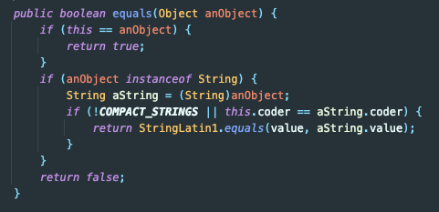
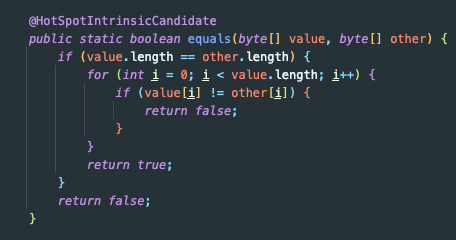

## Java - 문자열 비교에서의 시간 복잡도

삼성에서 주관하는 알고리즘 특강에서 라빈-카프 알고리즘에 대해서 배웠다.

그런데 한 가지 의문 사항이 생겼다.

문자열을 equals로 비교하는 것이 O(1)일텐데 왜 굳이 해시로 바꿔서 비교를 해야 하냐는 것이었다.
- (밑에 작성했지만 이는 사실이 아니었다!!)

## String.Equals

String 인스턴스의 equals 메서드를 살펴봤다. (JDK 13 기준)



해당 메서드에서는 StringLatin1.equals() 메서드를 호출하고 있다.

StringLatin1.equals() 메서드를 보자!



모든 byte를 전부 비교하고 있음을 알 수 있다. (어쩌면 당연한 결과이다!)

- 참고로 String의 value 타입은 Jdk 버전마다 구현이 다르다.

jdk 8의 경우에는 아래와 같이 char 배열을 사용하고, 아래와 같이 비교하는 로직을 사용하고 있다.

```java
public boolean equals(Object anObject) {
    if (this == anObject) {
         return true;
    }
    if (anObject instanceof String) {
        String anotherString = (String) anObject;
        int n = value.length;
        if (n == anotherString.value.length) {
            char v1[] = value;
            char v2[] = anotherString.value;
            int i = 0;
            while (n-- != 0) {
                if (v1[i] != v2[i])
                    return false;
                i++;
            }
            return true;
        }
    }
    return false;
}
```

<참고 - jdk 버전 별 String 구현>
- https://velog.io/@roro/Java-%EC%9E%90%EB%B0%94-String-byte-Compact-Strings

## 결론

어쩌면 당연하게도 String.equals는 각 byte 혹은 char 단위로 비교를 하고 있다.

즉, 시간 복잡도는 O(1)이 아니라 문자열 길이에 따라 다른 O(N)에 해당한다.

그래서 라빈-코프 알고리즘(참고: https://yjg-lab.tistory.com/218)처럼 Hash 값 기반으로 비교를 해서

전체 문자열 중 일부 문자열이 몇 번 포함되는 지 여부를 판단하면 시간 복잡도를 O(NM)을 O(N)으로 줄일 수 있다.

## 참고
- https://yjg-lab.tistory.com/218
- https://stackoverflow.com/questions/22030798/runtime-complexity-of-string-equals-in-java