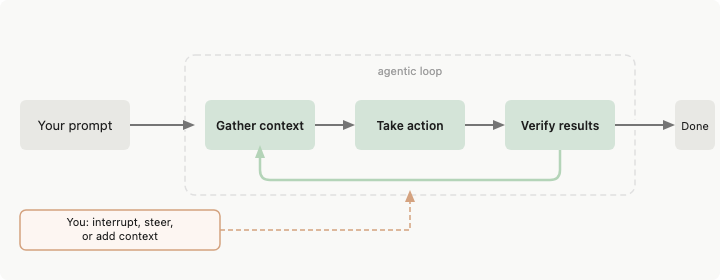

Claude Code는 Anthropic이 만든 개발자용 CLI 에이전트다. 터미널에서 실행하며, 자연어 지시만으로 파일을 읽고 수정하고, 명령을 실행하고, 테스트를 돌리는 등 실제 개발 작업을 자율적으로 처리한다.

단순히 코드를 제안하는 도구가 아니다. 직접 코드베이스를 탐색하고, 변경사항을 적용하고, 결과를 확인하는 전 과정을 에이전트로서 수행한다.

```bash
# 설치
npm install -g @anthropic-ai/claude-code

# 프로젝트 디렉토리에서 실행
claude
```

## Claude vs Claude Code

많은 사람들이 Claude(AI)와 Claude Code(Tool)를 혼용하는데 명확히 구분이 필요하다.

Claude는 일반적인 대화형 AI 어시스턴트로 단순히 챗봇 기능만 한다.

Claude Code는 개발자를 위한 CLI 도구로, 코드 작성이나 조언에 그치지 않고 파일을 직접 읽고 수정하며 명령을 실행하는 에이전트로 동작한다. 터미널에서 실행하며, 프로젝트 전체 컨텍스트를 파악해 실제 코드 변경까지 자율적으로 처리한다.

예를 들어 같은 요청을 해도 결과가 다르다.

| | Claude | Claude Code |
|--|--------|-------------|
| "로그인 버그 고쳐줘" | 코드 수정 방법을 설명해준다 | 직접 파일을 열고 버그를 찾아 수정한다 |
| "테스트 실패하는 거 고쳐줘" | 원인을 추측해서 알려준다 | 직접 테스트를 실행하고 실패 로그를 보고 수정한다 |
| "이 디렉토리 리팩토링해줘" | 리팩토링 방향을 제안한다 | 파일을 전부 읽고 직접 코드를 수정한다 |
| "유저 데이터 CSV로 만들어줘" | CSV 형식과 코드를 알려준다 | DB를 조회하고 직접 CSV 파일을 생성한다 |

## 동작 원리

Claude Code는 두 가지 핵심 개념으로 이루어져 있다.

- **Tool**: Claude가 실제 세계와 상호작용하는 수단. 파일 읽기/쓰기, 명령 실행, 웹 검색 등 각각의 능력 단위다.
- **Agent**: Tool을 조합해서 목표를 달성하는 루프. 단순히 도구를 쓰는 게 아니라, 결과를 보고 다음 도구를 판단하면서 스스로 작업을 완료해나가는 구조다.

Tool만 있으면 단순 자동화고, Agent가 있어야 "테스트 실패하면 고치고, 또 실패하면 다시 보고..." 같은 자율적인 흐름이 가능해진다.

사용자의 요청을 받으면 도구(tool)를 호출하는 루프를 반복하며 작업을 완료한다.

내부적으로 사용하는 주요 도구들:

| 도구 | 역할 |
|------|------|
| `Read` | 파일 내용 읽기 |
| `Write` / `Edit` | 파일 생성 및 수정 |
| `Bash` | 터미널 명령 실행 |
| `Glob` / `Grep` | 파일 탐색 및 코드 검색 |
| `WebSearch` / `WebFetch` | 웹 검색 및 문서 참조 |
| `Task` | 서브에이전트 생성 (병렬 작업) |

각 도구 실행 전에 승인 요청이 뜨고, 사용자가 허용해야 실행된다. `settings.json`의 `permissions`에 자주 쓰는 도구를 미리 허용해두면 매번 승인할 필요가 없다.

### 내부 동작 원리

Claude Code의 핵심은 **에이전트 루프**다. 내부적으로 Claude API를 반복 호출하는 구조로 동작한다.



주요 포인트:

- **모든 것이 컨텍스트에 쌓인다**: 읽은 파일 내용, 실행한 명령의 출력, 도구 결과 전부가 누적된다. 대화가 길어질수록 느려지는 이유가 이것이다.
- **Claude는 도구를 "선택"하는 것뿐**: 실제 실행은 Claude Code(CLI)가 한다. Claude가 `Bash("npm test")`를 반환하면 Claude Code가 터미널에서 실행하고 결과를 다시 넘긴다.
- **서브에이전트도 같은 구조**: `Task` 도구를 호출하면 별도의 컨텍스트로 Claude API를 새로 호출해서 독립 실행하고 결과만 반환한다. 병렬 처리가 가능한 이유다.
- **시스템 프롬프트가 기반**: CLAUDE.md, 메모리 파일, 작업 디렉토리, 사용 가능한 도구 목록이 모두 시스템 프롬프트에 포함돼서 매 API 호출마다 전달된다.

## CLAUDE.md

`CLAUDE.md`는 Claude Code가 프로젝트를 시작할 때 자동으로 읽는 지시사항 파일이다. 매번 프롬프트로 설명하지 않아도, 프로젝트의 컨벤션, 기술 스택, 주의사항을 여기에 한 번 작성해두면 Claude Code가 항상 참고한다.

```markdown
# 프로젝트 개요
- 기술 스택: Next.js 14, TypeScript, Prisma, PostgreSQL
- 패키지 매니저: pnpm
- 테스트: Vitest + Testing Library

# 코드 컨벤션
- 함수형 컴포넌트만 사용
- 상태 관리는 Zustand 사용

# 주의사항
- 직접 DB 쿼리 금지, 반드시 서비스 레이어를 통해서
- 환경 변수는 .env.local에만 추가
```

위치에 따라 적용 범위가 달라진다.

| 위치 | 적용 범위 |
|------|---------|
| 프로젝트 루트 `/CLAUDE.md` | 전체 프로젝트 |
| 특정 디렉토리 `/src/CLAUDE.md` | 해당 디렉토리 이하 |
| `~/.claude/CLAUDE.md` | 모든 프로젝트 (글로벌) |

## Claude Code 활용해서 개발하기

개발을 할 때는 무수한 접근이 가능하겠지만 크게 아래의 접근 방법이 있다.
1. prompt → 개발
2. prompt → plain → 개발
3. prompt → prd.md → 개발
4. prompt → spec → plan → task → 개발 (SDD)

단순한 작업은 1번으로 빠르게 처리하고, 복잡하거나 규모가 있는 작업일수록 단계를 늘리는 것이 좋다. 단계가 많을수록 불필요한 작업과 방향 오류를 사전에 방지할 수 있다.

개발을 할 때 반드시 prd, guide, spec와 같은 문서와 테스트코드는 갱신하는 것을 권한다. 그래야 컨텍스트가 끊겼을 때 다시 시행착오를 겪지 않을 수 있다.

## 컨텍스트 관리

Claude Code의 컨텍스트 윈도우는 유한하다. 대화가 길어질수록 성능이 저하되고 초반 내용이 잊혀질 수 있다.

- **작업 단위로 대화 분리**: 완전히 다른 작업은 새 대화로 시작하는 것이 효율적이다.
- **/clear**: 대화 기록을 전부 지우고 컨텍스트를 초기화한다.
- **/compact**: 대화 기록을 요약해서 압축한다. 맥락은 유지하면서 토큰을 줄이고 싶을 때 사용한다. `/clear`처럼 완전히 초기화하지 않아도 되는 상황에 적합하다.
- **문서 갱신**: 작업이 끝나면 prd, spec, 테스트코드를 갱신해두자. 다음 대화에서 Claude가 문서를 읽어 이전 컨텍스트를 복원할 수 있다.

## 효과적인 요청 방법

구체적인 지시가 좋은 결과를 만든다.

```
❌ "로그인 기능 만들어줘"

✅ "JWT 기반 로그인 API를 만들어줘.
   - POST /api/auth/login
   - 이메일/비밀번호 검증
   - access token(15분) + refresh token(7일) 발급
   - Prisma User 모델 사용"
```

복잡한 작업은 단계를 나눠서 요청하는 것이 더 정확한 결과를 낸다.

## 참고

- https://code.claude.com/docs/ko/how-claude-code-works
