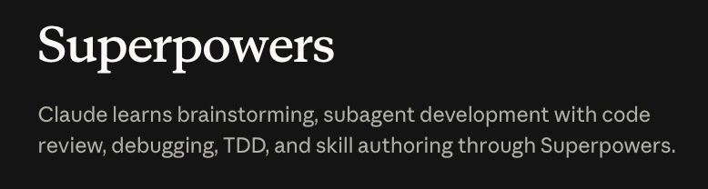

Superpowers는 Claude Code의 공식 플러그인 마켓플레이스에서 제공하는 플러그인이다. Claude Code에 개발 워크플로우에 특화된 스킬들을 추가해준다.

**579.9K 다운로드**로 전체 플러그인 중 **2위**를 기록하고 있다. 사실 이 지표만으로도 충분히 강력한 기능을 제공한다는 것을 알 수 있다.

## 왜 사용해야 하는가?

AI Agent를 예전에 사용한 사람들은 충분히 공감할 것이다. 

예전에는 AI Agent에게 일 1가지를 시키면 핑퐁을 10번, 20번도 넘게 했던 경험이 있다.

Superpowers를 사용하면 소프트웨어 개발 방법론을 적용해서 AI Agent가 스스로 계획을 세우고, 체계적으로 디버깅하고 훨씬 더 효율적이고 안정적으로 작업을 수행할 수 있다.

즉, Superpowers에게 작업을 맡기면 손부터 나가지 않고, 충분한 계획과 설계를 가지고 일을 하기에 핑퐁도 3번 정도면 꽤 만족스러운 결과물을 가져오고, 토큰 사용량도 아낄 수 있다. SDD와 TDD를 할 때 유용할 것이다. 

직접 Skills를 필요에 맞게 만들어 사용하는 경우도 있지만, Skills를 어떤 식으로 만들 지도 잘 몰라서 영감을 받고 싶거나, 잘 만들어져서 검증된 스킬을 사용하고 싶다면 강력히 추천한다!

## 설치

```bash
# 플러그인 설치
/plugin install superpowers
```

또는 `settings.json`에 직접 추가할 수 있다.

```json
{
  "enabledPlugins": {
    "superpowers@claude-plugins-official": true
  }
}
```

## 제공하는 스킬

Superpowers는 개발 단계별로 사용할 수 있는 스킬들을 제공한다.

| 스킬 | 설명 |
|------|------|
| `brainstorming` | 구현 전 요구사항과 설계를 먼저 탐색 |
| `writing-plans` | spec을 바탕으로 단계별 구현 계획 작성 |
| `executing-plans` | 작성된 계획을 검토 체크포인트와 함께 실행 |
| `systematic-debugging` | 버그나 테스트 실패 발생 시 원인 분석 |
| `test-driven-development` | 구현 전 테스트 코드 먼저 작성 |
| `dispatching-parallel-agents` | 독립적인 작업을 병렬 에이전트로 분산 |
| `requesting-code-review` | 구현 완료 후 코드 리뷰 요청 |
| `receiving-code-review` | 리뷰 피드백을 검토하고 반영 |
| `using-git-worktrees` | 작업 격리를 위한 git worktree 생성 |
| `finishing-a-development-branch` | 구현 완료 후 머지/PR/정리 옵션 안내 |
| `verification-before-completion` | 완료 선언 전 실제 검증 수행 |
| `writing-skills` | 새로운 스킬 작성 및 배포 |

## 사용 방법

각 스킬은 `/` 명령어로 호출할 수 있다.

```bash
# 새 기능 구현 전 브레인스토밍
/brainstorming

# 구현 계획 작성
/writing-plans

# 버그 발생 시 체계적으로 디버깅
/systematic-debugging

# 완료 전 검증
/verification-before-completion
```

## 핵심 스킬 소개

### brainstorming

구현을 시작하기 전에 요구사항과 설계를 먼저 탐색한다. 방향이 잘못된 채로 코드를 짜는 것을 방지해준다.

### writing-plans + executing-plans

spec이나 요구사항을 받으면 먼저 단계별 계획을 작성하고, 그 계획을 별도 세션에서 체크포인트와 함께 실행한다. 큰 작업을 안전하게 처리할 수 있다.

### systematic-debugging

버그나 테스트 실패가 생겼을 때 즉시 수정하려 하지 않고, 원인을 먼저 체계적으로 분석한다. 잘못된 수정을 방지한다.

### verification-before-completion

"완료됐습니다"라고 말하기 전에 실제로 검증 명령을 실행하고 결과를 확인한다. 근거 없이 완료를 선언하는 것을 막는다.

사용자가 별도로 스킬을 챙길 필요 없이 단순히 작업을 지시하면, Claude Code가 단계에 맞는 스킬을 알아서 불러와 사용한다.

## 참고

- https://claude.com/plugins/superpowers