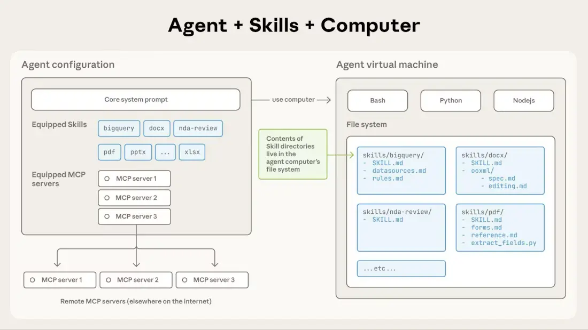
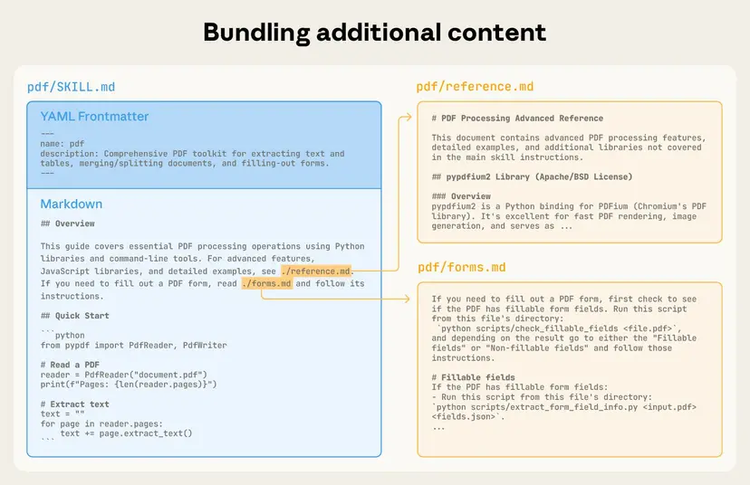

# Claude Skills: 에이전트의 능력을 확장하는 방법

Claude Skills는 특정 작업에서 **더 나은 성능**을 발휘할 수 있도록 에이전트가 **동적**으로 탐색하고 로드할 수 있는 지시문, 스크립트, 리소스의 정리된 폴더이다. 

즉, Claude 에이전트에게 특정 도메인이나 작업에 대한 **전문 지식**을 제공하는 메커니즘이라고 생각할 수 있다.

## 왜 Skills를 사용할까?

### 문제점
Claude 에이전트가 특정 도메인의 작업을 수행할 때, 일반적인 지식만으로는 최적의 결과를 내기 어려울 수 있다.
- 특정 프로젝트의 컨벤션이나 best practices
- 복잡한 문제 해결을 위한 구체적인 단계
- 특정 도메인의 전문적인 지식

### Skills의 해결책
Skills를 정의함으로써 아래의 것들을 할 수 있다.
- 에이전트가 필요한 **순간에만 해당 지식을 로드** (효율적인 토큰 사용)
- **일관성 있는 결과** 제공
- 복잡한 작업을 **구조화된 방식**으로 처리

전체 공통으로 지켜야 하는 개발 컨벤션의 경우에는 `rules`에 정의할 수 있다.

skills는 **특정 작업에 대한 전문 지식**을 제공하는 데 초점을 맞추고 있다. 예를 들어, CVE 검사 및 수정과 같은 특정 작업에 대한 스킬을 정의할 수 있다.


## Architecture



### 폴더 구조

```
skills/
├── skill-1/
│   ├── SKILL.md
│   ├── script.py
│   └── template.json
├── skill-2/
│   ├── SKILL.md
│   └── guide.txt
└── skill-3/
    └── SKILL.md
```

**skills 폴더** 안에 **스킬 이름의 폴더**를 생성하고, 그 안에 아래 파일을 구성한다.
- **SKILL.md** (필수): 스킬의 메타데이터와 상세 설명
- 관련 리소스 파일들: 스크립트, 템플릿, 가이드 등

에이전트는 사용자의 요청이 들어오면 아래와 같은 동작을 수행한다.
1. 필요한 SKILL을 선택
2. 해당 SKILL.md를 읽어 내용 파악
3. 필요시 관련 리소스 파일 로드
4. 해당 지식을 바탕으로 작업 수행

> **팁**: 선택할 SKILL이 중복될 수 있기 때문에 **가능한 상세하고 명확하게** 작성하는 것이 중요하다.
> 
> 터미널에서 명령어 목록에서 skills를 실제로는 활용하지 않았다면 위 부분을 체크하자. 

## SKILL.md 파일 포맷

### 구조



SKILL.md는 **Metadata**와 **Body** 두 가지 섹션으로 구성된다.

### Metadata (YAML Front Matter)

```yaml
---
name: "CVE 검사 및 수정"
description: "프로젝트의 의존성에서 보안 취약점(CVE)을 감지하고 자동으로 수정하는 작업"
input_schema:
  dependencies: "패키지 목록 (package@version 형식)"
  ecosystem: "패키지 생태계 (npm, pip, maven 등)"
target_model: "claude-3-5-sonnet"
---
```

**주요 필드**:
- `name`: 스킬의 간단한 이름
- `description`: 스킬이 무엇을 하는지 명확하게 설명
- `input_schema`: 스킬이 필요로 하는 입력값 정의
- `target_model`: 이 스킬을 처리할 최적의 모델

### Body

스킬의 **상세한 지시문**과 **실행 방법**을 기술한다.

```markdown
## 개요
이 스킬은 프로젝트의 의존성에서 CVE를 검사하는 방법을 제공합니다.

## 단계별 처리 방법
1. 의존성 목록 파싱
2. 각 의존성별 CVE 조회
3. 취약점 발견시 패치 버전 제안
...

## 참고 파일
- `scripts/check-cve.py` - CVE 검사 스크립트
- `templates/report.json` - 보고서 템플릿
```

### 파일 참고

`SKILL.md`에서 다른 파일을 참고할 때는 **경로를 명확하게** 작성해주면, 에이전트가 필요시 해당 파일을 로드할 수 있다.

**예시**:
```markdown
## 참고 파일
- `./scripts/deploy.sh` - 배포 스크립트
- `./templates/config.yaml` - 설정 템플릿
```

## Context Management: 효율적인 토큰 사용

Skills는 **3단계 레벨**에서 Context를 다르게 관리함으로써 토큰 사용을 최적화한다.

| 레벨 | 설명 | 로드 시점 | 토큰 사용량 |
|------|------|---------|-----------|
| **Metadata** | SKILL.md의 YAML 헤더 | 항상 로드 | ~100 Tokens |
| **Body** | SKILL.md의 상세 내용 | 스킬이 선택됨 | <5K Tokens |
| **Bundle Files** | 참고 파일/리소스 | 필요할 때만 | Unlimited |

### 설계 의도

1. **빠른 스킬 선택**: Metadata만 로드하여 어떤 스킬이 필요한지 빠르게 판단
2. **필요시만 상세 정보 로드**: Body는 스킬이 확정되었을 때만 로드
3. **유연한 리소스 관리**: 참고 파일은 에이전트가 필요시에만 로드

이러한 계층적 관리로 **컨텍스트 윈도우를 효율적으로 사용**하면서도 **필요한 정보는 모두 제공**할 수 있다.

### 실제 예시

사용자가 "CVE를 확인해줘"라고 요청하면:

1. **Step 1**: 모든 SKILL.md의 Metadata만 로드 → CVE Remediator 스킬 발견 (~100 tokens)
2. **Step 2**: CVE Remediator의 Body 로드 → 작업 방법 파악 (<5K tokens)
3. **Step 3**: 필요한 스크립트나 템플릿만 로드 → 작업 실행

## Deterministic (결정론적): 예측 가능한 결과

Skills의 주요 특성 중 하나는 **Deterministic**이다.

### 의미

**결정론적(Deterministic)**이란 동일한 입력에 대해 항상 동일한 출력을 생성한다는 뜻이다. 이는 **멱등성(Idempotency)**과 유사한 개념이다.

### 실제 사례

**스킬 없이**: CVE 수정을 요청할 때마다 다른 패키지 버전을 제안할 수 있음
```
요청 1: react@16.0 → react@18.2 제안
요청 2: react@16.0 → react@17.5 제안 (다른 결과!)
```

**스킬 사용**: SKILL.md에서 명확한 지시문을 제공하므로 항상 같은 결과
```
요청 1: react@16.0 → react@18.2 제안
요청 2: react@16.0 → react@18.2 제안 (일관된 결과!)
```

### 왜 중요한가?

1. **신뢰성**: 사용자가 같은 작업을 반복해도 일관된 결과를 기대할 수 있다
2. **디버깅**: 문제가 발생했을 때 원인을 파악하기 쉽다
3. **재사용성**: 다른 팀이나 프로젝트에서도 동일한 결과를 기대할 수 있다

## Best Practices

### 1. 명확한 설명 작성
```yaml
# 나쁜 예
description: "코드 관련 스킬"

# 좋은 예
description: "프로젝트의 의존성에서 보안 취약점을 검사하고 자동으로 수정하는 스킬"
```

### 2. 구체적인 입력값 정의
```yaml
# 나쁜 예
input_schema:
  packages: "패키지들"

# 좋은 예
input_schema:
  dependencies: "package@version 형식의 의존성 목록 (예: react@16.0.0, vue@3.2.0)"
  ecosystem: "패키지 생태계 선택 (npm, pip, maven, go 등)"
```

### 3. 단계별 명확한 지시문
```markdown
## 처리 단계

1. **의존성 파싱**
   - package@version 형식 검증
   - 버전 범위 표준화

2. **CVE 데이터 조회**
   - 각 의존성별 알려진 취약점 검색
   - 심각도 분류

3. **패치 제안**
   - 최소 버전 제안
   - 호환성 검토
```

### 4. 참고 파일의 경로를 명확하게
```markdown
더 자세한 내용은 다음을 참조하세요:
- `./scripts/validate.sh` - 검증 스크립트
- `./templates/report.json` - 보고서 템플릿
```

## 주의사항

### 스킬 선택 충돌
여러 스킬의 설명이 비슷하면 에이전트가 어떤 스킬을 선택해야 할지 혼동할 수 있다.

**해결책**: 각 스킬의 설명을 가능한 **구체적이고 유일하게** 작성한다.

### 토큰 오버헤드
과도하게 큰 Body나 리소스 파일은 토큰을 낭비할 수 있다.

**해결책**:
- Body는 핵심 내용만 포함 (세부 사항은 참고 파일로 분리)
- 리소스 파일은 필요한 것만 포함

## 결론

Claude Skills은 아래의 목적을 위해 필요하다.

- **동적인 지식 제공** 메커니즘
- **효율적인 토큰 관리**로 비용 절감
- **일관성 있는 결과** 보장
- **확장 가능한 구조**로 새로운 도메인 추가 용이

복잡한 작업을 체계적으로 처리하고 싶다면 Skills를 활용해보자!

