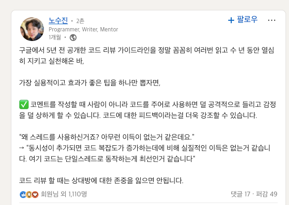

## 나는 코드 리뷰를 잘 하는가

코드 리뷰를 잘한다고 생각해왔다.

하지만, 돌이켜보면 누군가에게 "A씨는 코드 리뷰를 잘하고 계세요?" 라고 물어보면 대부분 잘하고 있다고 얘기할 것 같다.

코드 리뷰 뿐만 아니라 추상적인 개념일수록 그런 경향이 있다.

그렇다면 근거는 무엇일까..

## 코드 리뷰 가이드

코드리뷰도 학습하지 않으면 느낌가는 대로만 진행하게 될 것이다.

하지만, 코드 리뷰는 속한 팀에서도, 오픈 소스를 기여할 때도 매우 중요하다.

그리고 코드 리뷰를 잘하기 위해서는 좋은 가이드가 많이 있다.
- [카카오 기술 리뷰: 효과적인 코드리뷰를 위한 리뷰어의 자세](https://tech.kakao.com/posts/498)
- [스마트 스튜디오: 코드 리뷰를 어떻게 하는 게 좋을까?](https://smartstudio.tech/how-to-make-a-good-code-review/)
- ...

## 구글 코드리뷰 가이드라인

링크드인을 보다가 핫한 포스트를 하나 발견했다.

내용을 요약하면 코드리뷰에서 코드를 주어로 사용해야 하면 효과적이라는 것이다.

'지금까지 한 코드 리뷰의 주어는 코드였는가' 라고 생각한다면 딱히 그렇지는 않았던 것 같다. (주어를 의식하지는 않았다..)

> Linkedin: [노수진 - 구글 코드리뷰 팁](https://www.linkedin.com/posts/soojinro_%EA%B5%AC%EA%B8%80%EC%97%90%EC%84%9C-5%EB%85%84-%EC%A0%84-%EA%B3%B5%EA%B0%9C%ED%95%9C-%EC%BD%94%EB%93%9C-%EB%A6%AC%EB%B7%B0-%EA%B0%80%EC%9D%B4%EB%93%9C%EB%9D%BC%EC%9D%B8%EC%9D%84-%EC%A0%95%EB%A7%90-%EA%BC%BC%EA%BC%BC%ED%9E%88-%EC%97%AC%EB%9F%AC%EB%B2%88-%EC%9D%BD%EA%B3%A0-activity-7303196418125582336-WsCK?utm_source=social_share_send&utm_medium=member_desktop_web&rcm=ACoAADcQiTIBCwBEJFXNZN9NJHm2Li1fmkQVzvc)

그래서 구글 코드 리뷰 가이드라인을 한번 읽어보게 되었다. (내용이 생각한 것보다 훨씬 많았다.)

## 구글 코드 리뷰 가이드 라인

## 참고

- https://tech.kakao.com/posts/498
