## 배민 B마트 CQRS 적용기를 보면서 (+ 조회 모델 설계, 변경된 데이터 동기화 방법, ...)

해당 포스팅은 "B마트 전시 도메인 CQRS 적용하기"라는 강연의 내용을 정리한 글이다.
- https://www.youtube.com/watch?v=fg5xbs59Lro

## CQRS

CQRS는 Command and Query Responsibility Segregation의 약자로 **명령과 조회의 책임을 분리**라는 뜻이다.

이전에 CQRS의 내용을 정리한 적이 있는데 외부 강연들을 보면서 추가로 궁금한 사항들이 생겼다.
- 왜 조회 모델을 DB에 저장을 할까..?!, 데이터가 변경되면 어떻게 Pub/Sub로 조회 모델에 반영될까?...
- (이전 포스팅: https://jaehoney.tistory.com/255)

**B마트 전시 도메인 CQRS 적용하기**라는 강연에서 CQRS에 대해 더 자세히 설명해준다.

해당 강연을 보고 추가적으로 알게된 사실을 해당 포스팅에서 작성한다.

## 내부 데이터와 외부 데이터

우리는 DB에서 도메인 모델을 꺼낼 수도 있지만, MSA를 적용하고 있다면 외부 API를 통해 모델을 조회할 수도 있다.

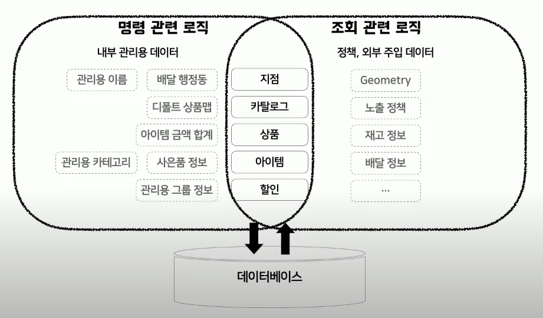

이때 단일 도메인 모델을 사용하면 **명령 관련 로직**과 **조회 관련 로직**이 함께 존재할 수 밖에 없다.

외부 API를 통해 불러온 모델은 Hibernate에서 관리할 수 있는 모델이 아니기에 모델을 다루기에 훨씬 복잡하고, 명령과 조회를 함께 다뤄야 한다면 더 복잡해진다.

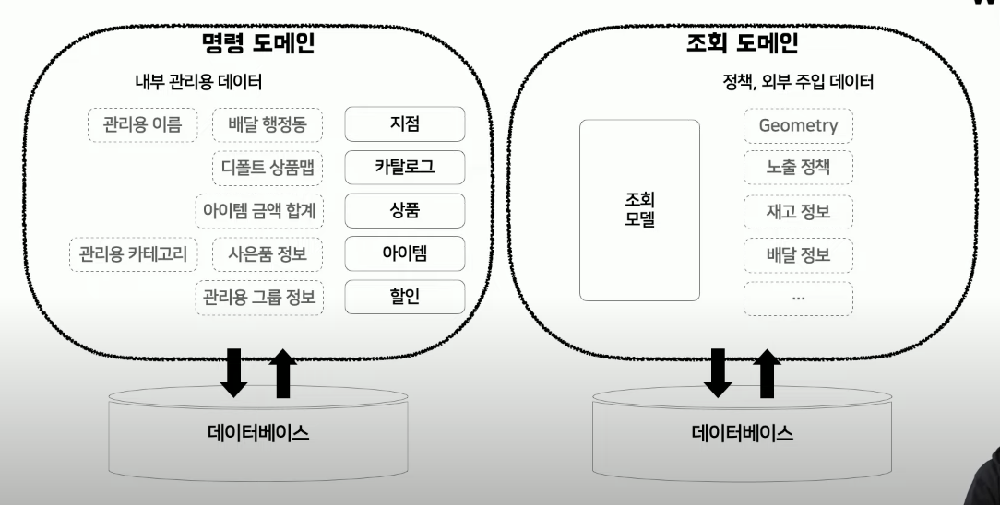

그래서 큰 도메인 안에서 명령과 도메인과 조회 도메인을 나눠서 문제를 해결하는 것이 CQRS가 나아가는 방향이다.

- 명령 모델: 기존의 모델이라고 보면 된다.
- 조회 모델: 각 모델을 결합한 비정규화된 데이터를 한번 더 정의한 것이다.

## 2차 저장소

조회 모델을 만들기 위해서는 여러 쿼리와 많은 외부 API로의 요청이 필요하다. 이는 당연히 성능상의 부담이 된다.

그래서 Cache를 사용해야 한다. 이때 아래의 문제가 생길 수 있다.
- Heap 메모리 사이즈 부족
- 캐시와의 트래픽량 증가

그래서 명령 모델을 통해 데이터가 변경되는 시점에 조회 모델을 생성하고 비정규화된 데이터를 그대로 DB에 다시 저장한다. (사실 캐싱과 유사하다.)
- 이때 CQRS의 조회모델을 DB로부터 가져오는 과정에서 조인이나 여타 연산을 제한해야 한다.
- 그래서 비정규화된 데이터를 저장해서 DB에서 데이터를 꺼내서 곧바로 사용할 수 있게 한다.

해당 데이터는 곧바로 사용할 수 있는 비정규화된 데이터이기 때문에 JsonFormat이 주로 이용이된다. 그래서 RDB가 아니라 NoSQL을 사용하는 경우가 많다.
- Redis, Elasticsearch, DynamoDB

단, 이렇게 저장소를 나누면 다른 저장소간 데이터의 정합성을 보장할 수 있어야 하기에, 시스템이 안착할 때 까지는 모니터링에 더 관심을 기울여야 한다.

## 동기화

그렇다면 명령 모델과 조회 모델의 데이터가 불일치가 발생하는 것을 어떻게 막을 수 있을까..?!

B마트에서는 이벤트 소싱 방식으로 명령 모델에서 데이터를 변경하면 이벤트를 날리고, 해당 이벤트를 구독하던 서버에서 조회 모델을 생성한다.

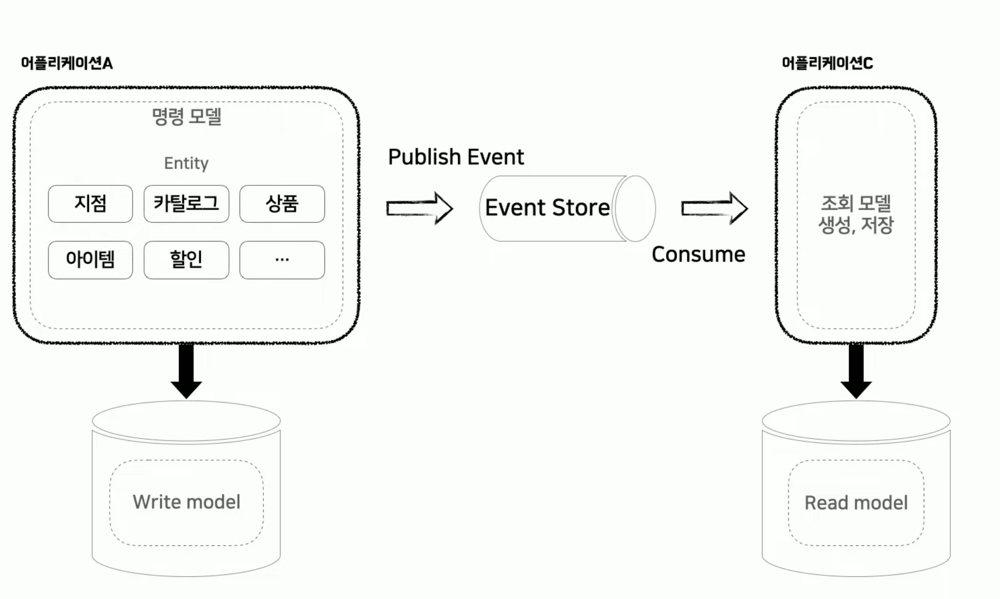

## CQRS 모델

CQRS를 적용한다는 것이 반드시 **모든 도메인 모델을 대상으로 명령 모델과 조회 모델로 분리하는 것**을 의미하는 것은 아니다.

고객에게 전시하는 **전시 도메인** 영역에만 툭정해서 CQRS를 적용할 수 있다.

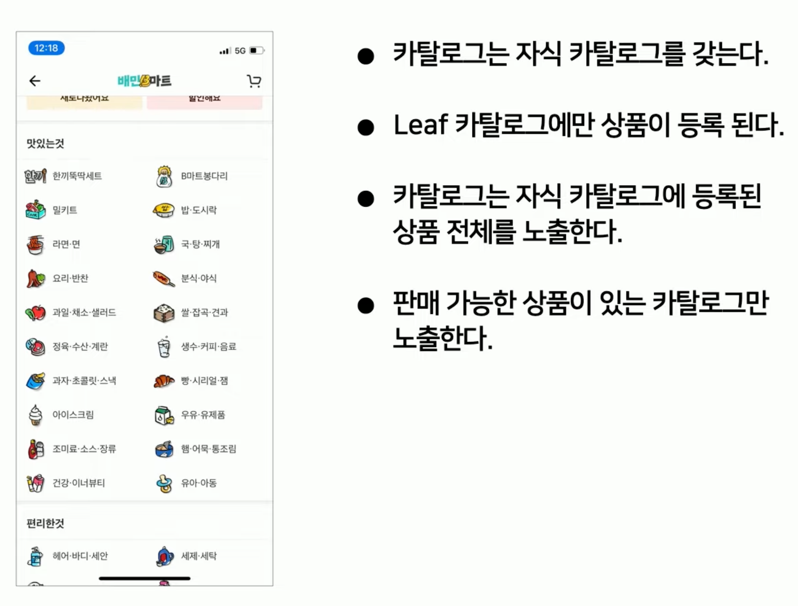

B마트에서 가장 복잡한 조회 모델은 카탈로그 모델이라고 한다. 해당 요구사항들을 만족하기 위해 카탈로그 조회 모델로 아래의 **전체 트리 모델 하나**만 사용하면 깔끔하게 관리될 것이라고 판단했다.

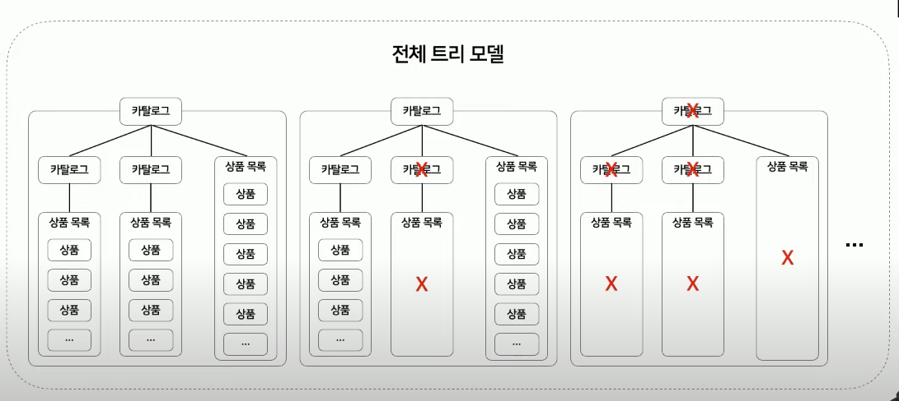

하지만 해당 모델을 계속 사용하기엔 큰 무리가 있었다.
- 새로운 UX 요소가 계속 추가되고 있는 상황
- 서비스 전반에 영향을 주는 비즈니스 정책이 많이 추가됨
- 개인화(찜, 장바구니 담았는지 여부, 개인화 추천 구좌)
- ...

그래서 전체 트리 모델이 너무 비대해지고 의존성 경계를 넘나드는 경우가 많이 생겼다고 한다.

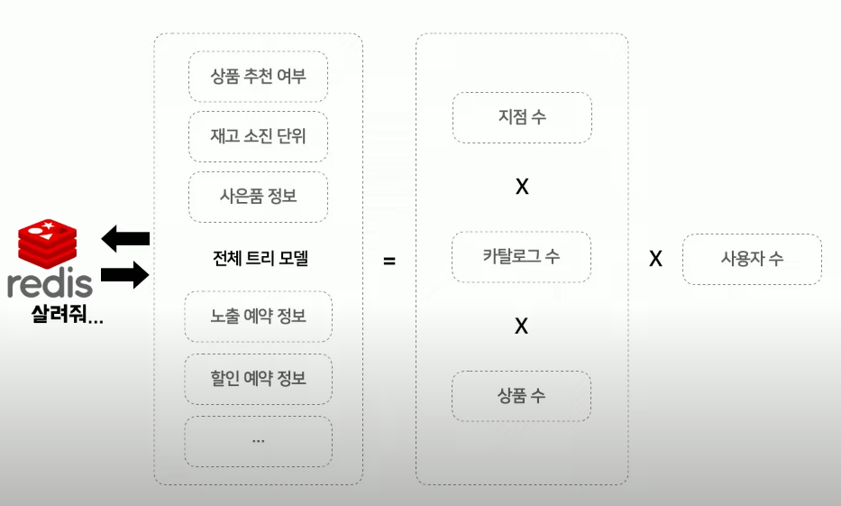

추가로 지점 수와 카탈로그 수와 상품 수와 비례해서 모델의 크기가 커지는 문제가 있었고, 사용자 수가 늘면 트래픽을 전체 트리 모델을 저장하는 레디스가 감당할 수 없는 상황이 되었다.

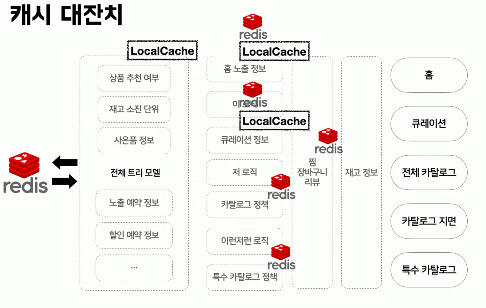

그래서 전체 트리 모델 하나만 사용했을 때 트래픽을 감당할 수 없었고, 사방팔방에 로컬 캐시와 레디스를 적용하게 되었다. 
- (로컬 캐시) 하지만 그만큼 서버의 힙 메모리 사용량이 증가했고
- 데이터 정합성을 맞춰주기가 너무 어려웠다.
- 추가로 여전히 전체 트리 모델을 사용하는 곳이 너무 많아져서 근본적인 해결책이 되지 못했다.

그래서 CQRS 모델을 다시 설계해야 했다.

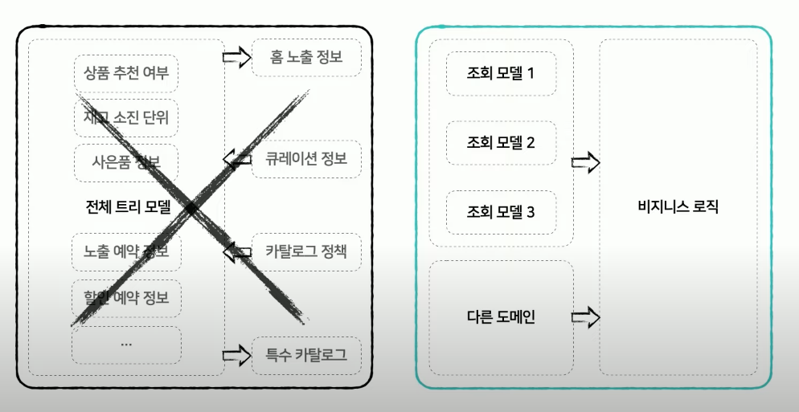

위에서 설계한 전체 트리 모델을 제거하고 최소한의 쿼리로 새로운 조회 모델을 만들 수 있도록 정의해야 했다.

그래서 B마트 개발팀에서는 **전체 트리 모델에 의존성을 가지고 있던 모든 로직**을 **한 클래스**로 모아봤다.
- (모으면서 비즈니스 로직이 더 꼬이는 현상도 발생했지만 우직하게(?) 모두 한 클래스로 모았다.)

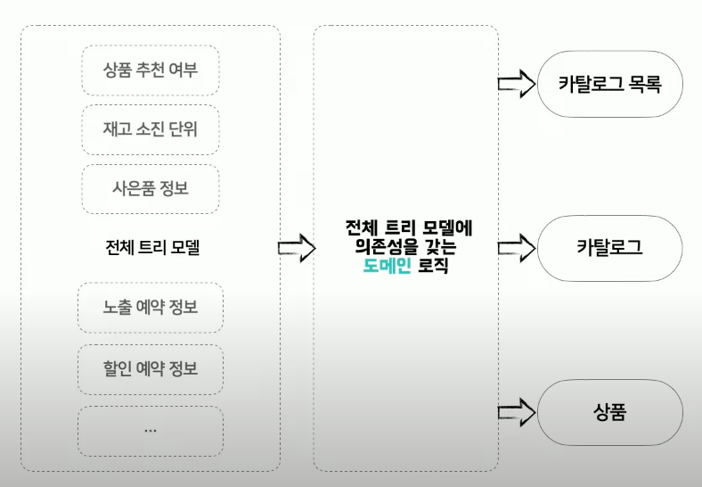

그 결과 전체 트리 모델에 의존성을 갖는 **도메인 로직**이 해당 클래스에 남게 되었다. 해당 로직은 카탈로그 목록, 카탈로그, 상품 세 가지 데이터를 통해 만들어 졌다.

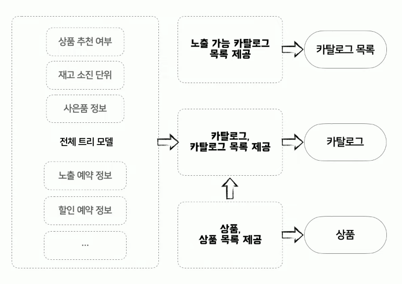

그래서 도메인 로직은 위의 기능들로 정리할 수 있었다. 결과적으로 전체 트리 모델 -> 카탈로그 목록 모델, 카탈로그 모델, 상품 모델로 분리하였고, 이를 조회 모델로서 활용하게 되었다.

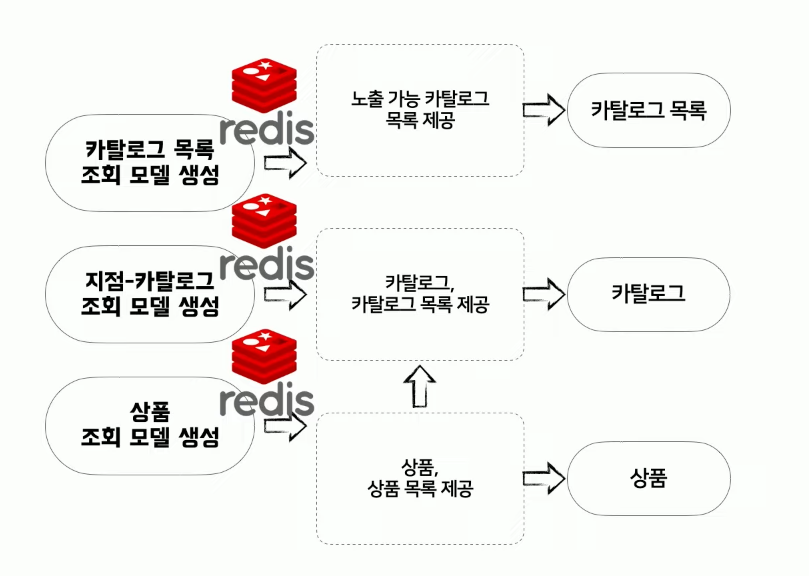

기존 전체 트리 모델이라는 하나의 조회 모델에 의존하고 각 로직별로 캐시에 의존했던 구조가 적절한 조회 모델로 분배함으로써 도메인 로직이 깔끔하게 나눠지게 되었다. 추가로 해당 조회 모델에만 캐시를 적용하기 때문에 캐시 트래픽도 줄어들 수 있었다.

## 이벤트

해당 조회 모델이 수정되었을 때 이벤트를 통해 조회 모델에도 동기화를 해야 한다. 그래서 이벤트에는 아래의 내용을 담아서 발행이 필요했다.
- 이벤트 변경에 따라 갱신 해야할 대상(카탈로그 or 상품) id
- 변경을 감지할 property 지정
- 실행 Method 지정
- 데이터 변경자 이름

그래서 감지 대상 엔터티는 아래의 인터페이스를 구현한다.

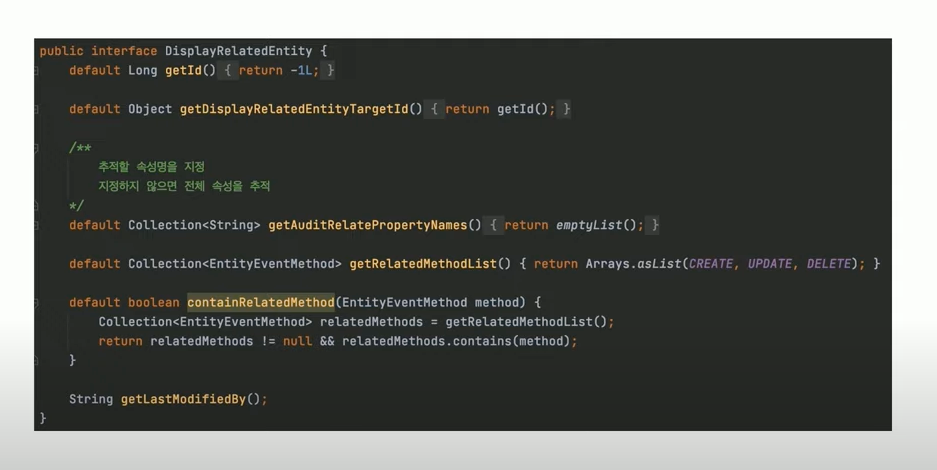

## 변경 감지 방법

이벤트를 발행하려면 변경 감지를 해야 한다. 방법은 총 4가지가 있었다.
1. JPA EntityListeners 
2. Hibernate EventListener 
3. Hibernate Interceptor
4. Spring AOP

해당 방법들은 1에서 4로 내려갈 수록 추상화 레벨이 낮아진다.

### JPA EntityListener

- @Entity 혹은 @MappedSuperclass 객체 메서드에 애노테이션 지정으로 사용이 가능하다.
- Callback 지정 함수 선언이 간단하다. (@PrePersist, @PostPersist, @PreUpdate 등 7가지)
- 단, 해당 엔터티만 인자로 반환할 수 있기 때문 어떤 값에서 어떤 값으로 변경되는 지를 알기는 어렵다.

### Hibernate EventListener
- Hibernate에서는 SessionFactoryImpl 클래스로 세션팩토리가 구현된다. 해당 팩토리에는 EventLIstenerRegistry가 있어서 이를 사용할 수 있다.
- 26가지 디테일한 상황에 콜백이 가능하다.
- 상세한 정보를 전달할 수 있다. (이전 상태, 현재 상태, 변경된 프로퍼티 등)
- 단, 모든 엔터티에 공통으로 적용이 가능하지만 각 엔터티에 별도로 적용하기

### Hibernate Interceptor
- Session 혹은 SessionFactory에 Interceptor를 등록할 수 있다.
- EventListener에 비해 적은 콜백 종류
- 저장될 데이터 조작 가능

### Spring AOP
- Method에 설정 가능
- Method 실행 전/후, 반환 후, 예외 상황, 애노테이션이 붙은 경우 등에 대해 Pointcut으로 동작
- 부득이한 경우에만 사용한다.

B마트 팀에서는 변경 감지를 위해 아래와 같이 2번(Hibernate EventListener)를 기본으로 이용하고,

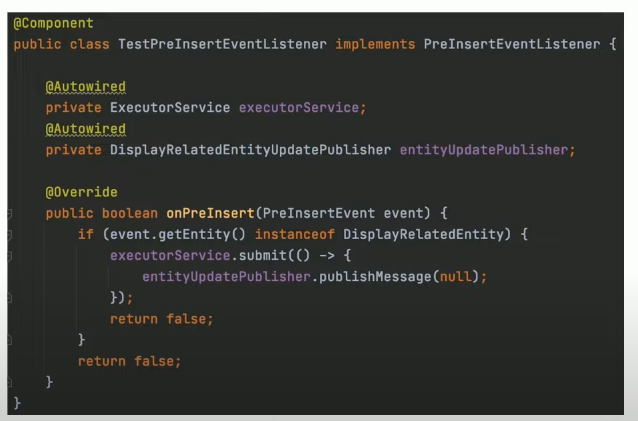

DeleteInBatch와 같이 EntityManager를 타지 않고 단순 쿼리가 실행되는 경우에만 아래와 같이 Spring AOP 방법을 적용했다.

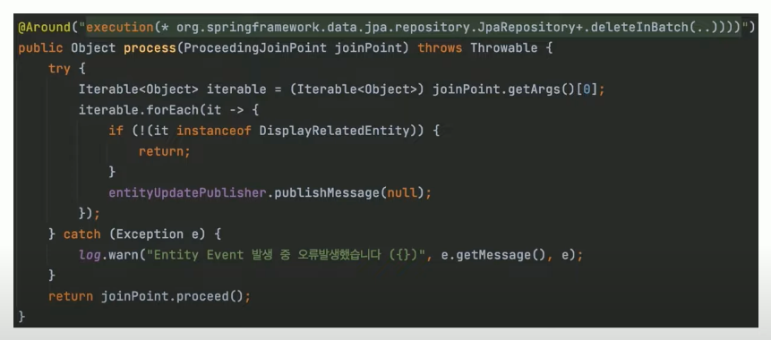

## 이벤트 구독

이벤트 구독자가 해당 이벤트가 생성될 떄마다 조회 모델을 갱신하게 되면 DB에 대한 요청 수가 크게 상승해서 비효율적인 결과를 초래한다.

그래서 아래의 그림과 같이 버퍼(Redis)에 이벤트를 저장하고, Scheduler를 활용해서 10초에 한번씩 모든 이벤트를 가져와서 조회 모델을 Bulk로 생성하고 저장한다.

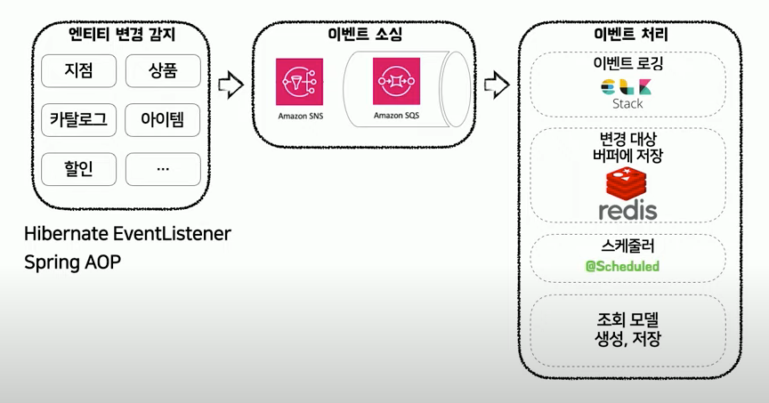

## 추가 내용

최범균님의 "CQRS 아는척하기"라는 강연을 보면 CQRS에는 아래의 종류가 있다.
- 같은 프로세스, 같은 DB
- 같은 프로세스, 같은 DB, 다른 테이블
- 같은 프로세스, 다른 DB
- 다른 프로세스, 다른 DB

- 우아한 형제들에 다니는 전 동료분께 여쭤보니 모든 시스템이 CQRS를 위에서 다룬 강연에서 처럼 다른 DB 로써 구성하는 것은 아니라고 한다.

일반적으로 전사 Default는 Slave DB를 사용해서 조회하고, 모델 정도만 분리할 수 있는 정도라고 한다.

즉, 해당과 같은 강연을 보고 모든 시스템이 이와 같이 이벤트 기반 아키텍처와 CQRS 패턴을 적용되어 있다고 생각하는 것은 오해가 있다.
- 모든 시스템이 Redis를 활용하는 것도 아니고, Kafka를 활용하는 것도 아니다.
- (참고만 하도록 하자!)

## 참고
- https://www.youtube.com/watch?v=fg5xbs59Lro

