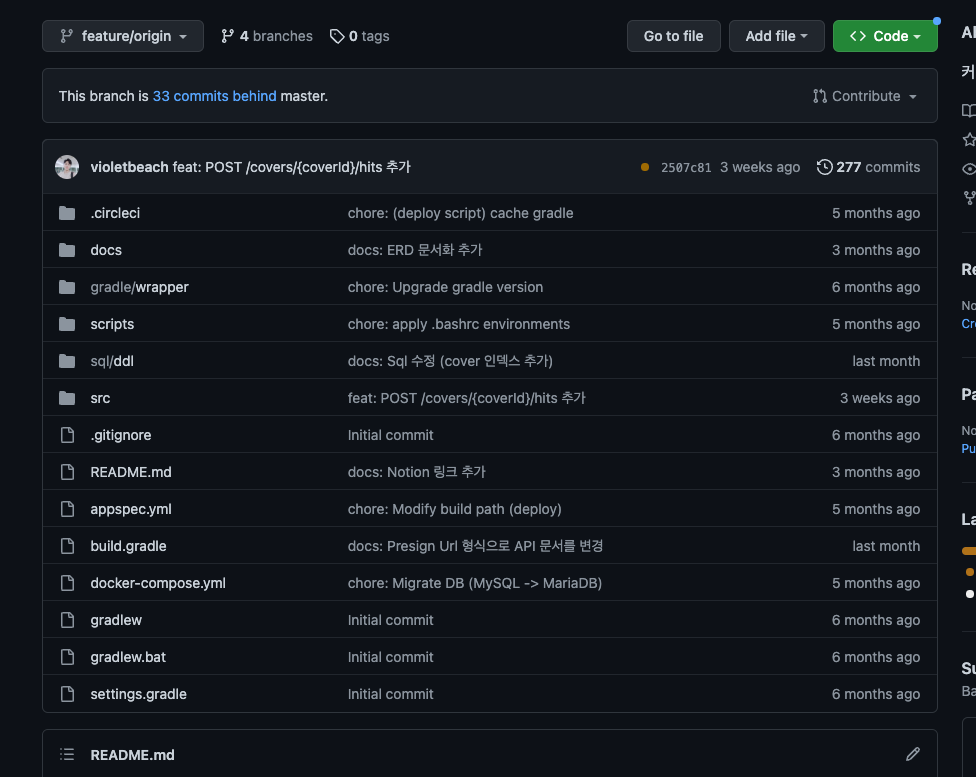
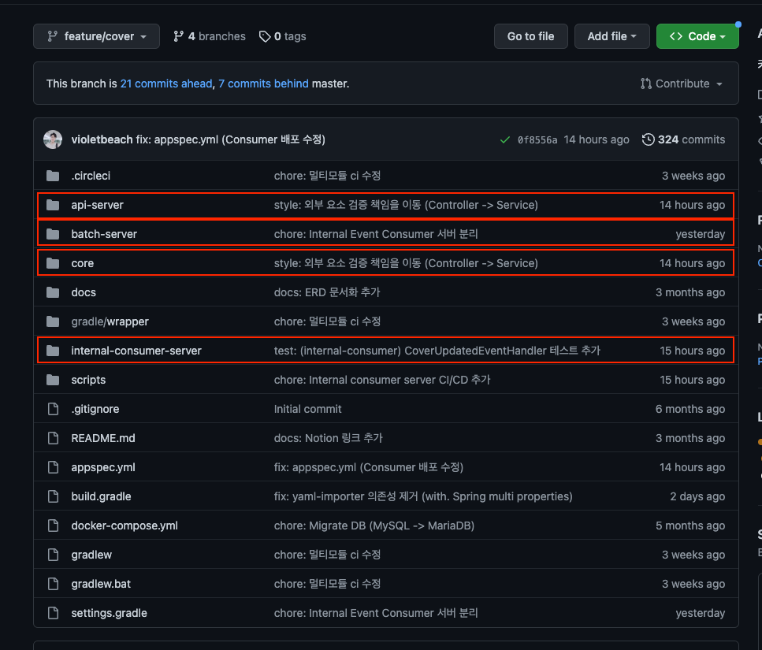
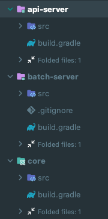
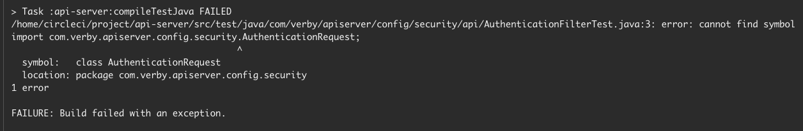
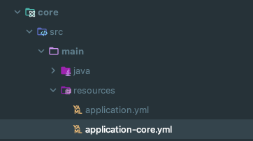
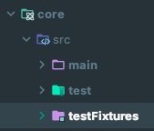

## 멀티 모듈을 적용하면서 (+ CQRS 적용)

최근 사이드 프로젝트에서 멀티모듈을 적용하면서 생긴 문제점들과 해결 과정을 공유하고자 한다.

우선 결과를 간단하게 설명하자면 아래와 같이 생긴 싱글 모듈 프로젝트를



아래와 같이 네 개의 모듈로 분리할 수 있었다.



추가적으로 Common 모듈이나 다른 모듈로 분리를 추가해도 문제가 없다.

## 멀티 모듈

영상 플랫폼을 개발하면서 아래의 두 가지에 대한 해결이 필요했다. 

### 1. 조회수를 캐싱해서 매번 쿼리를 보내는 것이 아닌 시간 단위로 반영해야 한다. (Write Back)

조회 수를 매번 Update문으로 해결하면 DB에 부하가 매우 커질 것이라고 판단했다.

시간 단위로 Write Back을 해서 DB에 반영할 수 있도록 작업이 필요했고, 해당 작업을 Scheduler로 반영을 하게 되었다.

그래서 해당 API에 Scheduler를 추가하자니 아래의 문제가 있었다.

- 주 관심사인 메인 API로 성능 및 장애가 전파되어도 되는가?
- 메인 API에 코드를 작성해서 한 번에 관리해도 되는가? (메인 프로덕션 코드가 지저분해 질 수 있었다.)

고민 끝에 별도의 Batch Server 프로그램이 필요하다고 판단했다.

### 2. 명령 모델이 생성될 시점에 조회 모델도 생성되어야 한다.

CQRS를 적용하면서 발생한 문제이다.

명령 모델이 생성되면 이벤트를 전파해서 조회 모델을 생성해야 한다.

이때도 아래의 문제가 생길 수 있다.
- 조회 모델 생성이 주 관심사인 메인 API와 성능을 공유한다.
- 조회 모델 생성이 실패하면 주 관심사인 명령 모델 생성도 생성이 실패한다.

사실 이 점이 가장 고민이 많았다.

명령 모델이 생성되면 곧바로 조회가 가능해야 하는 것이 아닐까..?! 그렇다면 조회 모델도 동일한 트랜잭션 내에 존재해야 하는 것이 아닌가..? 하는 고민이었다.

고민을 해소하기 위해 아래의 자료를 참고했다.

- 최범균 - CQRS 아는 척하기 시리즈
- [우아콘2020] 배민 프론트서버의 사실과 오해
- [우아한Tech] B마트 전시 도메인 CQRS 적용하기

해당 강연들에서 주로 볼 내용은 Eventually Consistency(최종적 일관성)이다. 시스템 간 강결합(코드, 성능, 로직)을 제거하고 MQ를 활용한 이벤트 발행을 통해 최종적 일관성을 비 정규화된 데이터 형태로 조회 모델로서 저장하게 된다.

CQRS에서 조회 모델 생성을 비 관심사로 볼 지는 프로젝트의 특징에 따라 다를 것 같다.

개발중인 프로젝트에서는 조회 모델 생성이 **동시**에 이뤄지지 않아도 크게 상관이 없었다. 그래서 Consumer 모듈을 분리를 하게 되었다.

## 모듈 구성

각 모듈에 대한 빌드는 root 프로젝트를 기준으로 진행한다.

각 모듈은 src 패키지와 build.gradle 파일만 존재해야 한다.



추가로 멀티 모듈을 (혼자) 처음으로 구성하면서 어려웠던 점이 생각보다 조금 있었던 것 같다.

(QueryDSL, Jacoco, Asciidoctor 때문에 Build.gradle을 구성하는 데에만 하루가 걸렸다.. 특히 QueryDSL...)

각 요소에 대한 설명을 담기에는 포스팅이 너무 커질 수 있어서 아래에서 링크를 첨부했다.

각 모듈에 대한 의존성은 아래 Repository에서 확인할 수 있다. (Gradle 7.5 기반)
- https://github.com/verby-korea/verby-server

## 문제 해결

아래는 멀티 모듈을 구성하기 위해 문제를 해결하면서 알게된 사실이다.

### jar / bootJar

멀티 모듈을 다 구성했고 IntelliJ에서 테스트 및 빌드가 성공하는데 자꾸 CI/CD가 깨지는 현상이 발생했다.



에러 내용을 보면 Import가 자꾸 실패하거나 NoClassDefFoundError라고면서 테스트가 깨진다.

해당 내용은 IntelliJ에서 Gradle을 Build 할 때는 이상이 없지만, ./gradlew build와 같이 내장 그래들로 빌드할 경우 테스트가 깨지는 현상이 발생한다.

해당 원인은 Gradle에서 Java library plugin 및 Java test fixtures 플러그인을 사용할 때 jar를 수행하지 않으면 프로덕션 클래스가 BOOT_INF/classes 디렉터리 아래에 있어 패키지를 찾을 수 없는 문제가 발생하기 때문이다.

해당 원인을 해결하는 방법은 아래와 같다.

1. 테스트 classpath 명시

```groovy
test {
  // Make sure the classes dir is used on the test classpath.
  // When test fixtures are involved, the JAR is used by default
  classpath = sourceSets.main.output.classesDirs + classpath - files(jar.archiveFile)
} 
```

아래와 같이 테스트 클래스를 조정하면 테스트가 깨지지 않는다. (dir 클래스 추가 + jar 경로 제거)

2. 다른 방법은 jar을 수행하는 것이다.

싱글 모듈 프로젝트에서는 plain-jar가 생기는 것을 방지하기 위해서 jar을 disabled 처리하였다.

아래 처럼 그냥 jar을 허용하면 해당 이슈가 해결된다. (default라서 생략 가능)
```groovy
jar {
    enabled = true
}
```

그러면 여전히 plain-jar가 생성되는 문제가 생길 수 있다.

이는 아래와 같이 구성된 빌드 스크립트에서 plain-jar를 인식하기 때문에 생기는 이슈이다.

```
JAR_NAME=$(ls $REPOSITORY/jar/ |grep 'api-server' | tail -n 1)
```

해당 부분에서 `tail`을 `head`로 바꾸면 처리가 가능했다.

```
JAR_NAME=$(ls $REPOSITORY/jar/ |grep 'api-server' | head -n 1)
```


아니면 다른 방법도 있는데 그냥 jar 파일명을 변경하면된다.
```groovy
bootJar {
    archiveFileName = "another-name.jar"
}
```

```groovy
bootJar {
    archiveClassifier.set("boot")
}
```

아래와 같이 bootJar로 인해서 생성되는 파일 명을 새롭게 정의하고, 해당 파일명을 이용해서 빌드스크립트를 구성하면 쉽게 해결이 가능하다.
```
JAR_NAME=$(ls $REPOSITORY/jar/ |grep 'another-name' | tail -n 1)
```

**<참고>**
- https://github.com/gradle/gradle/issues/11696
- https://github.com/spring-projects/spring-boot/issues/19380

## yml

모듈을 구성하고 나니 core모듈의 프로퍼티가 web-server, batch-server 모듈에도 필요했다. 그래서 DRY 원칙에 따라 해당 프로퍼티를 한 곳으로 모아주는 처리가 필요했다.

권용근님의 custom-yaml-importer를 적용해봤으나, 프로젝트 버전 기준으로는 빌드가 제대로 동작하지 않았다. (런타임에만 동작함)

그래서 각 profiles에 core를 추가해준다.
```yaml
spring:
  profiles:
    include:
      - core
```

그리고 core모듈에서 application-core.yml을 작성해주면 된다.



그러면 각 실행 application에서 하위 듈의 yml을 가져다가 쓸 수 있게 된다.

`application-core.yml`에서 환경 분리를 하고 싶다면 아래와 같이 구성할 수 있다.

```yaml
---
spring.profiles: local
spring:
  datasource:
    url:  jdbc:h2:mem:multi
    username: SA
    password:

---
spring.profiles: dev
spring:
  datasource:
    url:  jdbc:h2:mem:multi-dev
    username: dbdev
    password: dbdevpassword

---
spring.profiles: stage
spring:
  datasource:
    url:  jdbc:h2:mem:multi-stage
    username: dbstage
    password: dbstagepassword
```

물론 DB 설정 부분은 `${MAIN_DB_URL}`처럼 시스템 변수를 받아오도록 사용할 수도 있다.

## TestFixture

jar, bootJar때 TestFixture 때문에 테스트가 깨지는 이슈가 발생했었다. TestFixture란 무엇일까..?

멀티모듈 프로젝트를 진행하더라고 프로덕션 코드는 공유하지만 테스트에서 사용하는 Support 코드는 공유할 수 없다.

java-test-fixtures 플러그인을 사용하면 이를 손쉽게 해결할 수 있었다.

```groovy
plugins {
    id 'java-test-fixtures'
}
```

java-test-fixtures plugin을 추가하고 아래와 같이 testFixtures 폴더를 만들어서 Support 클래스들을 넣는다.



그리고 api-server, batch-server 등 core 모듈안의 testFixtures를 사용하려면 아래의 dependency를 추가하기만 하면 된다.
- testImplementation(testFixtures(project(":core")))

## 추가로 해결할 문제

위 문제들을 해결하고 멀티 모듈을 구성을 완료했고 배포까지 완료했다.

하지만, 추가적으로 아쉬운 부분이 조금 남아있다.

### 배포

현재 CI/CD가 돌면 모든 프로젝트를 배포해버린다.

```shell
hooks:
  ApplicationStart:
    - location: scripts/deploy-api.sh
      timeout: 60
      runas: ec2-user

    - location: scripts/deploy-batch.sh
      timeout: 60
      runas: ec2-user

    - location: scripts/deploy-internal-consumer.sh
      timeout: 60
      runas: ec2-user
```

해당 부분은 수정이 이뤄지지 않은 다른 모듈까지 배포 프로세스가 진행된다는 단점이 있다.

```yaml
.api-module:
  variables:
    MODULE_NAME: "api"
  only:
    changes:
      - "api-server/**/*"
      - "core/**/*"
```

그래서 위와 같이 only.changes 구문으로 변경 내역이 있는 모듈만 배포하는 전략 적용이 필요하다.

<참고>
- https://docs.aws.amazon.com/ko_kr/codebuild/latest/userguide/sample-pipeline-multi-input-output.html

### CQRS

조회 모델로 Redis를 선택하면서 생긴 이슈이다.

Redis는 Key-Value 기반 데이터이기 때문에 Feed(프로젝트 메인 데이터) 목록에서 질의를 할 수 없었다.


## 참고
- https://techblog.woowahan.com/2637
- https://techblog.woowahan.com/7835
- https://redis.io/docs/manual/pubsub
- http://redisgate.kr/redis/command/pubsub_intro.php
- https://www.youtube.com/watch?v=fg5xbs59Lro
- https://www.youtube.com/watch?v=38cmd_fYwQk
- https://www.youtube.com/watch?v=b65zIH7sDug


