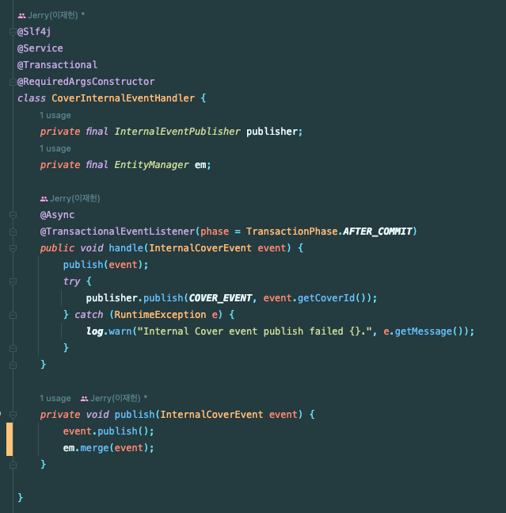

최근 사이드 프로젝트에서 멀티모듈을 적용하면서 생긴 문제점들과 해결 과정을 공유하고자 한다.

기존의 싱글 모듈 프로젝트를 아래 네 개의 모듈로 분리할 수 있었다.


멀티 모듈을 적용한 부분과 이벤트 기반 아키텍처를 적용한 부분에 대해 다룬다.

## 멀티 모듈

아래는 멀티 모듈을 적용해보게 된 이유에 대해 설명한다. 

#### 1. Write Back (주기 반영)

조회가 1회 발생할 때마다 조회 수를 매번 Update문으로 갱신하면 DB에 부하가 매우 커질 것이라고 판단했다.

- 쓰기 락으로 인해 처리량 감소 -> DB 커넥션 쌓임
- TPS 저하 및 DB 서버 부하 상승

그래서 Write Back을 해서 일정 주기로 DB에 반영할 수 있도록 작업이 필요했다. 즉, **Scheduler가 필요**했다.


API에 Scheduler를 추가를 하려고 했다가 아래의 단점 때문에 **별도 프로젝트가 필요**하다고 판단하게 되었다.
- **메인 코드가 방대**해진다.
- **주 관심사(API 기능)에 성능 및 장애가 전파**된다.

#### 2. 명령 모델이 생성될 시점에 조회 모델도 생성되어야 한다.

CQRS를 적용하면서 발생한 이슈로 명령 모델이 생성되면 **이벤트를 전파**해서 **조회 모델을 생성**해야 한다.


API 서버에서 이벤트를 소비하기에는 아래 문제가 있었다.
- 메인 코드가 방대해진다.
- 비 관심사(조회 모델 생성)가 **주 관심사(API 기능)와 성능을 공유**한다.

#### 강한 일관성 vs 최종적 일관성

여기서 고민이 1가지 있었는데 '**명령 모델이 생성되면 곧바로 조회가 가능해야 하는 것이 아닐까**'였다.

명령 모델과 조회 모델 생성은 동일 트랜잭션을 보장해야 할까?


프로젝트에서는 영상 플랫폼이라 **조회 모델 생성이 동시에 이뤄지지 않아도 크게 상관이 없었다.** 그래서 MQ를 통해 이벤트를 발행하고, Consumer에서 조회 모델 생성하도록 설계하게 되었다.

즉, **별도의 Consumer 모듈이 필요**하다.

## 이벤트 기반 아키텍처

이벤트를 담을 MQ는 클라우드 비용 문제로 Redis Pub/Sub를 사용하게 되었다.
- OCI 프리티어를 사용했다.

외부 이벤트는 **발행이 실패할 경우**에 대한 처리가 필요하므로 **Transactional Outbox 패턴**으로 동일 Transaction에서 Event 정보를 DB에 저장한다.


발행된 이벤트는 아래와 같이 Redis Pub/Sub을 타고 전파된다.



`event.publish`는 `isPublished`를 `true`로 처리한다.

즉, 실제로 발행되지 않은 이벤트는 여전히 `false`로 남아있으므로 배치로 처리할 수 있게 되었다.

## CQRS

아래는 이벤트를 구독하는 코드이다. 이벤트를 소비하는 측은 조회 모델을 저장해야 한다.


배민 B마트 CQRS 강연에서는 조회 모델로 Redis를 사용하고 있다는 것을 보고 적용했었다. 나도 조회 모델 저장소로 **Redis를 선택**했었다.
문제는 Redis는 Key-Value 기반 데이터이기 때문에 제목, 본문 등으로 질의가 사실상 불가능했다.


강연에서도 추가 요구사항에 따라서 Mongo나 ES 등으로 교체할 수도 있다고 한다.

배민 가게노출 시스템에서는 아래와 같이 **질의를 위한 DynamoDB**와 **캐싱을 위한 Redis를 각각** 사용하고 있다는 강연을 봤다.


그래서 복잡한 질의의 경우에는 DynamoDB, MongoDB와 같은 DB에서 처리를 한다고 한다.

#### Mongo + Redis

그래서 CQRS의 이점을 활용하기 위해 MongoDB 처럼 질의가 가능한 DB를 두고, Redis에 간단한 질의에 대한 정보를 캐싱하도록 했다.

API 서버의 전체 아키텍처는 아래와 같다.


- 명령(Command)은 Maria DB에서 수행한다.
- 간단한 조회(Query)는 Redis에서 수행한다.
  - Redis는 MongoDB의 데이터를 캐싱한다.
- 복잡한 조회(Query)는 MongoDB에서 수행한다.

#### EventHandler

아래는 최종적으로 반영된 코드이다. Cover가 생성 및 수정될 때 아래 코드를 수행한다.


1. 명령 모델 및 부속 데이터를 조회해서 **조회 모델로 변환**한다.
2. 조회 모델을 저장한다.
3. Redis에 해당 조회 모델을 캐싱한다.

## 문제 해결

멀티 모듈을 구성하면서 생긴 문제를 해결한 내용에 대해 가볍게 공유한다.

#### yml

core 모듈의 프로퍼티가 web-server, batch-server 모듈에도 필요했다. 그래서 사용하는 모듈의 프로퍼티를 읽는 것이 필요했다.

이는 각 profiles에 core를 추가해주면 동작한다.

```yaml
spring:
  profiles:
    include:
      - core
```

그리고 core 모듈에서 application-core.yml을 작성해주면 된다.


`application-core.yml`에서 환경 분리를 하고 싶다면 아래와 같이 구성할 수 있다.

```yaml
---
spring.profiles: dev
spring:
  datasource:
    url:  jdbc:h2:mem:multi-dev
    username: dev
    password: dev

---
spring.profiles: real
spring:
  datasource:
    url: ${MAIN_DB_URL}
    username: ${MAIN_DB_USERNAME}
    password: ${MAIN_DB_PASSWORD}
```

다른 방법도 있다. core 모듈의 yml 파일도 환경 별로 분리하고 싶다면 메인 모듈에서 **grouping**을 사용하면 된다.

```yaml
spring:
  profiles:
    active: dev
    group:
      "dev": "core-dev,common"
      "prod": "core-prod,common"
```

#### TestFixture

멀티모듈 프로젝트에서 테스트 패키지의 일부 코드를 공유하고 싶을 때 **TestFixture**를 사용할 수 있다.

아래와 같이 `java-test-fixtures` 플러그인을 명시하기만 하면 된다.

```groovy
plugins {
    id 'java-test-fixtures'
}
```

`src` 밑에 `testFixtures` 폴더를 만들어서 Support 클래스들을 넣는다.


예를 들어 batch-server 모듈의 테스트에서 core 모듈의 testFixtures를 사용하려면 아래의 dependency를 추가하면 된다.
- `testImplementation(testFixtures(project(":core")))`

#### 배포

멀티 모듈에서 중요한 것은 변경된 모듈만 CI/CD를 실행하는 것이다.

Gitlab CI를 사용하면 아래와 같이 편리하게 사용할 수 있다.

```yaml
.api-module:
  variables:
    MODULE_NAME: "api"
  only:
    changes:
      - "api-server/**/*"
      - "core/**/*"
```

CircleCI에서는 많이 복잡했다. 아래 포스팅에서 상세하게 정리했으니 참고하자. (삽질을 많이헀다.)
- 멀티 모듈 CI/CD 적용: https://jaehoney.tistory.com/253

#### 마무리

**멀티 모듈**과 **CQRS**, **이벤트 기반 아키텍처**를 처음으로 적용해보는데 엔지니어링 하는 게 너무 재밌었다!

다음에는 `Axon Framework`로 SAGA 패턴을 진행해보겠다.

## 참고
- https://techblog.woowahan.com/2637
- https://techblog.woowahan.com/7835
- https://redis.io/docs/manual/pubsub
- http://redisgate.kr/redis/command/pubsub_intro.php
- https://www.youtube.com/watch?v=fg5xbs59Lro
- https://www.youtube.com/watch?v=38cmd_fYwQk
- https://www.youtube.com/watch?v=b65zIH7sDug
- https://techblog.woowahan.com/2667
- https://www.cohesity.com/blogs/strict-vs-eventual-consistency/