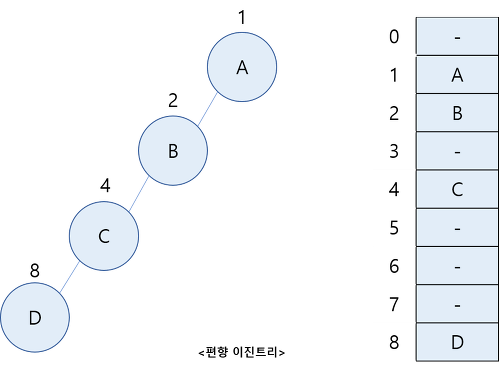

## 레드-블랙 트리(Red-Black Tree)를 왜 사용할까?

레드 블랙 트리(Red-Black Tree)는 어떤 목적을 위해서 사용할까? 알아보자.

먼저 자바의 TreeSet과 TreeMap은 레드-블랙 트리를 베이스로 한 구현을 사용한다.

우리가 트리에 저장하는 절차를 살펴보자.

## 사용 이유

일반적인 트리 구조에서는 삽입할 데이터 n이 있을 때 부모 노드부터 탐색하면서 삽입한 데이터보다 n이 해당 노드보다 작으면 왼쪽 노드에, 해당 노드보다 크면 오른쪽 노드에 저장한다.

그럼 데이터 1, 2, 4, 8이 저장되면 어떻게 될까?

편향 이진 트리가 된다. 배열로 표현하면 공간도 많이 소모될 뿐 아니라 탐색하는데 시간 복잡도 O(n)이 소모된다.

이러한 현상을 막으려면 중간중간에 **재배열**을 해서 아래와 같이 균형 이진 트리로 만들어줘야 한다.

이를 자가 균형 이진 트리라고 한다.
- 대표적으로 레드-블랙 트리(Red-Black Tree), AVL 트리(AVL Tree)가 있다.