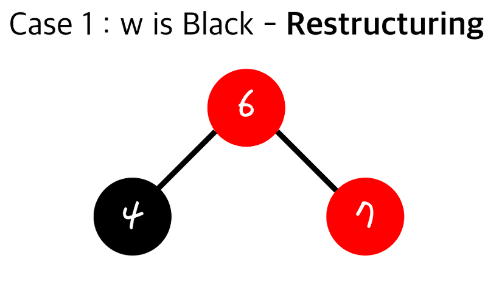

## 레드-블랙 트리(Red-Black Tree)를 왜 사용할까?

레드 블랙 트리(Red-Black Tree)는 어떤 목적을 위해서 사용할까? 알아보자.

먼저 자바의 TreeSet과 TreeMap은 레드-블랙 트리를 베이스로 한 구현을 사용한다.

우리가 트리에 저장하는 절차를 살펴보자.

## 사용 이유

일반적인 트리 구조에서는 삽입할 데이터 n이 있을 때 부모 노드부터 탐색하면서 삽입한 데이터보다 n이 해당 노드보다 작으면 왼쪽 노드에, 해당 노드보다 크면 오른쪽 노드에 저장한다.

그럼 데이터 1, 2, 4, 8이 저장되면 어떻게 될까?

편향 이진 트리가 된다.

배열로 표현하면 공간도 많이 소모될 뿐 아니라 탐색하는데 시간 복잡도 O(n)이 소모된다.

이러한 현상을 막으려면 중간중간에 **재배열**을 해서 위와 같이 시간복잡도가 O(log n)인 균형 이진 트리로 만들어줘야 한다.

중간중간 재배열을 해서 **균형 이진 트리** 형태를 유지하는 자료구조를 **자가 균형 이진 트리**라고 한다.

Worst Case에서도 O(log n)의 탐색 시간으로 탐색하기 위해서는 자가 균형 이진 트리가 필요하게 된다.

- 자가 균형 이진 트리의 종류는 대표적으로 **레드-블랙 트리(Red-Black Tree)**, **AVL 트리(AVL Tree)**가 있다.

여기까지가 Red-Black Tree를 사용하는 이유이다.

## 구현

레드-블랙 트리는 다음의 조건들을 만족한다.
1. 모든 노드는 빨간색 혹은 검은색이다.
2. 루트 노드는 검은색이다.
3. 빨간색 노드의 자식은 반드시 검은색이다.
4. 모든 리프 노드에서 Black Depth는 같다. (리프 노드에서 루트 노드까지의 경로 중 검은 노드의 개수가 같다.

루트 노드가 있다.

노드를 두 개 삽입하면 위의 상태가 된다. (삽입되는 노드는 무조건 Red이다.)

여기서 3을 삽입해보자.

이러면 위의 3번 조건에 어긋나게 된다. (빨간색 노드의 자식이 빨간색인 상태)

삽입, 삭제로 인해서 위의 조건에서 어긋날 때 아래의 과정 중 하나를 거친다.
- Restructuring
- Recoloring

각 과정을 선택하는 기준은 이러하다.

- z를 기준으로 볼 때 w(부모의 형제)가 검정(Black)일 땐 Restructuring을 수행한다.
- z를 기준으로 볼 때 w(부모의 형제)가 빨강(Red)일 땐 Recoloring을 수행한다.

### Restructuring

한쪽으로 데이터가 쏠리지 않게 재정렬 하는 작업이라고 생각하면 쉽다.

(매우 단순하다!!)

1. 리프 노드의 부모와 조부를 재정렬한 후
2. 부모 노드를 검정(Black)으로 만들고 자식을 Red로 만든다.
3. 기존의 자식을 추가해주면 된다.

Restructuring은 수행 전과 수행 후 Black Depth가 동일하므로 다른 서브트리에 영향을 끼치지 않는다.

Restructuring은 O(1)의 시간복잡도를 가진다.

### Recoloring

Recoloring은 노드의 배치는 그대로 두고 색상만 변경해서 위배한 조건을 만족할 수 있도록 처리되는 작업이다.

Recoloring은 다음의 과정을 수행한다.
- 부모와 그 형제를 검정(Black)으로 하고, 조부모를 빨강(Red)로 한다.
- (조부모가 Root가 아닐 시 3번 조건을 불만족할 수 있다.)

이때 변경된 트리가 서브트리라면 조부모 노드가 빨간색이므로 3번 조건에 또 위배될 수 있다.

그때는 조건을 만족할 때까지 거슬러 올라가면서 Recoloring을 수행하게 된다.

서브 트리의 조부모 노드가 루트 노드라면 블랙(Black)으로 바꿔주면 된다.

Recoloring은 시간 복잡도 O(log N)을 가진다.

## 참고
- https://code-lab1.tistory.com/62
- https://zeddios.tistory.com/237