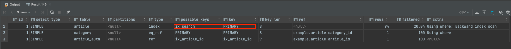
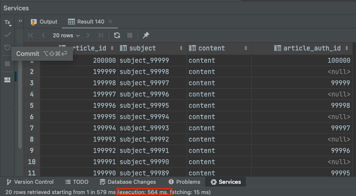
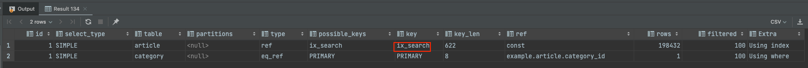
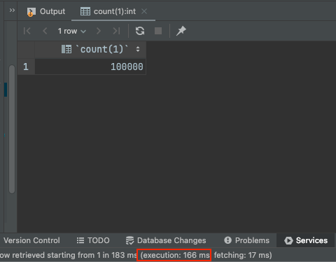
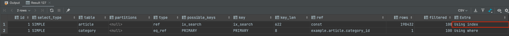
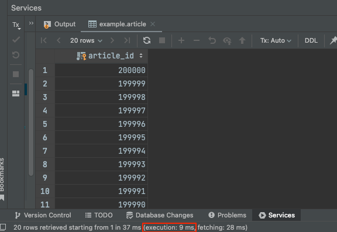
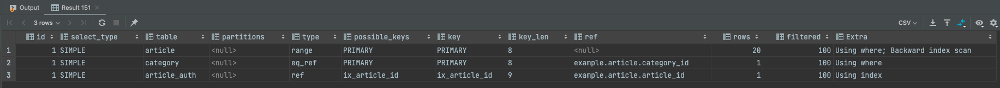
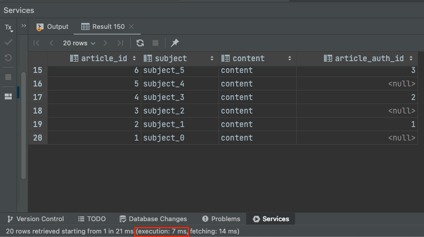

아래는 실무에서 **Querydsl**을 사용해서 Pagination 조회 기능을 **커버링 인덱스로 성능을 개선**했던 내용이다.

커버링 인덱스에 대해서는 지난 포스팅을 참고하자.

- [https://jaehoney.tistory.com/216](https://jaehoney.tistory.com/216)

아래 포스팅에서는 예시를 위한 더미 데이터를 사용했으며, Category 10만, Article 300만, ArticleAuth 100만건으로 구성했다.

## 기존 쿼리

기존에는 Querydsl을 통해 아래의 쿼리문으로 데이터를 조회하고 있었다.

(예시를 위해 구현한 부분이고, 실제로는 훨씬 더 복잡하다.)

```sql
select article.article_id,
       article.subject,
       article.content,
       article_auth.article_auth_id
       # .. 생략
from article
left outer join
     category on (category.category_id = article.category_id)
left outer join
    article_auth on (article_auth.article_id = article.article_id)
where
    region_code = 'KR' and
    (category.is_public = true or category.category_id is null)
    # 검색조건
order by article.article_id desc
limit 0, 20;
```

실행 계획은 아래와 같다.



여기서 문제가 메인 쿼리에서 인덱스를 안타고 PK를 타고 있었다.

소요 시간은 아래와 같다.



**564ms**가 소요되었다.

(실무의 쿼리는 훨씬 복잡하고 데이터도 많아서 2초 이상 소요되었고 TPS가 너무 낮았다. 그래서 개선이 필요하게 되었다.)

#### 카운트 쿼리

아래는 카운트 쿼리이다.

```sql
select count(1)
from article
left outer join
     category on (category.category_id = article.category_id)
where
    region_code = 'KR' and
    (category.is_public = true or category.category_id is null)
    # 검색조건
limit 0, 20;
```



카운트 쿼리는 정상적으로 인덱스를 타고 있었다.



**실행 시간은 166ms**가 소요되었다.

#### 프로덕션 코드 (QueryDsl)

Repository 코드는 아래와 같다.

```java
@Repository
public class ArticleRepositoryImpl {
    private final JPAQueryFactory jpaQueryFactory;
    private final Querydsl querydsl;

    public AsIfRepository(JPAQueryFactory jpaQueryFactory, EntityManager entityManager) {
        this.jpaQueryFactory = jpaQueryFactory;
        this.querydsl = new Querydsl(entityManager, new PathBuilderFactory().create(Article.class));
    }

    public Page<ArticleInfo> findList(String regionCode, Pageable pageable) {
        JPAQuery<ArticleInfo> baseQuery = jpaQueryFactory
            .select(new QArticleInfo(
                article.articleId,
                article.subject,
                article.content,
                category.categoryId,
                articleAuth.articleAuthId
            ))
            .from(article)
            .leftJoin(category)
            .on(category.categoryId.eq(article.categoryId))
            .leftJoin(articleAuth)
            .on(articleAuth.articleId.eq(article.articleId))
            .where(
                article.regionCode.eq(regionCode),
                category.isPublic.eq(true).or(category.categoryId.isNull())
            );

        JPQLQuery<ArticleInfo> pagingQuery = querydsl.applyPagination(pageable, baseQuery);

        JPAQuery<Long> countQuery = createCountQuery(baseQuery.getMetadata().getWhere());

        return PageableExecutionUtils.getPage(pagingQuery.fetch(), pageable, countQuery::fetchOne);
    }

    private JPAQuery<Long> createCountQuery(Predicate whereCondition) {
        return jpaQueryFactory.select(article.count())
            .from(article)
            .where(whereCondition)
            .leftJoin(category)
            .on(category.categoryId.eq(article.categoryId));
    }
}
```

해당 코드를 커버링 인덱스 기법을 활용한 조회로 바꿔보자.

## 커버링 인덱스 적용

**기존 - 2개의 쿼리를 수행**

- 목록 조회
- 카운트 조회

**커버링 인덱스 조회 - 3개의 쿼리를 수행**

- 커버링 인덱스 조회
- 카운트 조회
- 데이터 블록 조회

#### 1. 커버링 인덱스 조회

아래는 article의 id만 조회하는 커버링 인덱스 쿼리이다.
```sql
select article.article_id
from article
left outer join
     category on (category.category_id = article.category_id)
where
    region_code = 'KR' and
    (category.is_public = true or category.category_id is null)
    # 검색조건
order by article.article_id desc
    limit 0, 20;
```
달라진 점은 아래와 같다.
- select절에 article_id만 포함되어서 모든 쿼리를 인덱스로 커버할 수 있게 되었다.
  - 실제 데이터 블록에 접근하지 않을 수 있다.
  - 인덱스를 유도하는 효과가 있다.
- 결과 row 수에 영향을 미치지 않는 join을 제거
  - article_auth의 경우 1:0..1 이기 때문에 Left Outer Join을 지금 당장 할 필요가 없다.
  - 후속으로 처리하면 내부적으로 정렬 등의 처리할 대상이 훨씬 간소화된다.

아래는 실행 계획이다.



실행 계획을 보면 **커버링인덱스(use index)**로 조회를 했고, PK가 아니라 사용된 인덱스를 사용할 수 있었다.



실행 시간은 **9ms**가 소요되었다.

커버링인덱스는 쿼리 실행 순서에 맞게 개발자가 최적화된 조회를 구성할 수 있다는 장점이 있다.

여기서 드라마틱한 변화를 만든 것은 인덱스만으로 조회가 가능하므로 Optimizer가 좋은 인덱스를 선택하게 유도한 것이었다.
- 기존에는 Optimizer가 해당 index로 모든 쿼리를 커버할 수 없다는 이유로 PK를 선택하고 있었다.

#### 2. 카운트 쿼리

카운트 쿼리는 기존과 동일하다.

```sql
select count(1)
from article
left outer join
     category on (category.category_id = article.category_id)
where
    region_code = 'KR' and
    (category.is_public = true or category.category_id is null)
    # 검색조건
limit 0, 20;
```

카운트 쿼리도 커버링 인덱스로 조회를 하고 있다.


#### 3. 목록 조회

마지막으로 SELECT를 해서 살을 붙이는 쿼리이다.

```sql
select article.article_id,
       article.subject,
       article.content,
       article_auth.article_auth_id
       # .. 생략
from article
         left outer join
     category on (category.category_id = article.category_id)
         left outer join
     article_auth on (article_auth.article_id = article.article_id)
where
    article.article_id in (1, 2, 3, 4, 5, 6, 7, 8, 9, 10, 11, 12, 13, 14, 15, 16, 17, 18, 19, 20) and
    (category.is_public = true or category.category_id is null)
order by article.article_id desc
```

아래는 실행 계획이다.



별도의 Non-Clustered Index를 사용하지 않고 PK 기반 range 스캔으로 조회할 수 있다.



실행 소요 시간은 **7ms**이다.

### 프로덕션 코드 (QueryDsl)

Querydsl을 사용한 Java 코드는 아래와 같이 작성했다.

```java
@Repository
public class ArticleRepositoryImpl {
    private final JPAQueryFactory jpaQueryFactory;
    private final CategoryRepository categoryRepository;
    private final Querydsl querydsl;

    public ArticleRepositoryImpl(JPAQueryFactory jpaQueryFactory, CategoryRepository categoryRepository,
        EntityManager entityManager) {
        this.jpaQueryFactory = jpaQueryFactory;
        this.categoryRepository = categoryRepository;
        this.querydsl = new Querydsl(entityManager, new PathBuilderFactory().create(Article.class));
    }

    public Page<ArticleInfo> findList(String regionCode, Pageable pageable) {
        // 조회 대상 id 목록을 커버링 인덱스로 조회한다.
        JPAQuery<Long> idsQuery = jpaQueryFactory
            .select(article.articleId)
            .from(article)
            .where(
                article.regionCode.eq(regionCode),
                category.isPublic.eq(true).or(category.categoryId.isNull())
            );

        // 페이지 네이션 적용 (offset, limit, sort) 후 쿼리 실행
        List<Long> ids = querydsl.applyPagination(pageable, idsQuery).fetch();

        // 토탈 개수를 위해 카운트 쿼리를 생성한다. -> where 재사용
        JPAQuery<Long> countQuery = createCountQuery(idsQuery.getMetadata().getWhere());

        // 실제 데이터 블록 조회 쿼리
        JPAQuery<ArticleInfo> dataQuery = jpaQueryFactory.select(new QArticleInfo(article, articleAuth))
            .from(article)
            .leftJoin(articleAuth)
            .on(articleAuth.articleId.eq(article.articleId))
            .where(
                article.articleId.in(ids)
            );

        // 정렬 필드 적용 및 조회
        List<ArticleInfo> result = querydsl.applySorting(pageable.getSort(), dataQuery).fetch();

        return PageableExecutionUtils.getPage(result, pageable, countQuery::fetchOne);
    }

    private JPAQuery<Long> createCountQuery(Predicate whereCondition) {
        return jpaQueryFactory.select(article.count())
            .from(article)
            .where(whereCondition)
            .leftJoin(category)
            .on(category.categoryId.eq(article.categoryId));
    }
}
```

중요한 점은 카운트 쿼리에서 Where 조건을 PK 조회 쿼리와 동일하게 적용해야 한다.

- `jpaQuery(instance).getMetadata().getWhere()`로 재사용할 수 있었다.

추가로 count 쿼리의 결과가 바뀌진 않는 지 주의해야 한다. (기존 쿼리에 1:N LeftOuterJoin이 있는 경우 등)

## 결과 정리

샘플 데이터 기반으로 아래의 성능 변화가 있었다.

- 기존 쿼리
    - 목록 조회 - 564ms
    - 카운트 조회 - 166ms
- 커버링 인덱스 쿼리
    - id 조회 - 9ms
    - 카운트 쿼리 - 166ms
    - 내용 조회 (후속 쿼리) - 7ms

결과적으로 730ms -> 182ms 정도로 효율이 개선되었다.

(인덱스 유도 효과도 포함된 결과이다. Index를 강제로 태우는 것 대비해서는 2배 정도 개선되는 것으로 확인했다.)

#### 실제 운영 환경 변화 

샘플 데이터가 아니라, 실제 환경에서는 아래의 개선이 있었다.

**DB 조회 시간 감소**
- 기존 쿼리
    - 목록 조회 - 3s 362ms
    - 카운트 조회 - 207 ms
- 수정 후 쿼리
    - id 조회 - 123ms
    - 카운트 쿼리 - 207ms
    - 내용 조회 (후속 쿼리) - 180ms

**HTTP 트랜잭션 수행 시간 감소**

- 기존 - 3.792s
- 수정 후 - 371ms

즉, 커버링 인덱스를 적용하고 약 10배에 근접한 처리량 개선을 할 수 있었다. (인덱스 유도 효과도 포함된 결과이다. Index를 강제로 태우는 것 대비해서는 2배 ~ 3배 정도 개선되는 것으로 확인했다.)

### 번외 - Projection

추가로 필요하지 않는 컬럼까지 조회해서 성능을 낭비하는 문제가 있었다.

```java
@QueryProjection
public ArticleInfo(Article article, ArticleAuth articleAuth) {
    this.articleId = article.getArticleId();
    this.subject = article.getSubject();
    this.content = article.getContent();
    this.categoryId = article.getCategoryId();
    this.articleAuthId = articleAuth.getArticleAuthId();
}
```

해당 프로젝션을 사용하면 필요한 컬럼만 Select할 것을 예상하고 코드가 작성된 것 같다. 하지만 모든 필드를 조회하고 있었다.
- `@QueryProjection` 생성자의 인수로 필요한 컬럼만을 넘겨야 한다.
    - 엔터티를 넘겨서 의미 없는 컬럼까지 모두 조회하고 있었다.

그래서 아래와 같이 필요한 필드만 조회하도록 수정했다.

```java
@QueryProjection
public ArticleInfo(Long articleId, String subject, String content, Long categoryId, Long authId) {
    this.articleId = articleId;
    this.subject = subject;
    this.content = content;
    this.categoryId = categoryId;
    this.articleAuthId = authId;
}
```

실제 데이터 블록을 조회하는 쿼리를 위와 같이 변경한 이후에는 필요한 데이터만 조회할 수 있었다.