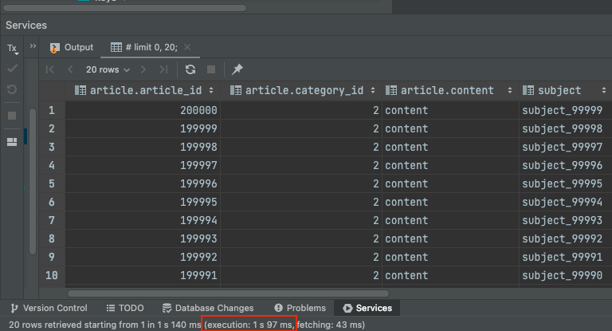
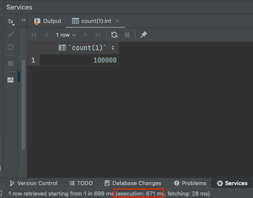

아래는 실무에서 Querydsl을 사용해서 Pagination 조회 기능을 커버링 인덱스로 성능을 개선했던 내용이다.

커버링 인덱스에 대해서는 지난 포스팅을 참고하자.

- [https://jaehoney.tistory.com/216](https://jaehoney.tistory.com/216)

## 기존 쿼리

기존에는 Querydsl을 통해 아래의 쿼리문으로 데이터를 조회하고 있었다.

```sql
select
    mail0_.id              as no1_7_0_,
    mail0_.office_id       as basic_in2_7_0_,
    # 생략 (메일 데이터)

    mailconfid2_.id        as no1_6_1_,
    mailconfid2_.office_id as basic_in2_6_1_,
    # 생략 (메일 상태 데이터)
from mail.mail_content mail0_
left outer join
     mail.mailbox mailbox_ on (
         mailbox_.id = mail0_.mbox_id
             and mail0_.office_id = mailbox_.office_id
    )
left outer join
     mail.mail_confidence mailconfid2_ on (
         mail0_.id = mailconfid2_.fk_mail_content_id
             and mail0_.office_id = mailconfid2_.office_id
             and mail0_.user_id = mailconfid2_.user_id
    )
where mail0_.del_flag = 'N'
  and mail0_.office_id = 1994
  and mail0_.user_id = 1
  and mailbox_.lockinfo_type not in ('LOCK', 'LIMIT')
limit 10
```

실행 계획은 아래와 같았다.


(메인 쿼리에서 인덱스를 안타고 PK를 타고 있었다.)

수행 시간은 환경별로 아래와 같았다.

- dev → 3s 362
- prod → 1s 491

count 쿼리의 경우 207ms가 소요되었다.

- dev → 207ms
- prod → 183ms

API 요청 수행 시간 (HTTP Transaction)

- dev → 3.79s

## 커버링 인덱스로 개선

**기존 - 2개의 쿼리를 수행**

- 목록 조회
- 카운트 조회

**수정 후 - 3개의 쿼리를 수행**

- 커버링 인덱스 조회
- 카운트 조회
- 목록 조회

아래는 수정 후 세개의 쿼리 내용과 처리 시간 및 실행 계획이다.

#### 1. 커버링 인덱스 조회

```sql
select mail0_.id as col_0_0_
from mail.mail_content mail0_
left outer join
     mail.mailbox mailbox_ on (
         mailbox_.id = mail0_.mbox_id
             and mail0_.office_id = mailbox_.office_id
    )
where mail0_.del_flag = 'N'
  and mail0_.office_id = 1994
  and mail0_.user_id = 1
  and (
      mailbox_.lockinfo_type not in ('A', 'B')
      or mailbox_.id is null
  )
limit 10
```

**dev - 123ms**가 소요되었다.



실행 계획을 보면 커버링인덱스로 조회를 했고, PK가 아니라 사용된 인덱스를 사용할 수 있었다.

#### 2. 카운트 쿼리

```sql
select count(mail0_.id) as col_0_0_
from
     mail.mail_content mail0_
left outer join
     mail.mailbox mailbox_ on (
         mailbox_.id = mail0_.mbox_id
             and mail0_.office_id = mailbox_.office_id
    )
where mail0_.del_flag = 'N'
  and mail0_.office_id = 1994
  and mail0_.user_id = 1
  and (
      mailbox_.lockinfo_type not in ('A', 'B')
      or mailbox_.id is null
  )
```

**dev - 351ms**가 소요

카운트 쿼리도 커버링 인덱스로 조회할 수 있었다.


#### 3. 목록 조회

마지막으로 SELECT를 해서 살을 붙이는 쿼리이다.

```sql
select
    mail0_.id as no1_7_0_,
    mail0_.office_id as basic_in2_7_0_,
    # 생략 (메일 데이터)

    mailconfid2_.id as no1_6_1_,
    mailconfid2_.office_id as basic_in2_6_1_,
    # 생략 (메일 상태 데이터)
from
   mail.mail_content mail0_
left outer join
    mail.mail_confidence mailconfid1_
    on (
        mail0_.id=mailconfid1_.fk_mail_content_id
            and mail0_.office_id=mailconfid1_.office_id
            and mail0_.user_id=mailconfid1_.user_id
    )
where
     mail0_.id in (
            ? , ? , ? , ? , ? , ? , ? , ? , ? , ? , ? , ? , ? , ? , ? , ? , ? , ? , ? , ?
    )
   and mail0_.office_id = 1994
   and mail0_.user_id = 1
```

**dev - 180ms** 소요



별도의 Non-Clustered Index를 사용하지 않고 PK만으로 조회를 하기 때문에 빠르게 수행이 가능하다.

### 실제 프로덕션 코드 (QueryDsl)

Querydsl을 사용한 Java 코드는 아래와 같이 작성했다.

```java
// 조회 대상 id 목록을 커버링 인덱스로 조회한다.
JPAQuery<Long> idsQuery = subJpaQueryFactory
        .select(mail.id.no)
        .from(mail)
        .leftJoin(mailbox)
        .on(mailbox.no.eq(mail.mailbox.id), mail.id.officeNo.eq(mailbox.officeId))
        .where(
                mail.id.officeId.eq(officeId),
                mail.userId.eq(userId),
                // 비즈니스 조건 적용 (생략)
        );

// 페이지 네이션을 적용하는 부분 (offset, limit을 써도 무방하다. 사내 라이브러리를 사용헀음)
JPQLQuery<Long> idsPageQuery = querydsl.applyPagination(pageable, idsQuery);

// 토탈 개수를 위해 카운트 쿼리를 날린다.
JPAQuery<Long> countQuery = createMailListCountQuery(idsPageQuery.getMetadata().getWhere());

// 조회 쿼리 실행
Page<Long> idsPage = PageableExecutionUtils.getPage(idsPageQuery.fetch(), pageable, countQuery::fetchOne);

// 실제 데이터 블록 조회 쿼리
JPAQuery<MailDto.ListInfo> query = subJpaQueryFactory.select(
        new QMailDto_ListInfo(mail, mailConfidence))
        .from(mail)
        .leftJoin(mailConfidence)
        .on(
                mail.id.eq(mailConfidence.mailContentId),
                mail.officeId.eq(mailConfidence.id.officeId),
                mail.userId.eq(mailConfidence.userId)
        )
        .where(
                mail.id.in(idsPage.getContent()),
                mail.officeNo.eq(officeId),
                mail.userId.eq(userId)
        );

// 정렬 필드 적용 및 조회
List<MailDto.ListInfo> result = querydsl.applySorting(pageable.getSort(), query).fetch();

return new PageImpl<>(result, idsPage.getPageable(), idsPage.getTotalElements());
```

중요한 점은 카운트 쿼리에서 Where 조건을 PK 조회 쿼리와 동일하게 적용해야 한다.

- `jpaQuery(instance).getMetadata().getWhere()`로 재사용할 수 있었다.

추가로 count 쿼리의 결과가 바뀌진 않는 지 주의해야 한다. (기존 쿼리에 LeftOuterJoin이 있는 경우, ...)

### Projection

추가로 아직 필요하지 않는 컬럼까지 조회해서 성능을 낭비하는 문제가 있었다.

- DTOProjection을 잘못 사용해서 문제가 발생하고 있었다.
- `@QueryProjection` 생성자의 인수로 필요한 컬럼만을 넘겨야 한다.
  - 기존 코드에서는 엔터티를 넘겨서 의미 없는 컬럼까지 모두 조회하고 있었다.

그래서 아래와 같이 필요한 필드만 조회하도록 수정했다.

```java
JPAQuery<MailDto.ListInfo> query = subJpaQueryFactory.select(
        new QMailDto_ListInfo(
                mail.id,
                // 필요한 메일 필드
                mailConfidence.id,
                // 필요한 인증 필드
        ))
        .from(mail)
        .leftJoin(mailConfidence)
        .on(
                mail.id.no.eq(mailConfidence.mailContentId),
                mail.id.officeNo.eq(mailConfidence.officeId),
                mail.userId.eq(mailConfidence.userId)
        )
        .where(
                mail.id.in(idsPage.getContent()),
                mail.officeId.eq(officeId),
                mail.userId.eq(userId)
        );
```

실제 데이터 블록을 조회하는 쿼리를 위와 같이 변경한 이후에는 필요한 데이터만 조회할 수 있었다.

## 결과 정리

dev 환경 기준으로 아래의 성능 변화가 있었다.

#### DB 조회

- 기존 쿼리
    - 목록 조회 - 3s 362ms
    - 카운트 조회 - 207 ms
- 수정 후 쿼리
    - id 조회 - 123ms
    - 카운트 쿼리 - 207ms
    - 내용 조회 (후속 쿼리) - 180ms

#### HTTP 트랜잭션 수행 시간

- 기존 - 3.792s
- 수정 후 - 371ms

즉, 커버링 인덱스를 적용하고 약 10배의 처리량 개선을 할 수 있었다.

커버링 인덱스가 왜 빠른 지에 대한 설명은 서론의 포스팅을 참고하자.

> (참고) 위 쿼리 중 Outer Join 때문에 TPS가 부족해서 이후에 튜닝을 다시 했다.  (10.8 -> 107.7)
> [https://github.com/violetbeach/blog-code/blob/master/loadtest/mail-api/readme.md#4-1-mails](https://github.com/violetbeach/blog-code/blob/master/loadtest/mail-api/readme.md#4-1-mails "https://github.com/violetbeach/blog-code/blob/master/loadtest/mail-api/readme.md#4-1-mails")