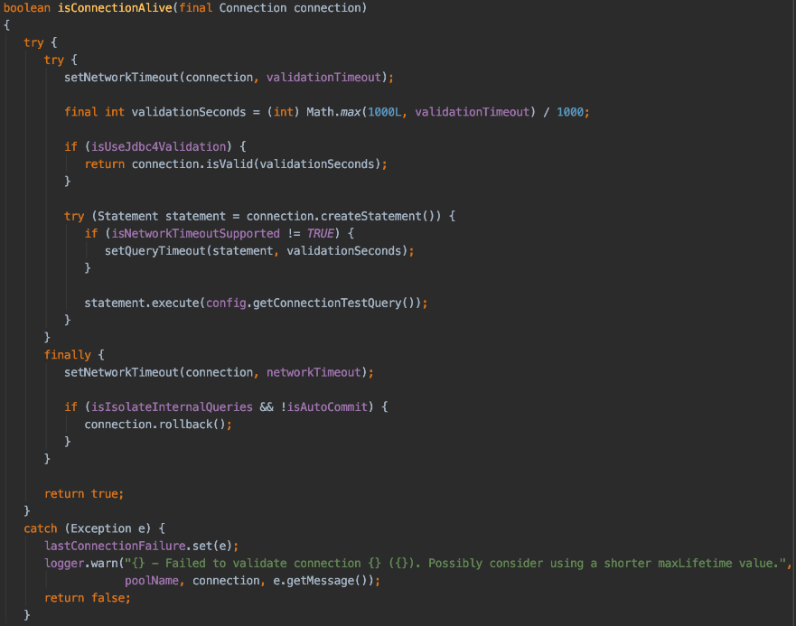

## HikariCP 커넥션 누수 해결기 (Session wait_timeout 적용!)

아래의 에러가 뜨면서 커넥션 연결이 실패하는 이슈가 발생했다.

```java
the last packet successfully received from the server was 30,035 milliseconds ago. The last packet  sent successfully to the server was 30,036 milliseconds ago.
```

조금더 로그를 올라가보니 이런 경고가 뜨고있었다. 아래와 같이 모든 커넥션으로 연결을 시도하다가 모두 실패했다.

```
2023-04-18 08:01:12.345  WARN 20 --- [nio-8080-exec-9] com.zaxxer.hikari.pool.PoolBase          : HikariPool-3 - Failed to validate connection com.mysql.cj.jdbc.ConnectionImpl@1d5d809b (No operations allowed after connection closed.). Possibly consider using a shorter maxLifetime value. 
2023-04-18 08:01:12.346  WARN 20 --- [nio-8080-exec-2] com.zaxxer.hikari.pool.PoolBase          : HikariPool-3 - Failed to validate connection com.mysql.cj.jdbc.ConnectionImpl@656228eb (No operations allowed after connection closed.). Possibly consider using a shorter maxLifetime value. 
2023-04-18 08:01:12.346  WARN 20 --- [nio-8080-exec-2] com.zaxxer.hikari.pool.PoolBase          : HikariPool-3 - Failed to validate connection com.mysql.cj.jdbc.ConnectionImpl@1ee6e7a8 (No operations allowed after connection closed.). Possibly consider using a shorter maxLifetime value. 
2023-04-18 08:01:12.347  WARN 20 --- [nio-8080-exec-9] com.zaxxer.hikari.pool.PoolBase          : HikariPool-3 - Failed to validate connection com.mysql.cj.jdbc.ConnectionImpl@100d934e (No operations allowed after connection closed.). Possibly consider using a shorter maxLifetime value. 
2023-04-18 08:01:12.347  WARN 20 --- [nio-8080-exec-2] com.zaxxer.hikari.pool.PoolBase          : HikariPool-3 - Failed to validate connection com.mysql.cj.jdbc.ConnectionImpl@316d65af (No operations allowed after connection closed.). Possibly consider using a shorter maxLifetime value. 
2023-04-18 08:01:12.347  WARN 20 --- [nio-8080-exec-9] com.zaxxer.hikari.pool.PoolBase          : HikariPool-3 - Failed to validate connection com.mysql.cj.jdbc.ConnectionImpl@5a179137 (No operations allowed after connection closed.). Possibly consider using a shorter maxLifetime value. 
2023-04-18 08:01:12.348  WARN 20 --- [nio-8080-exec-2] com.zaxxer.hikari.pool.PoolBase          : HikariPool-3 - Failed to validate connection com.mysql.cj.jdbc.ConnectionImpl@4cf3ac6d (No operations allowed after connection closed.). Possibly consider using a shorter maxLifetime value. 
2023-04-18 08:01:12.348  WARN 20 --- [nio-8080-exec-9] com.zaxxer.hikari.pool.PoolBase          : HikariPool-3 - Failed to validate connection com.mysql.cj.jdbc.ConnectionImpl@2bbf9bb6 (No operations allowed after connection closed.). Possibly consider using a shorter maxLifetime value. 
2023-04-18 08:01:12.348  WARN 20 --- [nio-8080-exec-2] com.zaxxer.hikari.pool.PoolBase          : HikariPool-3 - Failed to validate connection com.mysql.cj.jdbc.ConnectionImpl@38a2e068 (No operations allowed after connection closed.). Possibly consider using a shorter maxLifetime value. 
2023-04-18 08:01:12.349  WARN 20 --- [nio-8080-exec-9] com.zaxxer.hikari.pool.PoolBase          : HikariPool-3 - Failed to validate connection com.mysql.cj.jdbc.ConnectionImpl@1ed2242a (No operations allowed after connection closed.). Possibly consider using a shorter maxLifetime value. 
```

## 원인

원인은 사실 대부분 잘 알다시피 커넥션 누수다.

App단의 HikariCP의 maxTimeOut으로 인해 커넥션 연결을 끊기도 전에 MySQL에서 wait_timeout으로 인해 연결을 끊어버리면 위와 같이 커넥션 누수가 발생한다.
- HikariCP와 Tomcat-dbcp 철학이 달라서 발생한 문제라고 한다.
  - HikariCP는 Tomcat-dbcp와 달리 사용하지 않는 Connection을 빠르게 회수하도록 설계
  - Tomcat-dbcp는 지속적으로 DB에 Validation Query를 보내서 커넥션이 끊어지지 않도록 설계
  
## 해결 방법 (알려진 솔루션)



위는 PoolBase.isConnectionAlive() 메서드이다. HikariCP는 이미 닫힌 커넥션으로 어떤 행위도 할 수 없다. 로그만 찍어준다.

HikariConfig의 maxLifeTime이 끝나면 커넥션 풀에서 해당 커넥션을 종료 후 리소스(메모리)도 해제한다. 이후 커넥션 객체를 새로 생성해서 커넥션 풀에 추가한다. 

그래서 HikariCP의 철학대로 DB에서 wait_timeout으로 커넥션을 끊기 전에 App에서 Hikari의 maxTimeOut으로 인해 커넥션을 해제해야 한다.

### 1. maxTimeOut 조정

HikariCP에서는 maxTimeOut을 DB의 wait_timeout보다 2~3초 낮게 설정하는 것을 권장한다.

문제는 현재 MySQL 운영 서버의 wait_timeout이 15초이고, HikariCP의 maxTimeOut의 최솟값은 30초이다.

```java
private void validateNumerics(){
    if(maxLifetime!=0&&maxLifetime<SECONDS.toMillis(30)){
            LOGGER.warn("{} - maxLifetime is less than 30000ms, setting to default {}ms.",poolName,MAX_LIFETIME);
            maxLifetime=MAX_LIFETIME;
    }
    // ... 생략
}
```

HikariCP는 maxTimeOut을 30초보다 낮게 잡으면 Default인 30분으로 강제로 설정한다 ㅠ
- HikariCP에서 maxTimeOut이 너무 낮으면 성능 저하나 커넥션 끊기는 이슈가 발생을 우려한 부분이다.

결국 해당 부분은 라이브러리를 고쳐야 했는데 권장되지 않는 방법이라서 적용하지 않았다.

### 2. wait_timeout 조정

MySQL 서버의 wait_timeout을 조금 더 높게 수정을 하면 이를 해결할 수 있다고 한다.

하지만 개발 운영팀에서는 기존의 PHP 레거시 코드 때문에 wait_timeout을 높이지 못한다는 답변을 받았다.
- 기존에 존재하는 PHP 코드는 스크립트 언어라서 커넥션을 맺고 커넥션을 닫지 않고 종료되는 일이 너무 많다.
- 그 경우에 빨리 커넥션을 끊지 않으면 성능이 크게 저하되다가 서버가 터질 수 있다고 한다.

### 3. autoreconnect 옵션을 설정

HikariCP의 JdbcUrl에 autoreconnect 파라미터를 true로 설정할 수 있다.

단, 해당 부분은 트랜잭션이 진행중일 때 연결이 끊기면 즉시 커밋되는 이슈가 있어서 정합성에 문제가 있었다.

결국 이 방법도 적용할 수 없었다.

## 적용한 방법

다음으로 선택한 방법이 세션의 wait_timeout을 설정하는 방법이다.

wait_timeout 설정도 GLOBAL 설정이 있고, SESSION 설정이 있었다.

즉, SpringBoot 앱에서 MySQL 서버로 연결할 때 세션의 wait_timeout을 바꿀 수 있다면 해결할 수 있지 않을까..? 하는 생각이었다.

```yaml
hikari:
  pool-name: SpringBootJPAHikariCP
  maximum-pool-size: 10
  connection-timeout: 10000
  validation-timeout: 10000
  max-lifetime: 580000
  # Session wait_timeout 수정
  connection-init-sql: set wait_timeout = 600
```

spring.datasource.hikari.connection-init-sql을 사용하면 Connection 객체가 생성될 때 init SQL을 실행해서 세션 wait_timeout을 수정할 수 있다.

나의 경우에는 다중 데이터 소스를 사용하고 있고 아래와 같이 설정할 수 있었다.

```java
if(hikariConfig.getDriverClassName().equals("com.mysql.cj.jdbc.Driver")) {
    long waitTimeOut = TimeUnit.MILLISECONDS.toSeconds(hikariConfig.getMaxLifetime()) + 5;
    hikariConfig.setConnectionInitSql(String.format("SET SESSION wait_timeout = %s", waitTimeOut));
}
```

위 코드는 세션의 wait_timeout을 HikariPool의 maxLifeTime보다 5초 더 높게  설정한다.

결과적으로 더 이상 메모리 누수가 발생하지 않았고 maxLifeTime을 늘리라는 경고가 나타나지 않았다. 성공적으로 적용을 완료할 수 있었고 현재도 문제 없이 운영중이다!

## 참고
- https://jaehun2841.github.io/2020/01/08/2020-01-08-hikari-pool-validate-connection/#maxLifetime-wait-timeout-%EC%96%B4%EB%96%BB%EA%B2%8C-%EC%84%A4%EC%A0%95%ED%95%B4%EC%95%BC-%ED%95%98%EB%82%98%EC%9A%94
- https://github.com/brettwooldridge/HikariCP
- https://pkgonan.github.io/2018/04/HikariCP-test-while-idle
- https://mangkyu.tistory.com/293
- https://do-study.tistory.com/97
