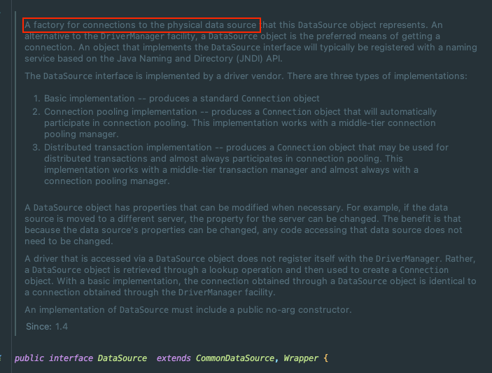
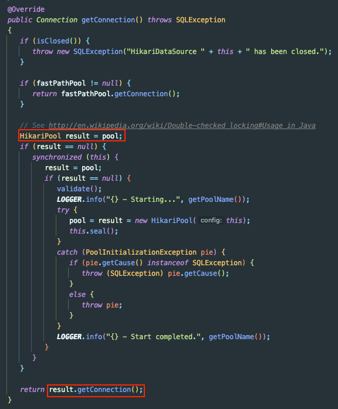
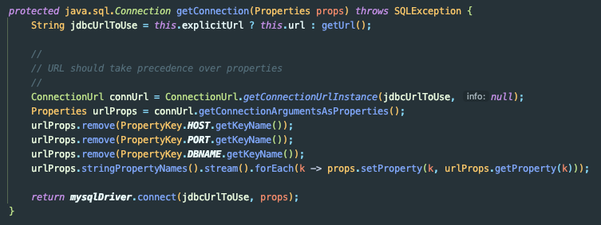

## Spring - DataSource와 ConnectionPool이란?

Spring으로 개발을 하다보면 DB에 접근 하다보면 두 개념에 마주하게 된다.

두 개념에 대해 더 자세히 알아보자.

## DataSource

DataSource는 DB 커넥션을 구하는 방법을 정의한다.

DataSource는 드라이버 Vendor에 의해 구현되며, 세 가지 타입이 있다.

1. Connection 객체를 얻는 방법을 구현
2. Connection Pooling 방식을 구현
3. 분산 트랜잭션 구현

DataSource의 대표적인 구현체는 아래와 같다.
- HikariDataSource
- JdbcDataSource
- MysqlDataSource
- SimpleConnectionDataSource
- JdbcConnectionPool

`HikariDataSource`는 내부적으로 `HikariPool`(DBCP)에 접근해서 사용한다.

반면 `MysqlDataSource`는 커넥션 풀을 사용하지 않고 새로운 커넥션을 생성한다.

즉, **DataSource는 커넥션을 가져오는 동작에 대한 인터페이스**이다.

## DBCP

DBCP(Database Connection Pool)은 사실 대부분 아시고 계실 것이다.

자바 프로그램에서 커넥션을 생성할 때 자원이 많이 소요되기 때문에 **일정 개수의 DB 커넥션을 미리 만들어두는 기법**이다.

Java에서 표준으로 제공하는 DBCP는 존재하지 않고, 각 **Vendor에서 제공하는 DataSource에서 사용할 Pool 클래스를 정의**해서 사용한다.

그렇기 때문에 아래에서 설명할 내용은 Java에서 표준화한 내용은 아니고, 현재 가장 많이 사용하는 HikariCP를 기준으로 설명한다.

아래는 HikariCP에서 제공하는 프로퍼티의 목록이다.

- autoCommit
- connectionTimeout
- idleTimeout
- maxLifetime
- connectionTestQuery
- connectionInitSql
- validationTimeout
- maximumPoolSize
- poolName
- allowPoolSuspension
- readOnly
- transactionIsolation
- leakDetectionThreshold

