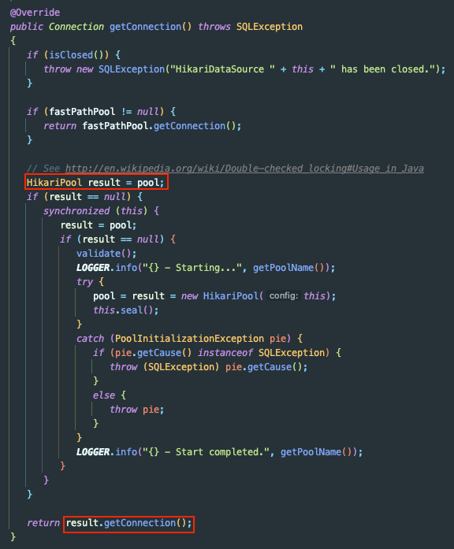
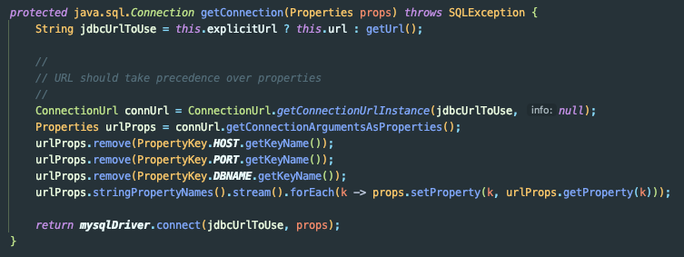
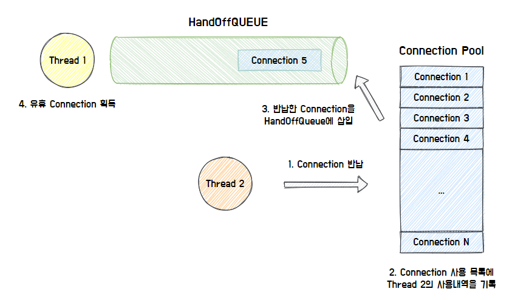
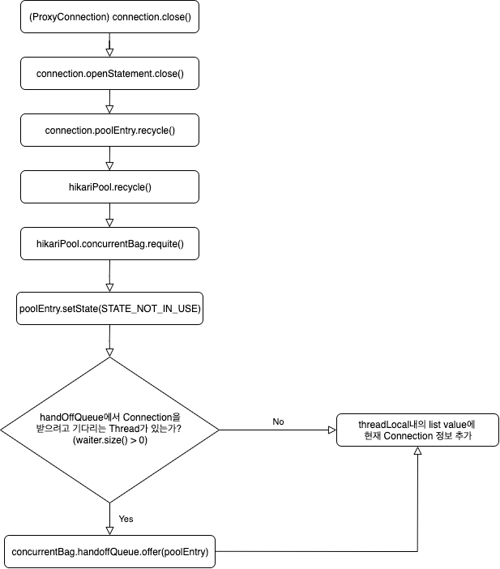
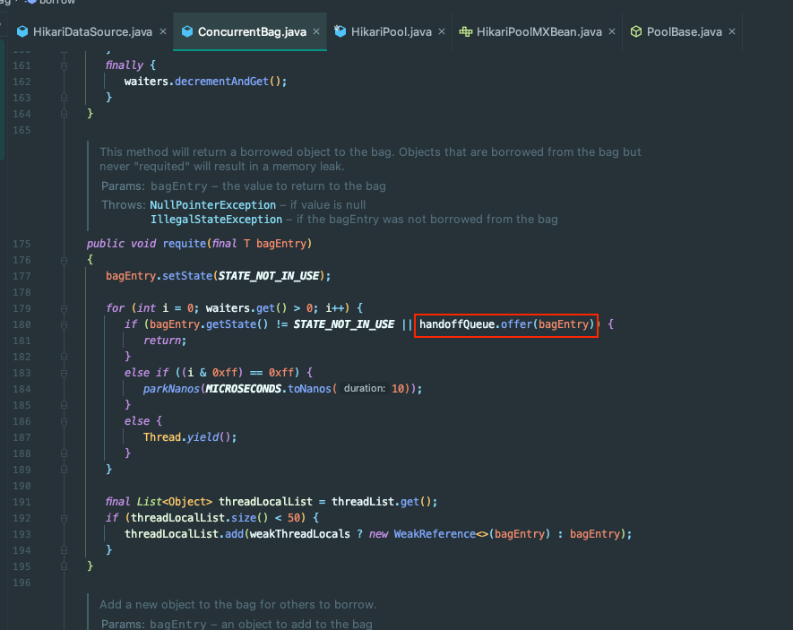

## Spring - DataSource와 ConnectionPool이란?

Spring으로 개발을 하다보면 DB에 접근 하다보면 `DataSource`와 `ConnectionPool`에 마주치게 된다.

두 개념에 대해 더 자세히 알아보자.

## DataSource

DataSource는 DB 커넥션을 구하는 방법을 정의한다.


문서를 번역해보면 아래와 같다.

```
DataSource는 드라이버 Vendor에 의해 구현되며, 세 가지 타입이 있다.
1. Connection 객체를 얻는 방법을 구현
2. Connection Pooling 방식을 구현
3. 분산 트랜잭션 구현
```

DataSource의 대표적인 구현체는 아래와 같다.
- HikariDataSource
- JdbcDataSource
- MysqlDataSource
- SimpleConnectionDataSource
- JdbcConnectionPool

`HikariDataSource`는 내부적으로 `HikariPool`(DBCP)에 접근해서 사용한다.



반면 `MysqlDataSource`는 커넥션 풀을 사용하지 않고 새로운 커넥션을 생성한다.



즉, **DataSource는 커넥션을 가져오는 동작에 대한 인터페이스**이다.

커넥션 풀을 사용할 지나 어떤 방식으로 가져올 지는 구현에 달렸다.

## DBCP

DBCP(Database Connection Pool)는 커넥션을 생성할 때 자원이 많이 소요되기 때문에 **일정 개수의 DB 커넥션을 미리 만들어두는 기법**이다.

Java에서 표준으로 제공하는 DBCP는 존재하지 않고, 각 **Vendor에서 제공하는 DataSource에서 사용할 Pool 클래스를 정의**해서 사용한다.

아래에서 설명할 내용은 현재 가장 많이 사용하는 **HikariCP**를 기준으로 설명한다.

## HikariCP

#### 동작 원리

HikariCP의 동작 원리는 아래와 같다.



1. 특정 쓰레드에서 커넥션의 상태를 `STATE_NOT_IN_USE`로 변경 후 반납한다.
2. 반납한 커넥션은 HandOffQueue로 삽입한다.
3. HandOffQueue를 Pooling하던 Thread는 Connection의 상태를 `STATE_IN_USE`로 변경 후 획득한다.
    - 지정한 TimeOut 시간이 지나면 예외를 던진다.

#### FlowChart

FlowChart로 나타내면 아래와 같다.



마지막에 수행되는 `concurruntBag.handoffQueue.offer(poolEntry)`의 경우 아래 코드에서 확인할 수 있다.



즉, `ConcurrentBag`는 내부적으로 `HandOffQueue`를 가진다.

`ConcurrentBag`이 `handOffQueue`를 관리한다고 생각하면 된다.


#### 프로퍼티

아래는 HikariCP에서 제공하는 자주 사용되는 프로퍼티의 목록이다.

- autoCommit: 자동 커밋 사용 여부
- connectionTimeout: Client가 Pool로부터 Connection을 기다리는 최대 초 (초과 시 SQLException 발생)
- idleTimeout: Connection이 유휴상태로 유지될 수 있는 최대 시간
- maxLifetime: Pool이 가진 Connection의 최대 수명 (DB 혹은 인프라의 Connection TimeOut보다 몇 초 짧아야 함)
- connectionTestQuery: 커넥션이 살아있는 지 확인하는 쿼리
- minimumIdle: Pool의 최소 유휴 커넥션 수
- maximumPoolSize: 유휴 커넥션과 사용 중인 커넥션을 포함해서 Pool이 관리할 수 있는 최대 Size
- metricRegistry: 메트릭을 기록할 `MetricRegistry`를 지정
- transactionIsolation: 커넥션의 기본 트랜잭션 격리 수준 설정
- poolName: 커넥션 풀 이름
- leakDetectionThreshold: 커넥션 누수 가능성이 있을 때 풀에서 벗어날 수 있는 시간 (0이면 비활성화)

가장 중요한 것은 **Connection Pool Size**이다.

PoolSize를 늘리면 커넥션을 대기하는 시간을 줄이고 DeadLock 해소할 수 있다. 하지만 필요 이상의 메모리를 사용하게 된다.

그래서 현재 상황에 맞게 설정하는 것이 중요하다.

## 참고

- https://steady-coding.tistory.com/564
- https://techblog.woowahan.com/2664/