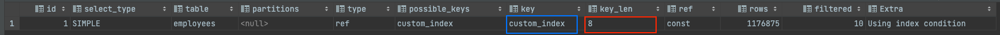
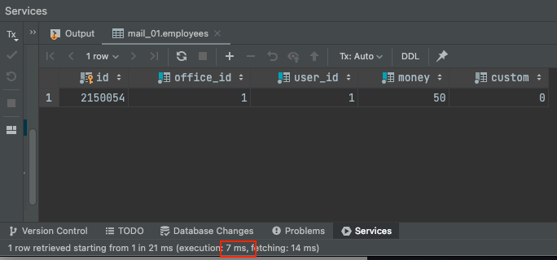

## Explain

**Explain(실행 계획)** 은 DB가 데이터를 찾아가는 일련의 과정이다. Explain의 각 항목에 대해 알아보자.

각 컬럼에 대해 세세한 것까지 전부 언급하면 글이 길어져서 중요한 부분들이 눈에 들어오지 않는 문제가 있다.

해당 포스팅에서는 UNION, Sub Query 등 **특수한 케이스**에 대해서는 **과감하게 생략**하고, **꼭 필요한 부분**에 대해 중점적으로 다룬다.

## 간단한 정보 

아래는 간단해서 상세히 설명할 것이 없는 요소들이다.

- id: 식별자
- table: 조회할 테이블
- partitions: 조회할 파티션
- possible_keys: 사용할 수 있는 인덱스 목록
- key: 실제 Optimizer가 선택한 인덱스

사실 위에서는 이름만 읽어도 해석이 가능하다.

중요한 건 이제부터다.

## select_type

SELECT 쿼리의 타입을 분류한다.
- SIMPLE: UNION 이나 SubQuery를 사용하지 않는 **단순 쿼리**
- PRIMARY: UNION 이나 SubQuery를 사용하는 쿼리
- SUBQUERY: FROM절 이외에서 사용되는 서브쿼리
- DRIVED: FROM 절에서 사용되는 서브쿼리
- ...

8가지 정도가 더 있는데 UNION과 같이 일반적으로 사용되지 않으므로 생략한다.

## type

접근 방식을 표시하는 필드이다. **행 데이터를 어떤 방식으로 조회할 지**를 나타내기 때문에 매우 중요하다.

매우 빠른 쿼리를 보장하는 경우

- const: PK, UK에 의해 `=` 또는 `!=`로 비교할 때 (결과가 1건)
- index: 인덱스를 전체 스캔하는 경우 (흔히 알려진 `Covered Index`를 사용하는 경우)
- ref: 인덱스로 `=`나 `!=`로 비교할 때 사용
- range: 인덱스로 범위 검색을 하는 경우 (`<`, `>` `IS NULL`, `BETWEEN`, `IN`, `LIKE` 등)
- eq_ref: 첫 번째 테이블의 결과를 두 번째 테이블의 PK, UK로 사용해서 검색하는 경우
- ALL: 전체 행 스캔 **(인덱스를 못 타는 경우)**
- ...

## key_len

사용된 인덱스 컬럼들의 총 Byte 수이다. 개인적으로 유용하게 사용한다.

아래의 예시를 보자. 인덱스 정보는 아래와 같다. 


아래의 쿼리를 실행시키면 어떻게 될까?

```mysql
explain select * from employees
where office_id = 1 and money = 50;
```

`key`로 `custom_index`가 무사히 선택되었다.



그러면 된걸까..? 그렇지 않다!! **key_len**을 보면 8인 것을 알 수 있다. key_len이 `office_id` 컬럼의 byte 수인 8이다. (bigint)

즉, `office_id` 까지는 이분 탐색에 성공했다. 그렇지만 `user_id`와 `money`는 전체 탐색은 한 것이다.


아래를 보면 실행 시간도 548ms이다.

그러면 `user_id`를 Where에 추가해보자. 참고로 테스트 용도로 넣은 user_id는 1 ~ 10 범위를 가진다. 즉 아래에서 추가한 user_id 조건은 사실상 **전체**이다.

```mysql
explain select * from employees
where office_id = 1 and user_id > 0 and money = 50;
```

그러면 key_len이 3개 컬럼의 바이트 값을 더한 24가 나온다.




쿼리 실행 시간도 548ms -> 7ms로 개선된 것을 볼 수 있다.

## 참고

- https://cheese10yun.github.io/mysql-explian/