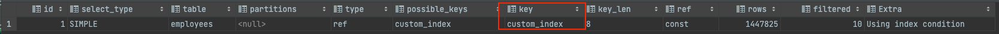
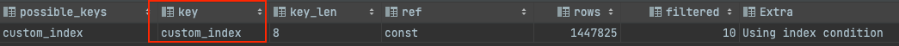
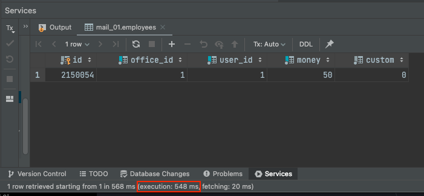
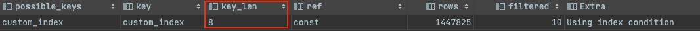
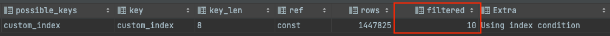
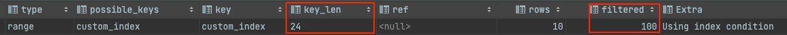
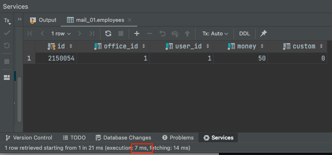
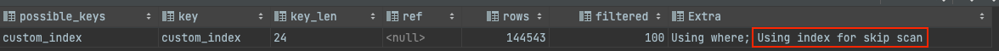

Optimizer가 원하는 Index를 사용했으면 최적의 쿼리인걸까?!

**그렇지 않다!** 예시를 통해 알아보자. 아래는 예시를 위해 생성한 Index이다.


아래의 쿼리를 실행시키면 어떻게 될까?

```sql
explain select * from employees
where office_id = 1 and money = 50;
```

`key`로 `custom_index`가 선택되었다.



글자가 너무 작아서 중요한 부분을 확대했다.



## 실행 시간

해당 쿼리의 실행 시간은 **548ms** 이다. **Index도 원하는 대로 탔고**, **매우 간단한 데 쿼리임에도 불구하고 매우 오래걸린다.**



뭐가 잘못된 걸까..?

## 1. key_len

다시 실행 계획을 보자.



여기서 가장 중요한 지표는 `key_len`이다.

**key_len**은 **쿼리 조건으로 사용된 인덱스 컬럼들의 총 Byte 수**이다. key_len을 보면 8이다. `office_id` 컬럼의 byte 수인 8이다. (bigint)

즉, `office_id` 까지는 인덱스 기반 검색을 했다. 그렇지만 `user_id`와 `money`는 **전체 탐색을 해서 필터링**을 한 것이다.

그래서 막대한 성능 저하가 일어났다.

## 2. filtered

`key_len`만 봐도 원인은 찾은 상황이다. 하지만 **중요한 1가지 지표가 더** 있다. `filtered`이다.

`filtered`는 **MySQL 엔진에 의해 필터링되고 남은 비율**이다.



`filtered`가 10이라는 것은 **스토리지 엔진에 의해 인덱스 기반으로 검색하고 남은 결과**를 **10%만 남기고 모두 필터링**했다는 뜻이다.

인덱스는 첫 번째 인덱스 컬럼인 `office_id`까지만 탔었다. 즉, `office_id` 조건이 일치하는 모든 레코드를 대상으로 하나씩 `user_id`, `money`로 **90%를 필터링**한 것이다. 
- (통계 정보에 기반한 예측 값이다. 수치는 정확하지 않다.)

## 조건을 바꾸면

그러면 `user_id`를 Where에 추가해보자. 더미 데이터로 넣은 user_id는 **1 ~ 10 범위**를 가진다. 즉, 아래에서 추가한 user_id 조건은 사실상 **전체**이다.

```sql
explain select * from employees
where office_id = 1 and user_id in (1, 2, 3, 4, 5, 6, 7, 8, 9, 10) and money = 50;
```

explain의 결과는 아래와 같다.



동일한 범위의 데이터 검색임에도 Explain의 결과가 다르다.

- key_len이 3개 컬럼의 바이트 값을 더한 24가 정확히 나온다. (마지막 컬럼까지 인덱스를 탈 수 있었다.)
- filtered가 100이 나온다. (Index 스캔을 기반으로 하는 스토리지 엔진만으로 모두 필터링했고, MySQL 엔진에서는 필터링을 하지 않아서 100%가 남았다.)

실행 결과는 아래와 같다.



쿼리 실행 시간도 **548ms -> 7ms**로 개선된 것을 볼 수 있다.

## 인덱스 스킵 스캔

**MySQL 8.0** 부터는 선행 인덱스 컬럼을 건너 뛸 수 있는  `Skip Scan Access Method`라는 것을 지원한다.

예를 들면 아래 쿼리를 보자.

```sql
explain select id from employees
where office_id = 1 and money = 50;
```

처음 문제가 되었던 쿼리에서 `select`절만 `*`에서 `id`로 바꿨다. 그래서 **Index 만으로 조회 쿼리를 실행**할 수 있게 되었다.

실행 계획은 아래와 같다.



**인덱스 스킵 스캔**을 사용해서 **특정 인덱스 컬럼을 건너 뛰고** 검색할 수 있다. `key_len`과 `filtered`를 볼 때 정상적으로 인덱스를 탈 수 있음을 알 수 있다.

## 결론

원하는 **인덱스를 사용했어도 후반 인덱스 컬럼을 활용하지 못하는 경우**도 생길 수 있다.
- `key_len`과 `filtered`를 알고 있다면 문제를 인식할 수 있다.

이때는 아래의 처리 중 고민해야 한다.
- **신규 인덱스를 생성** 또는 **기존 인덱스 교체** (중간 인덱스 컬럼 제거)
- 중간 인덱스 컬럼에서도 **인덱스를 탈 수 있도록 유도**
  - 중간 인덱스 컬럼 WHERE 조건 추가
- MySQL 8.0 이상이라면 Index Skip Scan을 활용할 수 있다.

## 참고

- https://cheese10yun.github.io/mysql-explian
- https://wisdom-and-record.tistory.com/137