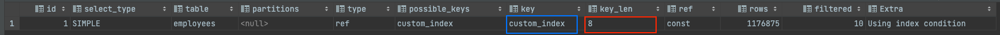
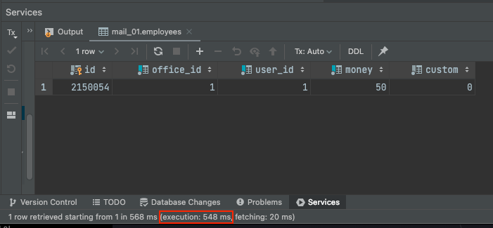

Optimizer가 원하는 Index를 탔으면 다 해결된걸까?!

그렇지 않다! 예시를 통해 알아보자. 아래는 예시를 위해 생성한 Index이다.


아래의 쿼리를 실행시키면 어떻게 될까?

```mysql
explain select * from employees
where office_id = 1
    and money = 50;
```

`key`로 `custom_index`가 선택되었다.



여기서 중요하게 생각해야 할 것은 `key_len`이다.

## key_len

해당 쿼리의 실행 시간은 **548ms** 이다. 쿼리 조건이 매우 간단한 데도 불구하고 느리게 실행된다.



다시 실행 계획을 보자.


`key_len`은 쿼리 조건이 사용된 인덱스 컬럼들의 총 Byte 수이다. **key_len**을 보면 8인 것을 알 수 있다. key_len이 `office_id` 컬럼의 byte 수인 8이다. (bigint)

즉, `office_id` 까지는 인덱스 기반 검색을 했다. 그렇지만 `user_id`와 `money`는 전체 탐색을 한 것이다.


그러면 `user_id`를 Where에 추가해보자. 테스트 용도로 넣은 user_id는 1 ~ 10 범위를 가진다. 즉, 아래에서 추가한 user_id 조건은 사실상 **전체**이다.

```mysql
explain select * from employees
where office_id = 1 and user_id > 0 and money = 50;
```

그러면 key_len이 3개 컬럼의 바이트 값을 더한 24가 나온다.


실행 결과는 아래와 같다.


쿼리 실행 시간도 548ms -> 7ms로 개선된 것을 볼 수 있다.

## 결론

특정 인덱스를 선택했어도 후반 인덱스 컬럼을 활용하지 못하는 경우도 생길 수 있다.

참고로 MySQL 8.0 부터는 선행 인덱스 컬럼을 건너 뛸 수 있는  `Skip Scan Access Method`라는 것을 지원한다.

그러나 해당 방식을 사용하지 못할 경우 아래의 처리를 고민해야 한다.
- 선행 인덱스 컬럼을 제거한 새로운 인덱스를 생성
- 선행 인덱스 컬럼에서 인덱스를 탈 수 있도록 유도

## 참고

- https://cheese10yun.github.io/mysql-explian
- https://wisdom-and-record.tistory.com/137