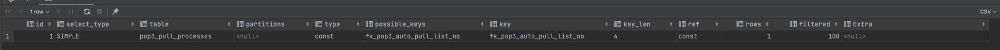
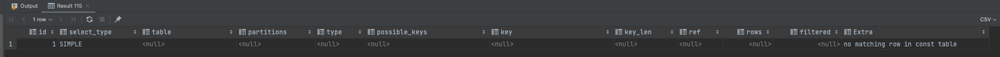
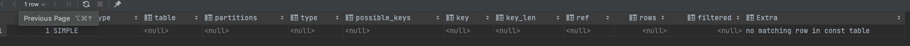
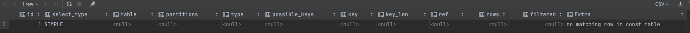
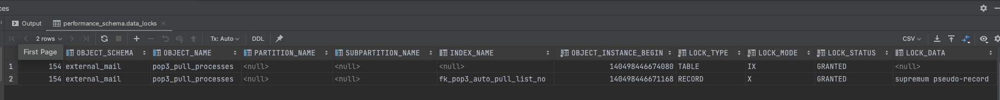
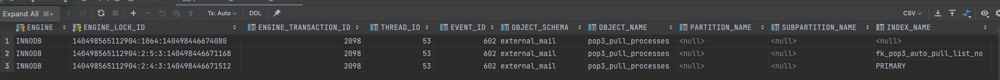
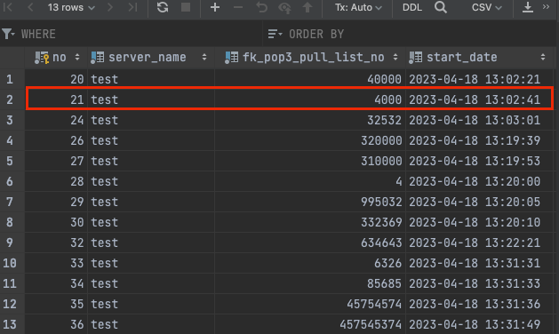

## MySQL -  SELECT FOR UPDATE + INSERT의 데드락이 발생하는 이유! (삽질..)

## 문제 상황

아래는 기존의 존재하던 PHP 구문이다.

```php
public function update_process($fk_pull_id){
    $server_name = gethostname
    $this->_db_connect();
    // Begin transaction
    $this->open_db->trans_begin
    // Lock the rows to be updated
    $sql_lock = "SELECT * FROM `external_mail`.`pop3_pull_processes` WHERE `fk_pull_id` = ? FOR UPDATE";
    $this->open_db->query($sql_lock, array($fk_pull_id
    // Check if rows were found
    if ($this->open_db->affected_rows() > 0) {
        // Rows were found, update the records
        $sql_update = "UPDATE `external_mail`.`pop3_pull_processes` SET `server_name` = ?, `update_date` = NOW() WHERE `fk_pull_id` = ?";
        $this->open_db->query($sql_update, array($server_name, $fk_pull_id));
    } else {
        // Rows were not found, insert a new record
        $sql_insert = "INSERT INTO `external_mail`.`pop3_pull_processes` (server_name, fk_pull_id, start_date, update_date) VALUES(?, ?, NOW(), NOW())";
        $this->open_db->query($sql_insert, array($server_name, $fk_pull_id));
    
    // Commit the transaction
    $this->open_db->trans_commit();
}
```

해당 로직을 SQL로 구성하면 아래와 같다. 
```mysql
START TRANSACTION;
SELECT * FROM `external_mail`.`pop3_pull_processes`
WHERE `fk_pull_id` = :pullId FOR UPDATE;

# 존재한다면
UPDATE `external_mail`.`pop3_pull_processes` SET `update_date` = NOW() WHERE `fk_pull_id` = :pullId;
WHERE

# 존재하지 않는다면
INSERT INTO `external_mail`.`pop3_pull_processes` (fk_pull_id, start_date, update_date)
VALUES(:pullId, NOW(), NOW());

COMMIT;
```

해당 쿼리를 수행하는 서버를 2대 돌리고 있고, 아래의 예외가 터졌다.

```
Query error: Deadlock found when trying to get lock; try restarting transaction - Invalid query: INSERT INTO `external_mail`.`pop3_pull_processes` (server_name, fk_pull_id, start_date, update_date)
VALUES(?, ?, NOW(), NOW());
```

pop3_pull_processes 테이블을 사용하는 곳은 해당 서버가 유일하다.

데드락이 대체 왜 발생하는 걸까..?

(미리 말하지만 Index 문제는 아니다!)

## 디버깅

MySQL의 5.7에서 Lock을 확인하려면 아래의 복잡한 SQL을 수행해야 한다.
- MySQL 8.0은 SELECT * FROM performance_schema.data_locks; 한줄 이면 된다..

```sql
SELECT
    straight_join w.trx_mysql_thread_id waiting_thread,
        w.trx_id waiting_trx_id,
        w.trx_query waiting_query,
        b.trx_mysql_thread_id blocking_thread,
        b.trx_id blocking_trx_id,
        b.trx_query blocking_query,
        bl.lock_id blocking_lock_id,
        bl.lock_mode blocking_lock_mode,
        bl.lock_type blocking_lock_type,
        bl.lock_table blocking_lock_table,
        bl.lock_index blocking_lock_index,
        wl.lock_id waiting_lock_id,
        wl.lock_mode waiting_lock_mode,
        wl.lock_type waiting_lock_type,
        wl.lock_table waiting_lock_table,
        wl.lock_index waiting_lock_index
FROM
    information_schema.INNODB_LOCK_WAITS ilw
    INNER JOIN information_schema.INNODB_TRX b ON b.trx_id = ilw.blocking_trx_id
    INNER JOIN information_schema.INNODB_TRX w ON w.trx_id = ilw.requesting_trx_id
    INNER JOIN information_schema.INNODB_LOCKS bl ON bl.lock_id = ilw.blocking_lock_id
    INNER JOIN information_schema.INNODB_LOCKS wl ON wl.lock_id = ilw.requested_lock_id;
```

MySQL 5.7에서는 경합 상황이 아니면 락이 조회되지 않는 다는 점을 주의하자!! (이거 떄문에 삽질했다..)

해당 쿼리로 DataGrip에서 콘솔 여러개를 켜서 이래저래 시나리오를 돌린 결과 아래의 사실을 찾을 수 있었다.

## 원인

세션 1에서 아래의 쿼리를 수행한다.
```sql
START TRANSACTION;
SELECT * FROM `external_mail`.`pop3_pull_processes`
WHERE `fk_pull_id` = 1111 FOR UPDATE;
```

세션 2에서 아래의 쿼리를 수행한다.
```sql
INSERT INTO `external_mail`.`pop3_pull_processes` (server_name, fk_pop3_pull_list_no, start_date, update_date)
 VALUES('test', 2222, NOW(), NOW());
```

결과는 어떻게 될까..?

정답은 성공할 수도 있고, 실패할 수도 있다. (MySQL에서는 Index를 잠그기 때문)

Index는 `constraint fk_pop3_auto_pull_list_no unique (fk_pull_id)`를 사용하고 있고, SELECT로 조회 시 반드시 해당 인덱스를 탄다.

#### 그런데!

해당 데이터가 있을 때는 아래와 같이 당연히 Index를 탄다.


테이블에 데이터가 없을 때는 아래와 같이 이상한 실행 계획을 볼 수 있다.


해당 부분의 경우 const 조회를 했지만, 데이터가 존재하지 않아서 Key를 사용하지 않았다는 내용이다.

ChatGPT한테 해당 내용을 물어봤었는데 아예 락을 걸지 않았다고 했다. 그런데 그게 아니고 테이블 단위의 갭 락이 걸린거였다.
- 다른 Key 컬럼으로 해서 INSERT를 할 수 없다.

Holy..!

### 해결 방법..?

해결 방법은 아래와 같이 강제로 INDEX를 지정하는 것이다.

```php
SELECT * FROM `external_mail`.`pop3_pull_processes`
FORCE INDEX (fk_pop3_auto_pull_list_no)
WHERE `fk_pop3_pull_list_no` = 12421 FOR UPDATE;
```

이상한 점은 실행 계획은 동일하게 보인다.



그렇지만 실제로는 동일하지 않았고 해당 부분으로 문제를 해결할 수 있었다.

그래서 어떤 차이가 있는 지 확인하려고 MySQL 8.0을 도커로 띄웠다..! ㅠ

### MySQL 8.0으로 디버깅해보자!

확인할 것은 아래의 두 개이다.
- 실행 계획
- 락 획득
- MySQL 5.7과 동작이 동일한 지 확인

우선 실행 계획의 경우 아래와 같이 FORCE INDEX 사용 여부와 관계없이 동일했다.



MySQL 8.0에서는 경합이 발생하지 않아도 Lock을 확인할 수 있어서 정합한 디버깅이 가능했다.



보면 Lock이 2개가 걸린다.
- Table 단위의 IX 락 (Intention exclusive lock)
- RECORD 단위의 X 락 (Exclusive lock)

이는 FORCE INDEX()를 사용해도 결과가 동일했고, 찾아보니 이는 정상적인 동작이라고 한다.

실행 계획이랑 LOCK이 똑같은데 어떻게 동작이 다를 수 있지..? 라고 생각해서 동작 확인을 해봤는데, MySQL5.7과 동작이 달랐다.
- FORCE INDEX를 사용해도 여전히 데드락이 터졌다.
- (뭐가 어떻게 되는거야 🤣...)
- MySQL 8.0에서는 스토리지 엔진에서 인덱스 스캔 시 락을 걸고 작업을 수행하기 때문이라고 한다.

그래서 FORCE INDEX를 활용한 방법도.. 완벽한 솔루션이라고 할 수 없었다 ㅠ

## 데이터 존재에 따라 결과가 달라지는 이유!

맨 처음에 데이터의 존재 여부에따라 데드락의 발생 여부가 달라진다고 했다. 해당 부분을 살펴보자!

#### 데이터가 없을 때


#### 데이터가 있을 때



- 데이터가 없을 때
  - Table 단위의 IX 락, LOCK_DATA = null
  - RECORD 단위의 X 락, LOCK_DATA = supremum pseudo-record
- 데이터가 있을 때
  - TABLE 단위의 IX 락, LOCK_DATA = null
  - RECORD 단위의 X, REC_NOT_GAP 락 (Index), LOCK_DATA = 325325, 6
  - RECORD 단위의 X, REC_NOT_GAP 락 (PK), LOCK_DATA = 6

데이터가 없을 때 발생하는 락의 LOCK_DATA인 supremum pseudo-record의 경우 마지막 지점을 의미한다고 한다.
즉, 해당 값을 기준으로 마지막 지점까지 gab-lock을 걸게 된다.
- 데이터가 많아지면 supremum pseudo-record 대신 정확한 레코드 락이 걸린다.
- 그래서 데이터가 많아지면 데드락이 발생하지 않았다.

아래는 MySQL 5.7 공식 문서에서 설명한 supremum pseudo-record에 대한 설명이다.

```
For the last interval, the next-key lock locks the gap above the largest value
in the index and the “supremum” pseudo-record having a value higher than any v
alueactually in the index. The supremum is not a real index record, so, in eff
ect, this next-key lock locks only the gap following the largest index value.
```

요약하면 인덱스의 가장 큰 값 위쪽의 갭을 모두 잠그게 된다는 말이다. 실제로 데이터를 삽입하면서 확인 해보니 잠근 레코드의 KEY 컬럼값보다 대략적으로 더 높은 값들로 INSERT 할 때만 데드락이 발생했다.
- 테스트 중 간헐적으로 발생한다고 생각했던 이유가 이거였구나..!

데이터가 많이 쌓이면 supremum pseudo-record 대신 조회하고자 하는 키 컬럼값의 바로 윗 데이터까지를 잠근다.

가령, 아래의 쿼리를 수행한다고 할 때

```sql
SELECT * FROM `external_mail`.`pop3_pull_processes`
WHERE `fk_pop3_pull_list_no` = 3252 FOR UPDATE;
```

키 컬럼이 3252이고 존재하는 데이터 중 3252 바로 위 값이 4000이다.



해당 경우에는 1~4000까지 데이터를 잠근다.

생각해보면 MySQL에서는 Index 기반으로 잠그는데, 데이터도 없는 채로 SELECT FOR UPDATE를 날리고, 레코드가 잠기길 기대했던 것이 생각이 조금 부족했던 듯 하다..

그래서 비관적 락은 현재 데이터 구조와 비즈니스 로직에서는 적합하지 않았던 것 같다.
- 차라리 로직을 분리하거나 분산 락으로 풀 수 있는 방법을 고민해보자..!
- SELECT FOR UPDATE는 조심해야 한다..!
  - INSERT 문과 함께 사용하면 데드락이 발생할 가능성이 크다는 것을 고려해야 한다.

## 참고
- https://kimdubi.github.io/mysql/insert_on_duplicate_lock
- https://dba.stackexchange.com/questions/257217/why-am-i-getting-a-deadlock-for-a-single-update-query
- https://jinhokwon.github.io/devops/mysql/mysql8-docker
- https://stackoverflow.com/questions/75012830/when-exactly-does-a-lock-pseudo-record-supremum-occur
- https://myinfrabox.tistory.com/188