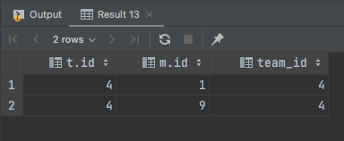
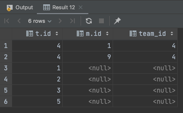
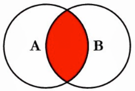
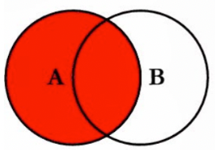

최근에 팀원 분이 LEFT OUTER JOIN의 **ON 절에 일반 조건**이 포함된 쿼리를 작성하신 것을 봤다.

```sql
SELECT *
FROM team t
LEFT OUTER JOIN member m
    ON t.id = m.team_id
    AND m.team_id = 4;
```

해당 부분이 예상대로 동작하지 않을 것을 예상하고 리뷰를 드리면서, 생각보다 잘 모르시는 분이 많으실 것 같아 정리하게 되었다. 

미리 말하지만 **해당 SQL은 의도대로 동작하지 않는다.**

**ON 절과 WHERE 절의 차이**에 대해 알아보자.

## Sample Data 삽입

테스트를 위해 데이터를 삽입했다.
- Team을 5개 삽입
- 각 팀별 멤버를 2개 삽입


## WHERE

```sql
SELECT *
FROM team t
LEFT OUTER JOIN member m
    ON t.id = m.team_id
WHERE m.team_id = 4;
```

Where 조건의 의미는 말 그대로 필터링이다.

`m.team_id`가 4인 것만 가져오라는 것이다.



결과도 예상과 같이 수행된다.

## ON

```sql
SELECT *
FROM team t
LEFT OUTER JOIN member m
    ON t.id = m.team_id
    AND m.team_id = 4;
```

ON절은 아래와 같이 예상하지 못한 결과가 수행된다.



왜냐하면 ON절에 조건을 명시하면 **조건에 맞는 데이터만 JOIN 하겠다는 뜻**이다.
- FROM 테이블은 전체가 노출
- **조건에 맞는 경우 OUTER JOIN 수행**

즉, LEFT OUTER JOIN의 ON절을 걸면 메인 테이블과 ON절의 조건과 **차집합**을 반환한다.

## Inner Join 에서는

`Inner Join`에서는 `WHERE`과 `ON` 모두 동일한 결과를 가져올 수 있다. 

ON절의 가장 중요한 개념은 **true가 아니면 조인을 하지 않는다는 것**이다. `Inner Join`의 경우 Join할 데이터가 존재하지 않으면 `FROM` 테이블 데이터도 반환하지 않는다.

그래서 `WHERE`절과 `ON`절이 동일한 것처럼 동작한다.
- 실제 용도와 의미는 분명히 다르다.

## 마무리

정리하면 `LEFT OUTER JOIN`에서 `WHERE` 절에 일반 조건을 명시하면 아래 결과가 나온다. 



반면 `ON` 절에 일반 조건을 명시하면 아래 결과가 나온다.



`WHERE`과 `ON`은 **용도와 의미가 명백히 다르며** **의미에 맞게 사용**해야 한다.

## 참고
- https://gibles-deepmind.tistory.com/entry/Oracle-SQL-JOIN%EC%8B%9C-WHERE-%EC%A0%88%EA%B3%BC-ON-%EC%A0%88%EC%9D%98-%EC%B0%A8%EC%9D%B4where-clause-vs-on-clause