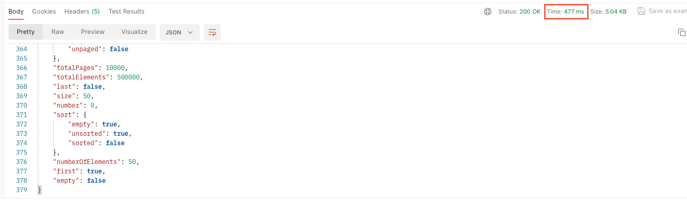
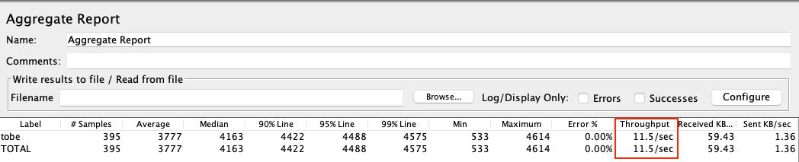

지난번 커버링 인덱스를 적용한 쿼리를 추가 개선한 이야기이다.
- 커버링 인덱스 적용 - https://jaehoney.tistory.com/333

지난번 조회 Latency가 너무 커서 커버링인덱스를 조회해서 2~3배, 최대 10배 효율적으로 개선을 할 수 있었다.

문제는 Latency는 큰 문제가 없음에도 TPS가 너무 안나왔다. HTTP 트랜잭션이 0.3s~0.4s 정도인 반면 TPS가 10.8 밖에 안나왔다.

결과를 먼저 소개하자면 **LeftOuterJoin 구을 Split**해서 **TPS를 10.8에서 107.7로 개선**했다.

아래는 문제 재현을 위해 임의로 구성한 환경에서 테스트를 진행한 부분이다.

## 기존 코드

먼저 기존 코드를 보자.

```java
@Repository
public class ArticleRepositoryImpl {
    private final JPAQueryFactory jpaQueryFactory;
    private final CategoryRepository categoryRepository;
    private final Querydsl querydsl;

    public ArticleRepositoryImpl(JPAQueryFactory jpaQueryFactory, CategoryRepository categoryRepository,
        EntityManager entityManager) {
        this.jpaQueryFactory = jpaQueryFactory;
        this.categoryRepository = categoryRepository;
        this.querydsl = new Querydsl(entityManager, new PathBuilderFactory().create(Article.class));
    }

    public Page<ArticleInfo> findList(String regionCode, Pageable pageable) {
        // 조회 대상 id 목록을 커버링 인덱스로 조회한다.
        JPAQuery<Long> idsQuery = jpaQueryFactory
            .select(article.articleId)
            .from(article)
            .leftJoin(category).on(category.categoryId.eq(article.categoryId))
            .where(
                article.regionCode.eq(regionCode),
                category.isPublic.eq(true).or(article.categoryId.isNull())
            );

        // 페이지 네이션 적용 (offset, limit, sort) 후 쿼리 실행
        List<Long> ids = querydsl.applyPagination(pageable, idsQuery).fetch();

        // 카운트 쿼리
        JPAQuery<Long> countQuery = createCountQuery(idsQuery.getMetadata().getWhere());

        // 실제 데이터 블록 조회 쿼리
        JPAQuery<ArticleInfo> dataQuery = jpaQueryFactory.select(new QArticleInfo(article, articleAuth))
            .from(article)
            .leftJoin(articleAuth)
            .on(articleAuth.articleId.eq(article.articleId))
            .where(
                article.articleId.in(ids)
            );

        List<ArticleInfo> result = querydsl.applySorting(pageable.getSort(), dataQuery).fetch();

        return PageableExecutionUtils.getPage(result, pageable, countQuery::fetchOne);
    }

    private JPAQuery<Long> createCountQuery(Predicate whereCondition) {
        return jpaQueryFactory.select(article.count())
            .from(article)
            .where(whereCondition)
            .leftJoin(category)
            .on(category.categoryId.eq(article.categoryId));
    }
}
```

해당 쿼리를 정리하면 아래와 같다.

```sql
# 1. 커버링 인덱스 기반 id 리스트 조회
select article.article_id
from article
left outer join
     category on (category.category_id = article.category_id)
where
    article.region_code = 'JP' and
    (category.is_public = true or category.category_id is null)
order by article.article_id desc
    limit 0, 20;

# 2. 카운트 쿼리
select count(1)
from article
left outer join
     category on (category.category_id = article.category_id)
where
    article.region_code = 'JP' and
    (category.is_public = true or category.category_id is null)

# 3. 데이터 블록 조회
select article.article_id,
       article.subject,
       article.content,
       article_auth.article_auth_id
       # .. 생략
from article
left outer join
     article_auth on (article_auth.article_id = article.article_id)
where article.article_id in (1, 2, 3, 4, 5, 6, 7, 8, 9, 10, 11, 12, 13, 14, 15, 16, 17, 18, 19, 20)
order by article.article_id desc
```

전체 HTTP 트랜잭션은 477ms 정도 소요되었다.



TPS를 측정해보니 VUsers 50 기준 2.0이 나왔다. (예시를 위한 데이터를 구성해서 그런 지 더 안좋게 나왔다.)


문제가 되는 주요 쿼리는 아래 쿼리이다.

```sql
select count(1)
from article
left outer join
     category on (category.category_id = article.category_id)
where
    region_code = 'JP' and
    (category.is_public = true or category.category_id is null)
```


여기서 카운트 쿼리의 실행계획을 한번 보자.


그렇게 큰 문제가 없어 보인다. 인덱스도 잘 타고 있다.

도대체 뭐가 문제인 걸까? 열심히 찾아보다가 article과 category가 조인하고 필터링하는 부분에서 성능이 저하됨을 알 수 있었다.

```sql
left outer join
     category on (category.category_id = article.category_id)
where
    region_code = 'JP' and
    (category.is_public = true or category.category_id is null)
```

해당 쿼리는 의도와 정확하게 일치하는 쿼리이다. 

article이 기본 category와 매핑된 것도 있다. 기본 category는 테이블에 보관하지 않는다. categoryId가 normal, notice, event인 경우이다.
해당 경우는 Join할 레코드가 없으므로 `category.category_id is null`로 체크한다. 요구사항을 정리하면 아래와 같다.
- region_code가 'JP'인 레코드만 조회한다.
- category의 is_public이 true 거나 조인할 카테고리가 없는 데이터만 노출한다.

**중요한 점은 Left Outer Join으로 인해 아래의 문제**가 있었다.
- Public Category를 필터링하는 과정이 복잡해진다.
- 가상 테이블에서 Article과 Category를 매칭하는 과정 필요
- 전체 SQL 과정이 다루는 데이터의 크기가 훨씬 커진다.
- 쿼리 캐시를 사용하기 어렵다.

개선을 고민해보다가 `JOIN` 쿼리를 분리해보게 되었다.

## 쿼리 분리

해당 쿼리를 아래와 같이 분리하면 나아질 수도 있을 것 같다는 생각이 들었다.
- Public Category ID 목록만 추출 (Default Category 포함)
- Article을 질의할 때는 categoryId 조건만을 사용

해당과 같이 분리하면 Join도 필요가 없었고, 필터링을 위한 조건도 필요가 없었다.

결과적으로 코드가 아래와 같이 변경되었다.

```java
@Repository
public class ArticleRepositoryImpl {
    private final JPAQueryFactory jpaQueryFactory;
    private final CategoryRepository categoryRepository;
    private final Querydsl querydsl;
    private final List<String> defaultCategoryIdList = List.of("normal", "notice", "event");

    public ArticleRepositoryImpl(JPAQueryFactory jpaQueryFactory, CategoryRepository categoryRepository,
        EntityManager entityManager) {
        this.jpaQueryFactory = jpaQueryFactory;
        this.categoryRepository = categoryRepository;
        this.querydsl = new Querydsl(entityManager, new PathBuilderFactory().create(Article.class));
    }

    public Page<ArticleInfo> findList(String regionCode, Pageable pageable) {
        // 카테고리 조회
        List<String> publicCategoryIds = categoryRepository.findAllByRegionCode(regionCode)
            .stream()
            .filter(Category::isPublic)
            .map(Category::getCategoryId)
            .collect(Collectors.toList());

        publicCategoryIds.addAll(defaultCategoryIdList);

        // 커버링 인덱스 기반 id 리스트 조회
        JPAQuery<Long> idsQuery = jpaQueryFactory
            .select(article.articleId)
            .from(article)
            .where(
                article.regionCode.eq(regionCode),
                article.categoryId.in(publicCategoryIds)
            );

        List<Long> ids = querydsl.applyPagination(pageable, idsQuery).fetch();

        // 카운트 쿼리
        JPAQuery<Long> countQuery = createCountQuery(idsQuery.getMetadata().getWhere());

        // 데이터 블록 쿼리
        JPAQuery<ArticleInfo> dataQuery = jpaQueryFactory.select(new QArticleInfo(article, articleAuth))
            .from(article)
            .leftJoin(articleAuth)
            .on(articleAuth.articleId.eq(article.articleId))
            .where(
                article.articleId.in(ids)
            );

        List<ArticleInfo> result = querydsl.applySorting(pageable.getSort(), dataQuery).fetch();

        return PageableExecutionUtils.getPage(result, pageable, countQuery::fetchOne);
    }

    private JPAQuery<Long> createCountQuery(Predicate whereCondition) {
        return jpaQueryFactory.select(article.count())
            .from(article)
            .where(whereCondition);
    }
}
```

해당 쿼리는 아래와 같다.

```sql
# 1. PUBLIC 카테고리 전체 검색
select category_id
from category
where is_public = true
    
# 2. 커버링 인덱스 기반 id 리스트 조회
select article.article_id
from article
where
    article.region_code = 'JP' and
    article.category_id in ('1', '2', '3', '4', '5', 'normal', 'notice', 'event')
order by article.article_id desc
limit 0, 20;

# 3. 카운트 쿼리
select count(1)
from article
where
    article.region_code = 'JP' and
    article.category_id in ('1', '2', '3', '4', '5', 'normal', 'notice', 'event')

# 4. 데이터 블록 조회
select article.article_id,
       article.subject,
       article.content,
       article_auth.article_auth_id
       # .. 생략
from article
left outer join
     category on (category.category_id = article.category_id)
left outer join
     article_auth on (article_auth.article_id = article.article_id)
where article.article_id in (1, 2, 3, 4, 5, 6, 7, 8, 9, 10,
        11, 12, 13, 14, 15, 16, 17, 18, 19, 20)
order by article.article_id desc
```

필터링할 카테고리 id 목록 조회를 먼저한다. 이후 쿼리에서는 **카테고리 조인과 카테고리 필터 조건을 제거**하고 **필터링한 id 목록을 기반으로 in 조건**만 걸 수 있었다.

전체 HTTP 트랜잭션은 421ms 정도 소요되었다. 쿼리 결과도 당연히 동일하다.


그러나 TPS를 측정해보니 VUsers 50 기준 11.5가 나왔다. 2.0에서 5배 이상 개선된 결과이다.



(TPS가 지나치게 낮다고 생각한다면 당연하다! Count 쿼리의 결과는 50만 건이다.)

(참고) 인덱스는 아래와 같다.
- category: `ix_region_code_category_id on category (region_code, category_id)`
- article_auth: `ix_article_id on article_auth (article_id)`
- article: `ix_region_code_category_id on article (region_code, category_id)`


## 마무리

**LEFT OUTER JOIN과 필터링을 1개의 쿼리로 Split**하는 작업을 진행했고, **TPS가 2.0에서 11.5로 개선**되었다.

실제로 운영중인 서버에서는 **TPS가 10.8에서 107.7로 개선**되었다. (레코드를 수백만 개 가지고 있는 테스트 계정이며, 레코드를 1만 개 정도 가진 계정의 경우 TPS가 780 가량 나온다.)

조회 쿼리의 성능이 너무 안나올 때 불필요한 Join이 많지는 않은 지 한번 확인해보길 권장한다. **복잡한 필터링도 많다면** 쿼리를 분리했을 때 **성능이 높아질 가능성**이 충분히 있다.