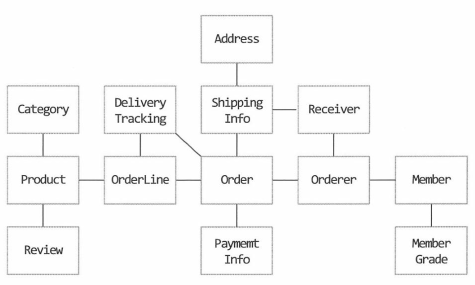

## 바운디드 컨텍스트 설계하기

전통적인 MVC 아키텍처가 아니라 DDD를 기반으로 아키텍처를 계획했으면 바운디드 컨텍스트를 설계해야 한다.

DDD에서는 일반적으로 바운디드 컨텍스트를 기반으로 패키지를 나누게 된다.

## 바운디드 컨텍스트

일반적으로 하나의 바운디드 컨텍스트는 하나의 애그리거트 루트를 가진다.

### 바운디드 컨텍스트 설계가 중요한 이유

바운디드 컨텍스트를 분리시켜 놓으면 책임을 명확히 할 수 있고,

도메인이 복잡해지면 MSA로 바운디드 컨텍스트를 분리하기도 용이하다.

## 설계 방법

바운디드 컨텍스트를 설계하기 위한 방법은 아래와 같다.
### 1. 도메인 모델을 모두 그린다.

### 2. 도메인 모델 간의 참조 관계를 모두 그린다.

### 3. 라이프 사이클을 기준으로 바운디드 컨텍스트를 나눈다.