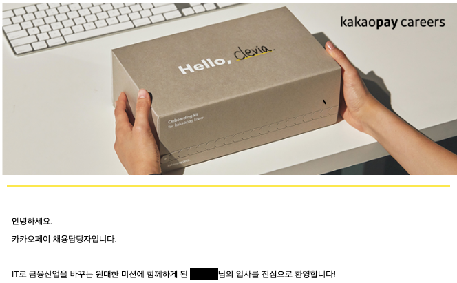

최근 이직을 하게 되어서 나름의 생각 정리와 궁금해하실 분들을 위해 공유하는 목적으로 글을 쓰게 되었다.

## 2년의 업무를 하며

회사 2년 동안 많은 업무를 했다. 너무 다양한 업무를 해서 어디서부터 적어야 할 지 모르겠다.. (정말 많다.)

그래서 그냥 **가장 잘한 것**과 **가장 못한 것**을 기록하기로 했다.

#### 가장 잘한 것

업무나 프로젝트와 해결한 문제 중 소개하고 싶은 것들이 많이 있다. 그렇지만 내가 가장 크게 기여한 부분은 **좋은 영향**이라고 생각한다.

영향력은 크게 두 가지로 나눌 수 있었다.

##### 1. 문화적 영향력

팀원 분들께서도 내가 기술 블로그를 꾸준히 작성하고, 업무 외 시간에 공부하는 것을 너무 잘 알고 있다.

출근도 1시간 30분 ~ 2시간 정도 일찍 와서 학습했다. 유연 근무제이지만 2년 동안 9-6 출퇴근만 하며 출근은 8시 이후에 해본적이 거의 없다.

업무를 하며 해결한 문제나 이슈는 **팀 전체**에게 잘 정리해서 공유했고, 코드 리뷰는 최대한 깔끔하게 정리해서 의견을 나누었다.
- 조금이라도 복잡한 문제는 반드시 **자세히 정리했다.** 그래서 소통은 정리한 것을 기반으로 나눌 수 있었다.
  - eg. 각 의존 설계(3~4 가지)를 그린 후 장단점을 정리하고 의견을 공유드리거나 제안
- 당연하지만 절대로 강요하지 않았다. 의견을 말씀드릴 때는 **'고민이 있습니다.'** 라는 치트키로 시작했고 상대방의 의견을 인정하고 내 의견을 말씀드렸다.
  - 억지로 공감한 것이 아니다. 실제로 개발하면서 생기는 95%의 문제는 정답이 없다고 생각한다. 그래서 상대 의견도 충분히 공감이 되었다.

기술적 세미나에서 발표도 진행했었다.
- DB 샤딩 라이브러리 개발 이야기
- 신입사원 온보딩 문서 작성 (+ Confluence 문서 개편)

이외에도 좋은 개발 문화를 만드려고 노력을 많이 했었던 것 같다.

##### 2. 코드적 영향력

내가 입사하고 팀에서 자바를 처음으로 사용하게 되었다. 그래서 팀에서 자바 스프링에 대한 충분한 지식이 없었다.

나는 **업무 이외의 시간에 충분히 학습**한 것들을 **회사에 하나씩 도입**할 수 있었다.

- ATDD (+ TDD)
- DDD
- Clean Architecture
- Event
- Auto Configuration
- OOP (+ 객체지향 생활체조)
- QueryDsl (+ Covered Index)
- DLQ
- 멀티 모듈
- ...

공유하려고 **의식했던 것은 아니다**. 눈을 떠보니 사내 동료들이 **따라서** 적용을 하고 있었다.

Clean Architecture의 경우 나는 **"안해도 된다."** 라고 설명을 드렸는데, 동료들이 대부분 따라서 적용을 하고 있었다. 물론 "안해도 된다" 뒤에 "그런데 이것도 좋고, 저것도 좋고, 이게 진짜 좋고, ..." 이렇게 설명을 드리긴 했었다.. ㅋㅋ

입사하실 때는 테스트 코드를 잘 모르시던 분도, 내가 퇴사할 때 쯤에는 정말 충실하게 테스트를 짜고 있었다.
테스트 관련해서 정말 많이 여쭤봐주셨고 대답해 드리는 과정에서 **나도 많이 성장**할 수 있었다.

동료 분들의 코드가 매우 깔끔해지고 테스트 코드도 늘어가면서 나 역시 매우 큰 **동기부여**가 되었다.

이러한 **문화적, 코드적 영향력**이 **가장 잘한 부분**이라고 생각한다.

#### 가장 힘들었던 때

신입 때는 입사하고 나서 시스템의 전반적인 부분들에 대해 개선하고 싶었다.

DB에는 불필요한 컬럼이 너무 너무 많았으며, 비합리적인 시스템 구조, 이해하기 어려운 프로세스가 너무 너무 많았다.

그래서 그런 것들에 대해서 해결하자고 말씀을 많이 드렸다. 문제는 내가 **신뢰자산**이 쌓이기 전이었다. **나는 기본기도 부족했고 간단한 업무를 수행하기에도 모르는 것이 너무 많은 상태**였다.

그 상태에서 **의견 어필**을 자꾸 하니까 **전부 반려**를 당했었다. 잘하는게 20이고 못하는 것이 80인데 잘하는 20에 대해서만 자꾸 **'내 말이 맞는데.. 왜 자꾸 못하게 하시지..'** 생각을 하게 되었다.

나는 이 문제를 해결하고자 **레거시에 충실**하자고 결심했다. 

**팀원 분들이 어려워 하시는 문제를 도맡아서 해결**하고, **이해하기 싫었던 기술을 이해**하고, **이해가 가지 않는 프로세스를 이해하려고 다이어그램과 플로우차트를 그려가며 열심히 정리**했다.
- 그래서 다양한 문제를 파악할 수 있었고 많은 문제를 해결할 수 있게 되었다.

그 결과, 팀 내에서 **굉장히 많은 업무를 담당**하게 되었고, 팀장님도 내가 무슨 말을 해도 **매우 긍정적으로 검토**해주시게 되었다!

## 이직을 결심

해결하고 싶은 문제가 여전히 너무 많았다. 그러나 **주어진 환경에서는 해결할 수 없었다.**

포스팅에서 자세하게 문제들에 대해 언급하거나 자세히 다루기는 어렵다. 그러나 **문화적**으로 **기술적**으로 **문제를 근본적으로 해결**하고 싶었으나 **한계가 분명히 있었다.**

이슈 대응에 대해서도 B2B 특성 상 논리적 결함이 존재해도 꼭 해결할 필요가 없는 문제도 있었다. 고객 수가 적으니 문제가 생겨도 그냥 수동으로 대응을 하면 되었다.

그래서 **더 다양한 문제에 도전**하고 싶고, 고객께 **최고의 사용자 경험**을 드리고 싶어서 이직을 결심하게 되었다.

#### 나름의 기준

이직을 시도할 때 주로 고려했던 것은 아래와 같다. (너무 많아서 정말 심플하게 정리했다.)
- 트래픽이 많이 발생하는 환경
  - 충분한 TPS를 요구하는 환경
- 훌륭한 동료와 성장 가능한 환경
- 기술적인 도전

기술적으로 풀고 싶은 문제는 아래와 같다.
- MSA 잘 다루기
  - 데이터 쿼리 (+ 충분한 캐싱)
  - 신뢰성 보장
  - 트랜잭션과 정합성
  - 모니터링
  - 분리 (성능 및 장애 결합도 제거)
- 대량의 트래픽 핸들링 (+ 데이터 배치)
- 외부 시스템 연동
- 보안 문제
- 자동화
- ...

정리하면 다니던 회사보다 **문화적으로 더 좋은 환경**과 **기술적으로 더 많이 도전할 수 있는 환경**을 원했다.

목표로 했던 회사가 많지는 않았던 것 같다.

## 결과

1월 8일부터 카카오페이 **금융서비스플랫폼 팀**으로 가게 되었다.

'**3년 이상** 서버 개발 경력을 가지신 분을 찾고 있어요.' 라고 적혀있었지만, **1년 11개월의 경력**으로 지원했고 **최종 합격**했다.

처우 협상의 경우 **얼마로 오퍼를 주시던** 콜하기로 결심했어서 바로 콜했다. (내가 부족하기도 하고, 지원한 이유의 99%가 직무 때문이라서)

- 참고로 다니던 회사도 복지나 처우는 충분히 만족헀다.

새로운 환경에서 경험하고 싶었던 것들을 경험할 수 있다는 생각에 설렌다.
실제로 2차 면접때 면접관님께서 **'입사하시면 ㅇㅇ님이 경험하시고 싶으셨던 것들은 전부 경험 하실 수 있을 거예요.'** 라고 얘기해주셨다.

(1차 면접관 분들도 너무 젠틀하셨고, 내 역량을 최대한 어필할 수 있게 도와주셨다.)

## 이직 팁(?)

이직하시는 개발자 분들을 보면서 이런 것들을 느꼈다. **'전부 이유가 있었다.'**

좋은 문화가 있고 다른 분들이 가고 싶어 하시는 곳을 가시는 분의 Github을 보거나 블로그를 보면 **다 이유를 찾을 수 있었다.**
평소에도 공부를 굉장히 열심히 하셨고, 정리하신 자료의 퀄리티를 보면 그 이유를 알 수 있었다. **절대 운으로 되지 않는다.**

꾸준히 하나씩 학습하셔서 **1레벨씩 올리시길 추천**드린다. 그러다 보면 **원하시는 기업에서 1%의 확률로 붙을 수 있는 레벨**이 될 것이고, **레벨이 올라가면서 확률도 더 높아질 것**이다. 

내 생각은 그렇다.

> 이 부분은 혹시라도 가르치는(?) 느낌을 받으셨다면 가볍게 무시해주세요 ㅎㅎ

## 무수한 감사

운이 좋게도 다니던 회사에서 **고마운 분들**이 정말 정말 많다.

함께 매일같이 대화하고, 리뷰를 주고 받으면서 **성장을 도와주신 매우 훌륭한 동료 분**도 계시고,

팀장님께서는 피드백을 많이 주셔서 내가 설명을 드리거나 설득하는 과정에서 **생각도 많이 정리**할 수 있었다.    

나를 **인정해 주시고** 이것저것 모르는 것을 매일같이 여쭤봐 주셔서 설명드리면서 다시 한번 생각을 정리하게 해주신 분도 계신다. (그 분께 **Soft-Skill**도 정말 많이 배웠다. 성장하시는 모습을 보고 **동기부여**도 정말 많이 되었다!)

최근에는 엄청난 실력의 신규 입사자 분들도 들어와서 무척이나 기대가 되었다.
- 리뷰에 대해 "감사합니다. 열심히 하겠습니다!"라고 말씀을 해주시는 등 업무에서 가장 중요한 **기술적 겸손함**까지 겸비하셨다. 정말 기대가 많이 되었다!

옆 팀에도 고민을 나누거나 업무 중 만난 문제를 공유하기도 하고 일상 얘기도 많이 하는 등 편하게 회사를 다닐 수 있게 해주신 분들이 정말 많다.

부족하지만 **좋게 봐주시고 아껴주신 고마운 분들께** **무수한 감사**🙇를 드린다. (언젠가 다른 모습으로 다시 만나길 기대할게요!)