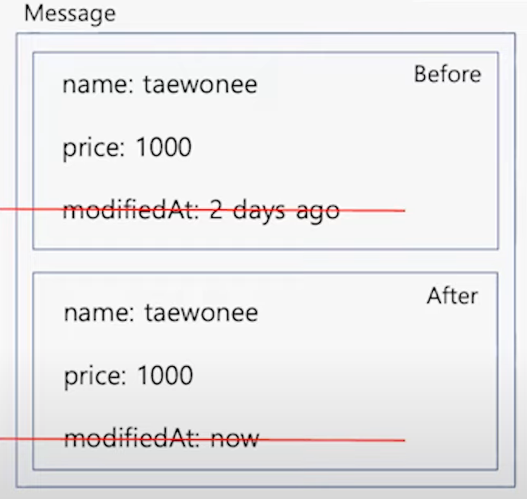

해당 포스팅은 NAVER ENGINEERING DAY(7월)의 아래 강연을 토대로 나름대로 정리한 글입니다.
- https://www.youtube.com/watch?v=Jpvh9oOyNVM&t=53s

조회용 DB로 분산 DB를 선택해서 개발한 내용과 겪게된 이슈에 대한 내용입니다.

## 분산 DB가 필요해진 이유

아래는 네이버 쇼핑에서 상품에 대한 정보들이다.

해당 페이지에 필요한 데이터를 얻기 위해 20개 이상의 테이블 데이터를 가져와야 한다고 한다.
- 카탈로그 기본 정보
- 판매처별 정보
- 리뷰 정보
- 속성 네이밍 정보

기존에는 Oracle을 사용해서 Join을 사용했는데 코로나 이후 트래픽 수가 급증하면서 Lock도 걸리고 Replication lag도 늘어나면서 장애 상황이 많이 생겼다.

그래서 분산 DB인 PostgreSQL을 메인 DB로 선택해서 개편을 생각했다.

## 분산 DB의 Join 문제

분산 DB를 적용하니 문제가 다양한 데이터가 필요해서 각 Node에 Join을 해야하고, 실시간성을 보장해야 하지만 Network OverHead + Memory 낭비가 심했다.

그래서 메인 DB로는 PostgreSQL을 사용하되 조회 용도로는 MongoDB를 사용하게 되었다.

그러면 반영은 어떤 방식으로 할까..?

## 전파

메인 DB의 정보를 조회용 DB(Mongo)에 반영을 해야 한다. 보통 Event를 직접 앱에서 발행하여 전달하는 경우를 많이 봤는데 네이버 쇼핑에서는 CDC를 사용한다.

CDC를 사용하면 MySQL이나 PostgreSQL 등의 변경 사항을 캡처해서 MQ로 전달할 수 있다. 최종 아키텍처는 아래와 같다.

- Converter: CDC (before, after 정보 포함) 토픽 구독
- Processor: 메인 DB 조회
- Writer: 정보를 가공해서 MongoDB에 Write
- Recover: 전체 데이터 생성
- Retry: 실패 발생 시 메인 DB를 질의해서 Mongo에 삽입
  - Join을 하지 않고 하나씩 조회한 후 앱에서 조합

아래는 위 아키텍처를 구축하면서 마주한 문제들이다.

## 많은 전파량

변경량이 너무 많아서 앱에서 감당할 수 있는 수준을 넘어서 데이터가 유실되는 시점까지 되었다. 이를 튜닝하려면 어떻게 해야 할까..?

첫 번째로 필요 없는 데이터를 제거했다고 한다.

두 번째로 중복 제거이다. Converter에서 Batch Listen을 하는데 같은 상품에 대해서 세 개의 수정사항이 있다면 

위와 같이 첫 Before와 마지막 After만 남겨서 다음 프로세스로 전달하니까 Converter의 성능 문제가 어느정도 해결되었다.

## 정규화 vs 반정규화

아래와 같이 가계명을 반정규화 했다고 가정하자. 그러면 수많은 데이터가 변경되어야 한다.

그래서 반정규화가 아닌 정규화를 해야 하는데 lookup 비용이 부담될 수 있다. 이를 어떻게 해결할까?

네이버 쇼핑에서는 **공통 캐시**를 사용해서 해결했다고 한다.

Key-Value 데이터베이스에 `Key = "{id}", Value: "11번가"` 데이터를 보관하고 질의한다.
- EH Cache를 선 조회 (Local Cache)
- 결과가 없으면 Redis Cache를 조회 (Global Cache) 

## 데이터 순서 보장

아래와 같이 여러 Table 데이터를 CDC를 통해 조회용 DB에 반영해주고 있었다. 

여기서 만약 상품을 등록했는데 상품과 속성의 CDC 메시지가 이미지의 CDC 메시지보다 훨씬많아서 이미지가 먼저 반영되었다고 가정해보자.

이 경우 상품은 없지만 이미지만 노출는 문제가 생길 수 있다. 그래서 전파 순서가 중요하다.

이 문제는 아래와 같이 해결할 수 있었다.
- 상품 TABLE CDC의 Operation이 CREATE 일때는 무조건 원본 DB를 조회해서 반영
- 이미지 TABLE CDC의 Operation이 CREATE 인 경우는 무시
- 속성 TABLE의 경우 무조건 반영

## SELECT 쿼리 최소화

Bulk 단위에서 이미 Create가 있었다면 SELECT를 하지 않고 UPDATE를 날릴 수 있다.

이렇게 극한의 튜닝까지해서 Writer의 성능 문제도 해결할 수 있었다.

## 배포전 시뮬레이션

이러한 이슈들은 어떻게 잡을 수 있었을까?

네이버 쇼핑에서는 API 요청에 대한 Access log를 남기고 있다. 해당 log로 데이터를 생성하고 가공하여 배포할 새로운 API에 요청을 그대로 보냈다. 

이런 과정으로 정합성이나 성능 이슈를 잡을 수 있었다고 한다.

## 결과

Latency 목표가 200ms 이하였는데 실제 결과를 알아보자.

결과로 아래와 같이 90%의 요청이 80ms의 응답으로 떨어지고 있다고 한다.

## 참고

- https://d2.naver.com/helloworld/4381253
- https://www.youtube.com/watch?v=Jpvh9oOyNVM&t=53s

