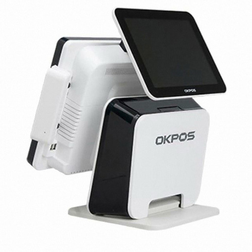

## VAN

카드 결제 과정에서 승인 / 매입 단계를 중개해주는 역항를 한다.

VAN사는 대표적으로 아래와 같이 있다.
- 나이스정보통신
- KSNET
- KIS 정보통신
- 금융결제원
- 다우데이타
- KCP
- ...

매입을 할 때 예전에는 가맹점에서 모아둔 전표를 모두 카드사에 직접 제출했다. 이러한 과정이 필요한 이유는 카드사도 돈을 내주는 것이기에 검증이 필요하다.

해당과 같은 귀찮은 업무를 대신 해주는 것이 VAN사이다.

가게 사장이 결제 단말기를 구할 때 VAN사가 나타난다. VAN사는 가게 사장에게 자사의 중개 프로그램이 설치된 **단말기**를 공급한다.
