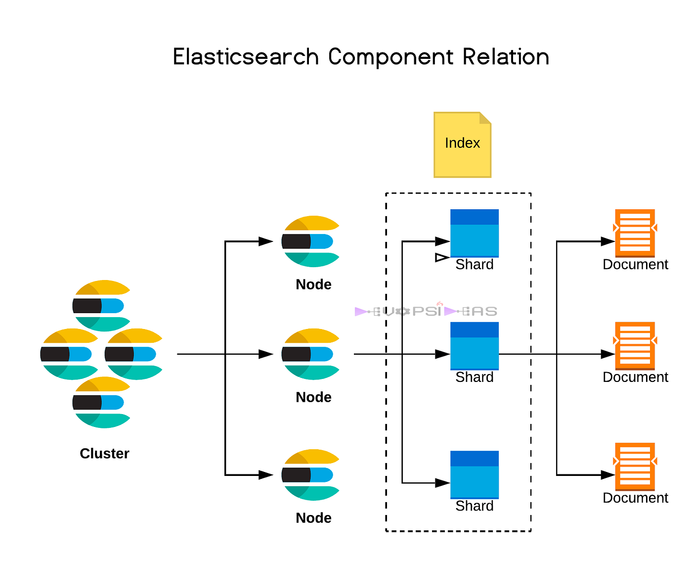

## Elasticsearch 시스템 구조



- 클러스터: 독립된 ES 환경, 1개 이상의 노드로 구성
- 노드: 실행중인 ES 시스템 프로세스
- 인덱스: 도큐먼트의 논리적 집합. 1개 이상의 샤드로 구성
- 샤드: 색인 & 검색을 진행하는 작업 단위
- 도튜먼트: 저장된 단일 데이터 단위

## 샤드

각 샤드들은 각기 다른 노드에 분산되어 저장된다.

그래서 특정 노드가 죽으면 해당 노드에 있는 Primary 샤드의 Replica 샤드를 가진 Node가 대신 요청을 받는다.
- 죽은 샤드가 Primary라면 Replica 샤드가 Primary로 승격한다.
- 새로운 Replica 샤드를 다른 노드에 추가한다.

아래와 같이 각 인덱스 별 Primary Shard 수와 Replica Shard 수를 지정할 수 있다.

```http
PUT books
{
  "settings": {
    "index": {
      "number_of_shards": 5,
      "number_of_replicas": 1
    }
  }
}
```

위와 같이 설정했다면 Primary 샤드 5개와 Replica 샤드 1개임을 의미한다.

Replica 샤드 수는 운영 중에도 변경 가능하지만, **Primary 샤드 수는 처음 인덱스 생성 이후 변경이 불가능하다.** 

### 색인

Elasticsearch는 데이터 색인 시 Round-robin 방식으로 데이터를 색인한다.

즉, 사용자는 도큐먼트가 어떤 샤드에 적재되었는 지 알 수 없다.

### 쿼리

데이터를 조회할 때도 Round-robin 방식으로 검색 요청을 보내면 요청을 받은 노드는 Coordinate Node가 된다.

Coordinate Node가 다른 노드 들한테 검색을 요청하고, 결과를 취합해서 사용자에게 응답하게 된다.

### Default

인덱스 용량에 따라 적절한 수의 샤드로 구성해야 한다.
- 인덱스 당 설정 가능한 최대 샤드 개수: 1,024
- 6.x 버전까지 Primary Shard 개수 default: 5개
- 7.0 버전부터 Primary Shard 개수 default: 1개

샤드 당 권장 사이즈는 시스템 사양에 따라 다르지만 10GB ~ 50 GB를 권장한다.

## 멀티 테넌시

아래와 같이 쉼표`,`로 나열하거나 와일드 카드`*`를 사용해서 서로 다른 인덱스를 묶어서 조회할 수 있다.
```
GET books,magazines/_search
```

이는 **로그 데이터**에서 유용하게 사용된다. 로그 데이터의 경우 날짜나 시간 단위로 데이터를 쌓는 것이 유리하다.
- logs-2022-06-01,logs-2022-06-02, ...
- logs-2022-06*/_search

위와 같이 검색하면 날짜별 인덱스를 삭제할 수 있고,  필요한 검색 범위를 최소화할 수 있다.

### Alias API

Alias API를 사용하면 멀티 테넌시를 더 유용하게 사용할 수 있다.

```
POST _alias
{
  "actions": [
    {
      "add": {
        "index": "logs-*",
        "alias": "logs"
      }
    }
  ]
}
```

이제 Alias를 사용해서 조회를 하면 간편하게 조회를 할 수 있다. 


## 참고
- https://medium.com/geekculture/elasticsearch-architecture-1f40b93da719
- https://www.youtube.com/watch?v=JqKDIg8fgd8