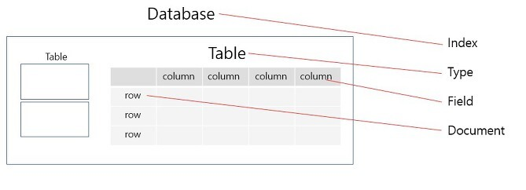

## ElasticSearch 이해하기!


엘라스틱서치(ElasticSearch)는 Apache Lucene 기반의 Java 오픈소스 분산 검색 엔진이다.

ELK 스택으로 로그 통합 시스템을 많이 활용하지만, 해당 포스팅에서는 엘라스틱 서치 자체에 대해서 다룬다.

## 활용 용도

요즘 **충분한 캐시**는 규모가 있는 기업이라면 당연하게 되었다.

우리가 구글, 유튜브 등에서 게시글을 조회한다고 가정하자.

검색 결과를 매번 조회하면 엄청나게 큰 부하가 발생한다.

그렇다면 캐시를 사용할 수 있을까..?

검색에서 캐시를 활용하기는 매우 어렵다.

캐시는 보통 Key-Value 구조를 가진다.

아래의 게시글이 있다고 가정하자.

```
동해물과 백두산이 마르고 닳도록
하느님이 보우하사 우리나라 만세
```

이때 아래와 같이 엄청나게 큰 데이터를 중복해서는 엄청나게 많은 저장 공간이 소요된다.
- key: 동해물과, value: 문서 전체
- key: 백두산이, value: 문서 전체
- key: 마르고, value: 문서 전체

그래서 **역색인**이라는 기법을 사용한다.

## 역색인

역색인(Inverted Index)은 색인(Index)과 반대로 Key에 추출된 키워드(term)을 저장하고 Value에 실제 문서를 찾아갈 수 있는 주소를 저장한다.


그래서 공간도 절약하면서 검색 결과도 전체 문서에 대해 열을 찾지 않아도 되므로 매우 빠르게 찾을 수 있다.

## Elastic Search

Elastic Search는 역색인을 활용한 검색엔진이다.

역색인의 경우 자주 등장하는 단어(a, the, and)로 검색할 경우 매우 느려질 수 있다.

그래서 Elastic Search에서는 이를 불용어(stopword)로 등록하고, 인덱스에서도 제거하고 검색어에서도 무시하게 되어있다.

추가로 Elastic Search는 Node Query Cache를 제공하는데, 아래와 같이 Size 등을 조절할 수 있다.

```
indices.queries.cache.size
index.queries.cache.enabled

indices.requests.cache.size
indices.requests.cache.expire
```

## RDB <-> Elastic Search

아래는 RDB의 개념을 Elastic Search에 대응시킨 것을 시각화한 자료이다.



추가로 타 DB와 마찬가지로 아래의 개념을 가진다.
- Cluster - 하나 이상의 노드로 클러스터를 구성할 수 있음
- Node - ES(Elastic Search)를 구성하는 하나의 단위 프로세스
- Shared - 데이터를 분산해서 저장하는 방법
- Replica - 손실을 대비해서 데이터의 샤드를 복제

## 장점

Elastic Search는 아래의 특징을 가진다.
- Scale out
  - 분산을 통해 규모가 수평적으로 늘어날 수 있다.
- 고 가용성
  - Replica를 통해 데이터의 안정성을 보장한다.
- Schema Free
  - Json 문서를 통해 데이터를 검색하므로 스키마라는 개념이 없다.
- Restful
  - CRUD 작업을 수행하는 REST API를 제공한다.
- Fast
  - ElasticSearch는 전체 텍스트 검색이 매우 빠르다. (역색인)
  - 이는 거의 실시간 검색으로 대기 시간이 1초 이내에 해결되기에 보안 분석, 인프라 모니터링 등에 용이하다.
- 데이터 처리
  - Elastic Search에서는 색인하기 전에 데이터를 전처리할 수 있습니다. 즉, 데이터 및 로그 수집 등을 신속하게 처리할 수 있다.

## 단점

- 저장 및 수정
  - Elastic Search는 역색인 구조를 하고 있기 때문에 저장 및 수정에 많은 시간이 소요된다.
  - 수정이 잦고 탐색이 없는 서비스에서는 적합하지 않을 수 있다.
- 실시간 처리가 불가능
  - 인메모리 버퍼를 사용하므로 쓰기와 동시에 읽기 작업을 수행하는 경우, 세그먼트가 생성되기 전까지는 데이터를 검색할 수 없다.
- 트랜잭션 불가능
  - 분산 시스템의 특징 때문에 비용 소모가 큰 트랜잭션 및 롤백 기능을 지원하지 않는다.
- 공간을 많이 차지한다.
  - 역색인 방식 만으로도 공간을 많이 차지한다.
  - 추가로 ElasticSearch는 hard-delete 및 업데이트를 하지 않는다.
    - Soft-delete를 수행하고, Update의 경우 새로 세그먼트를 생성한다.

## 참고
- https://steady-coding.tistory.com/581
- https://www.skyer9.pe.kr/wordpress/?p=1002


