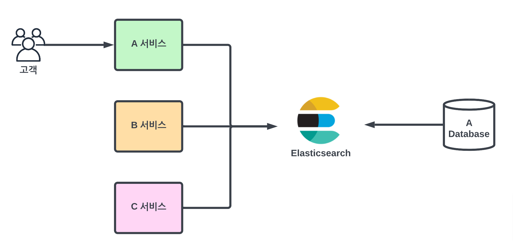
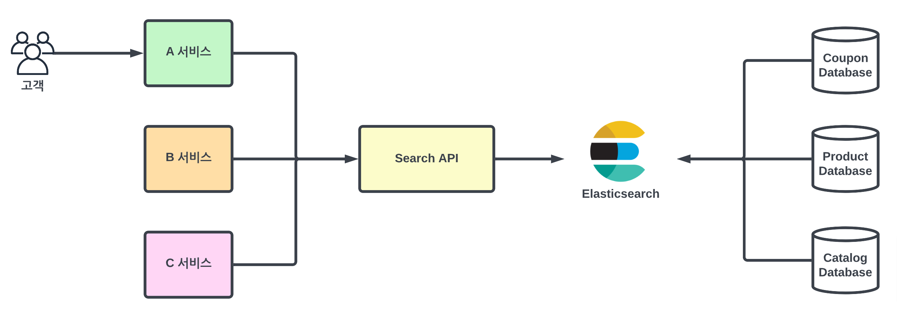

## 관계형 Database의 한계

일반적으로 RDB의 목적은 검색의 속도와 효율성보다는 **트랜잭션**, **일관성**, **쉬운 통합**, **스토리지 절약**이다.

그래서 텍스트 검색 시 성능 문제로 장애를 빈번하게 일으킬 수 있다. 

Full-Text Index를 제공하지만, 능동적인 검색이 불가능하고 ('영화'를 검색했는 데 '영화가'는 검색이 안됨)
인덱스를 사용하지 않는 Full-scan 방식이라 성능도 좋지 못하다.

## 검색 엔진

그래서 대규모 서비스에서 검색 기능 제공을 위해 별도의 **검색 엔진**을 사용하게 된다.

Elasticsearch와 같은 검색 엔진은 아래 장점이 있다.
- 분석기 처리
- 역인덱스를 통한 빠른 검색
- 고급 필터링 옵션 사용 가능
- 많은 양을 대상으로 검색 가능
- 동의어, 유사어 처리
- 뛰어난 확장성
- 랭킹, 부스팅
- HTML 형식에서 문자열만 추출하는 등 처리 용이

### 검색 엔진 적용 아키텍처

서비스에서 검색엔진을 직접적으로 사용할 시 **서비스가 검색 시스템에 강하게 결합**될 수 있다.

- 캐싱 전략 어려움, 부하 분산 어려움, 확장 어려움
- 검색 엔진 버전 민감, 유지 보수성 저하

#### 느슨한 결합

그래서 중간에 별도의 API를 두어서 도메인과 검색 시스템의 강 결합을 제거할 수 있다.

결과적으로 아래의 장점을 얻을 수 있다.
- 느슨한 결합, 독립성
- 확장성
- 유지보수성, 안정성 향상

