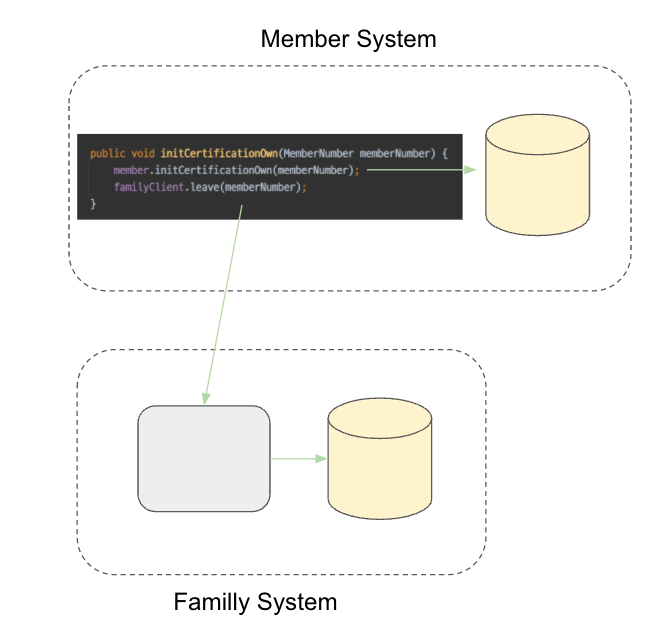
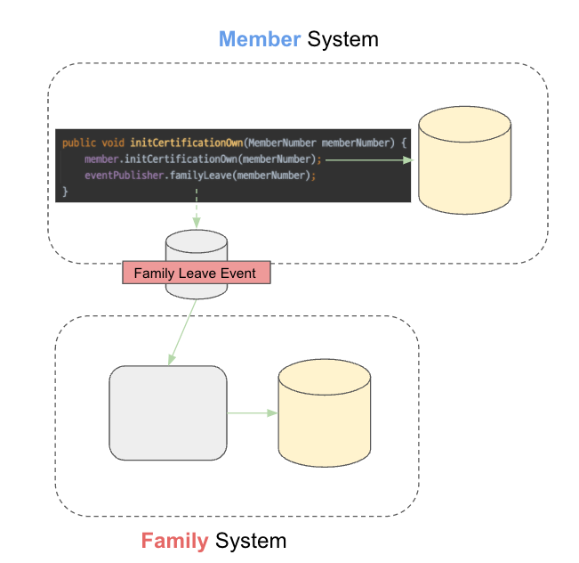
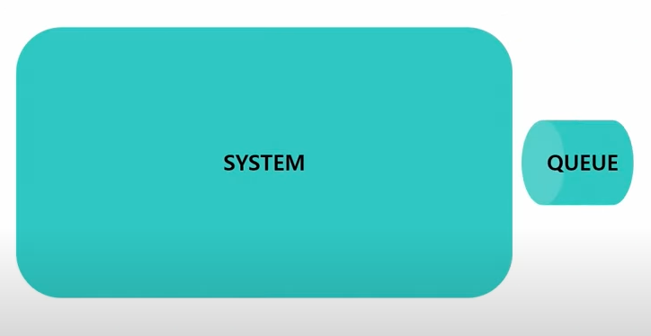
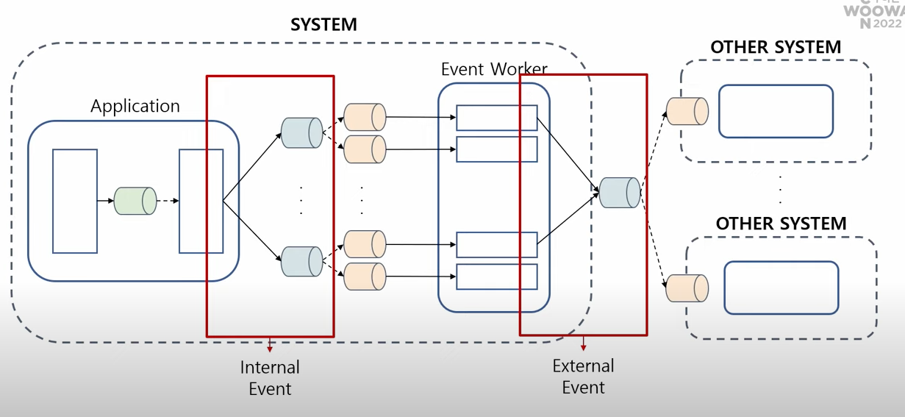

## 이벤트 기반 아키텍처 구축하기

최근 가장 궁금했던 것 중 하나가 MSA에서 <mark>이벤트 기반 아키텍처</mark>를 구축하는 방법이다..!
- 사실 뭐 어렴풋이 **도메인 이벤트(내부 이벤트)**와 **메시징 시스템(외부 이벤트)**를 사용해서 **Publisher와 Subscriber 형태로 구축**하면 되곘지..? 라고 생각했지만, 실무자의 경험이 듣고 싶었다.

그래서 해당 포스팅에서는 **권용근님의 회원시스템 이벤트기반 아키텍처 구축하기**라는 강연을 보고 나름대로 정리를 하고 살을 입히는 것을 목표로 한다.

> 강연 Link: https://www.youtube.com/watch?v=b65zIH7sDug&t=794s

## 무엇을 이벤트로 발행할 것인가?

Micro-Service Architecture(MSA)를 언급할 때 Event-Driven Architecture를 함께 언급하게 된다.

```
마이크로서비스(Microservice)는 애플리케이션을 **느슨하게 결합**된 서비스의 모임으로
구조화하는 서비스 지향 아키텍처(SOA) 스타일의 일종인 소프트웨어 개발 기법이다.
```

그 이유는 Micro service의 핵심 키워드 중 **느슨한 결합**때문이다. 느슨한 결합은 타 시스템에 대한 의존 영향도를 줄이고 각 시스템에 집중함으로써 강한 응집도를 가질 수 있다.

아래의 도메인을 예시로 들어보자.
- 하나의 애플리케이션에서 회원 도메인과 가족 계정 도메인이 있다.
- 회원의 본인 인증이 초기화되는 경우 가족 계정 서비스에서 탈퇴 되어야 한다.

해당 정책은 아래 코드로 구현할 수 있다.



이 행위에 대한 주체는 회원이고 가족 계정의 탈퇴 로직에 의존한다.

즉, 회원 도메인은 가족 계정 도메인의 정책에 따라 변경될 수 있고 회원 도메인은 가족 계정의 탈퇴 로직에 대한 후속 행위가 필요하게 된다. 두 도메인은 강한 결합을 가지게 된다.

(비동기 HTTP 호출을 사용하더라도 느슨한 결합이라고 볼 수 없다. -> 회원 도메인에서의 여전히 가족 계정 도메인에 의존하기 때문)



그래서 위와 같이 비동기 Event를 발행하면 어떻게 될까..? 이상하게도 여전히 회원 도메인이 가족 계정의 도메인을 알고 있다. 즉, 물리적인 의존은 제거되었지만 논리적인 의존은 여전히 남아있다.

> 발행한 이벤트가 **대상 도메인에게 기대하는 결과**를 담는다면, 이것은 비동기 요청일 뿐 우리가 다루고자 하는 **이벤트**가 아니다!! 

 

가족 계정 탈퇴 이벤트가 아닌 본인 인증 해제 이벤트를 발생하고, 가족 계정 도메인은 회원 시스템의 이벤트를 구독한다.
- 회원 도메인은 회원 본인인증 해제 이벤트를 발행했을 뿐, 가족 계정 도메인에 관여하지 않았다.
- 가족 계정 도메인은 회원 도메인의 이벤트를 구독하여 가족 계정 탈퇴를 처리했다.

이로써 회원 도메인과 가족 계정 도메인에 느슨한 결합이 이루어졌다.

즉, 느슨한 결합을 위한 진정한 이벤트는 **달성하려는 목적**이 아닌 **도메인 이벤트 그 자체**를 발행해야 한다.

## 이벤트 발행과 구독

하나의 Microservice는 1개의 System과 1개의 Messaging Queue를 가지게 된다.



회원 시스템에서는 1개의 System을 3가지 계층으로 분리했다.

### 1. Spring Event

Spring Application Event는 분산 비동기를 다룰 수 있는 이벤트 버스를 제공해서 트랜잭션을 제어할 수 있도록 지원하기에, 단일 Application 내에서 사용하기에 유용하다.
- 가령, 이벤트 발행의 경우 도메인에 영향이 없이 메시징 시스템에 대한 연결을 사용할 수 있어야 한다.

### 2. 내부 Event와 두 번째 구독자

Application Event를 구독하는 구독자가 발행하는 Event가 이에 해당한다. 메시징 큐를 사용하며, 시스템 내에서 Event Worker가 도메인 내 비관심사를 처리한다.

예를 들어 디바이스가 로그인되면 아래의 처리가 추가로 필요하다.
- Log 기록
- 동일 계정 로그인된 타 디바이스 로그아웃 처리
- 동일 디바이스의 다른 계정 로그아웃

이런 부가 정책(비관심사)를 내부 Event를 사용해서 결합을 느슨하게 만들고 도메인 응집도를 높인다.

### 참고

이때 의문이 생길 수 있다. 시스템 내 다른 Event Worker에서 해당 이벤트를 처리하느냐?! Application Event를 사용해서 내부적으로도 처리할 수 있지 않느냐?!

이는 Trade-Off의 결과이다.
- Application Event를 사용하면 주요 행위의 트랜잭션과 성능을 공유한다.
- 내부 Event를 사용하면 주요 행위의 트랜잭션과 성능을 분리한다.

회원 시스템에서는 비관심사로 인해 사용자와 주요 비즈니스에 영향을 주는 방향보다는 분리하는 방향을 선택했다.

### 3. MSA를 위한 외부 이벤트 발행

외부 시스템에 이벤트를 전파하는 행위 또한 **도메인 내에 존재하던 비관심사**이다. 이는 내부 Event를 처리하는 구독자가 발행하도록 만들 수 있다.



외부 이벤트는 시스템 외부에 있는 타 시스템이 구독한다.

내부 Event는 열려있지만, 외부 Event는 닫혀있다.
- 내부 Event의 Payload가 변경되더라도 이는 하나의 시스템 내부의 문제이기 때문에 System 내부에 있는 Event Worker가 인지하고 수정할 수 있다.
- 외부 Event는 시스템 외부에 구독자가 존재하기 때문에 관리할 수 없다. 한번 이벤트가 발행되면 다시는 Payload를 수정할 수 없게 된다.

## 이벤트 저장소 구축

내부 Event 혹은 외부 Event를 발행할 때 메시징 시스템으로 이벤트를 발행하게 된다. 문제는 해당 Event 발행이 실패할 수 있다는 점이다.

- Spring Application Event는 이벤트를 발행하는 행위를 트랜잭션으로 묶어서 이벤트 발행이 실패하면 도메인 행위가 실패하게 만들 수 있다.
  - 하지만 앱 서버가 외부(메시징 큐)의 성능 및 상태에 영향을 받게 되고, 메시징 시스템의 장애가 전체 시스템의 장애로 번질 수 있게 된다.

그래서 트랜잭션을 다른 범위로 잡고 이벤트는 비동기에서 발행하게 된다. 이때 요청이 실패해서 이벤트가 유실될 수 있다.

즉, **이벤트 저장소**가 필요하다.

메시징 큐로 이벤트 발행에 실패해도 이벤트 저장소에 데이터가 저장된다면, 어떠한 방식을 사용하든 해당 이벤트를 재발행할 수 있다.

### Transaction Outbox Pattern

이벤트의 경우 작은 단위로 저장이 되고, 고속 처리가 되어야 하기 때문에 RDB가 아니라 다른 저장소를 활용해야 한다고 생각할 수 있다.

단, 그 전에 확인해야 할 것이 이벤트 저장소를 사용하는 목적이다.
- 이벤트 실패를 대비하기 위해 이벤트 저장소를 사용한다.
- 이벤트 저장소에 대한 데이터 저장은 반드시 성공해야 한다.

그래서 현재 사용하고 있는 도메인 저장소와 Transaction을 묶을 수 있어야 한다. 이때 아래의 방법들이 있다.
1. 다중 데이터 베이스의 **분산 트랜잭션** 환경을 구축해야 한다.
   1. 매우 어렵고, 불가능에 가깝다.
2. 낮은 확률로 유실이 발생하는 **다중 데이터 베이스**를 사용한다.
3. 유실이 발생할 수 없도록 **데이터 베이스를 공유**한다.

회원 시스템에서는 첫 번째 방법은 불가능에 가깝고, 유실이 절대 발생해서는 안된다고 판단해서 세 번째 방법을 선택했다.


## 참고
- https://www.youtube.com/watch?v=b65zIH7sDug&t=794s
- https://techblog.woowahan.com/7835


