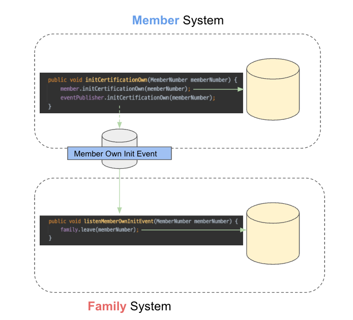

## 이벤트 기반 아키텍처 구축하기

최근 가장 궁금했던 것 중 하나가 MSA에서 <mark>이벤트 기반 아키텍처</mark>를 구축하는 방법이다..!
- 사실 뭐 어렴풋이 **도메인 이벤트(내부 이벤트)**와 **메시징 시스템(외부 이벤트)**를 사용해서 **Publisher와 Subscriber 형태로 구축**하면 되곘지..? 라고 생각했지만, 실무자의 경험이 듣고 싶었다.

그래서 해당 포스팅에서는 **권용근님의 회원시스템 이벤트기반 아키텍처 구축하기**라는 강연을 보고 나름대로 정리를 하고 살을 입히는 것을 목표로 한다.

> 강연 Link: https://www.youtube.com/watch?v=b65zIH7sDug&t=794s

## 무엇을 이벤트로 발행할 것인가?

Micro-Service Architecture(MSA)를 언급할 때 Event-Driven Architecture를 함께 언급하게 된다.

```
마이크로서비스(Microservice)는 애플리케이션을 **느슨하게 결합**된 서비스의 모임으로
구조화하는 서비스 지향 아키텍처(SOA) 스타일의 일종인 소프트웨어 개발 기법이다.
```

그 이유는 Micro service의 핵심 키워드 중 **느슨한 결합**때문이다. 느슨한 결합은 타 시스템에 대한 의존 영향도를 줄이고 각 시스템에 집중함으로써 강한 응집도를 가질 수 있다.

아래의 도메인을 예시로 들어보자.
- 하나의 애플리케이션에서 회원 도메인과 가족 계정 도메인이 있다.
- 회원의 본인 인증이 초기화되는 경우 가족 계정 서비스에서 탈퇴 되어야 한다.

해당 정책은 아래 코드로 구현할 수 있다.


이 행위에 대한 주체는 회원이고 가족 계정의 탈퇴 로직에 의존한다.

즉, 회원 도메인은 가족 계정 도메인의 정책에 따라 변경될 수 있고 회원 도메인은 가족 계정의 탈퇴 로직에 대한 후속 행위가 필요하게 된다. 두 도메인은 강한 결합을 가지게 된다.

(비동기 HTTP 호출을 사용하더라도 느슨한 결합이라고 볼 수 없다. -> 회원 도메인에서의 여전히 가족 계정 도메인에 의존하기 때문)


그래서 위와 같이 비동기 Event를 발행하면 어떻게 될까..? 이상하게도 여전히 회원 도메인이 가족 계정의 도메인을 알고 있다. 즉, 물리적인 의존은 제거되었지만 논리적인 의존은 여전히 남아있다.

> 발행한 이벤트가 **대상 도메인에게 기대하는 결과**를 담는다면, 이것은 비동기 요청일 뿐 우리가 다루고자 하는 **이벤트**가 아니다!! 

 

가족 계정 탈퇴 이벤트가 아닌 본인 인증 해제 이벤트를 발생하고, 가족 계정 도메인은 회원 시스템의 이벤트를 구독한다.
- 회원 도메인은 회원 본인인증 해제 이벤트를 발행했을 뿐, 가족 계정 도메인에 관여하지 않았다.
- 가족 계정 도메인은 회원 도메인의 이벤트를 구독하여 가족 계정 탈퇴를 처리했다.

이로써 회원 도메인과 가족 계정 도메인에 느슨한 결합이 이루어졌다.

즉, 느슨한 결합을 위한 진정한 이벤트는 **달성하려는 목적**이 아닌 **도메인 이벤트 그 자체**를 발행해야 한다.

## 이벤트 발행과 구독


## 참고
- https://www.youtube.com/watch?v=b65zIH7sDug&t=794s
- https://techblog.woowahan.com/7835


