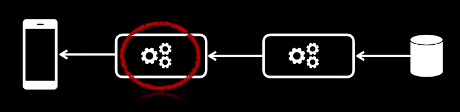
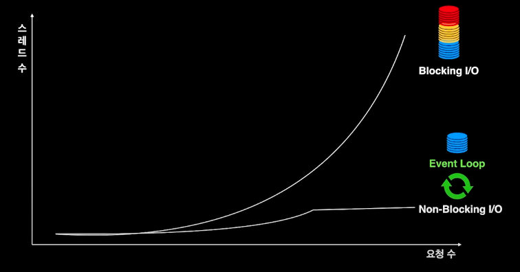
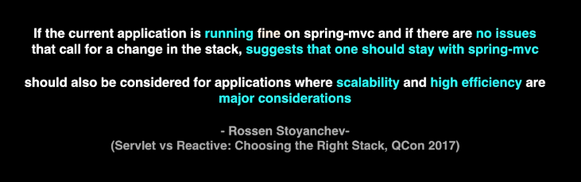

해당 포스팅은 [우아콘2020] 배민 프론트서버의 사실과 오해 라는 아주 멋진 강연을 해석하는 것에 중점을 둔다.
> Link: https://www.youtube.com/watch?v=38cmd_fYwQk

프론트 서버란 사용자 전면에서 요청을 처리하는 서버를 말한다.

즉, 이렇게 앱과 통신을 직접적으로 하는 서버를 말한다.

오해
- 프론트 서버의 기술은 단순하다.

#### 수많은 외부 서비스의 실시간 상태가 필요

1개의 가게를 노출하는데 필요한 외부 요청 수가 13번이었다.

하나의 요청을 보내는 데 걸리는 시간은 50ms이지만, 13번이면 650ms로 사용자에게 느리게 느껴질 수 있는 속도이다.

그래서 비동기 방식의 요청이 필요했다.
- 비동기 요청을 하면 13개의 요청 중에서 가장 늦게 처리되는 요청의 수행 시간이 전체 요청 시간이 된다.

그런데 비동기 방식의 요청을 수행하게 되면 Thread 문제가 생기게 된다.
- TPS(초당 트랜잭션 수)가 15000 정도가 나오고 있었다.
- 즉, 비동기로 요청을 수행하려면  15000 * 13(210,000) 개의 Thread가 1초 동안 사용되게 된다.

그때 필요한 것이 Non-Blocking I/O이다.
- 관련해서는 이전 포스팅을 참고하자. https://jaehoney.tistory.com/242

정리하자면 1개의 Thread가 여러 개의 작업을 한 번에 담당하면서, Blocking I/O라면 작업을 수행 중 대기해야 하는 시간에 다른 작업을 처리할 수 있게 되고, 전체 처리 시간이 짧아질 수 있다.
- 즉, Non-Blocking I/O는 대기 상황에서 스레드가 차단되지 않고 다른 작업을 수행할 수 있다.

결과적으로 요청 수가 증가함에 따라 기하급수적으로 증가하던 필요 스레드 수가 대폭 감소하게 된다.

## Spring WebFlux

Spring WebFlux는 2017년 말 Spring 5.0에 도입된 도입된 라이브러리로 Async와 Non-Blocking I/O 처리를 할 수 있도록 도와준다.

(SpringBoot 2.0에는 2018년에 도입이 되었다.)

Spring WebFlux는 기존 Spring MVC와 패러다임이 많이 다르다.

그래서 Spring Committer인 Rossen Stoyanchev는 위와 같이 얘기한다.

**Mvc를 구동하는데 문제가 없으면 그냥 Mvc를 써라.** 하지만 한편으로 **확장성과 효율성이 중요한 애플리케이션의 경우에는 Webflux를 사용해라.**고 얘기를 한다.

프론트 서버팀에서 **많은 동시 요청**과 **많은 트래픽**을 가지고 있고, **좋은 사용자 경험**을 제공해야 했기에 Mvc에서 WebFlux로 변경을 하게 되었다.

