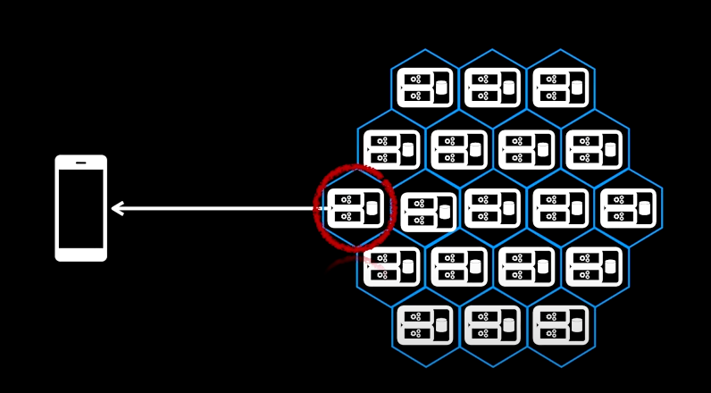
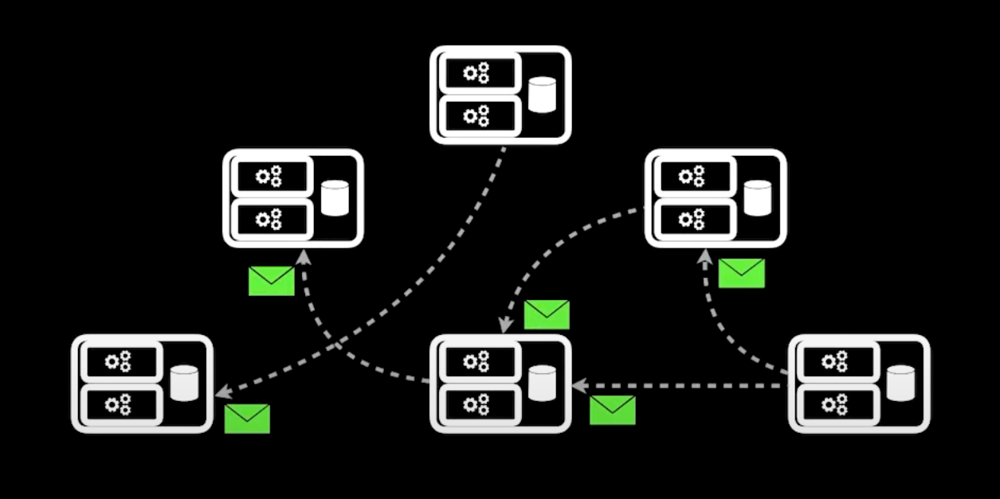
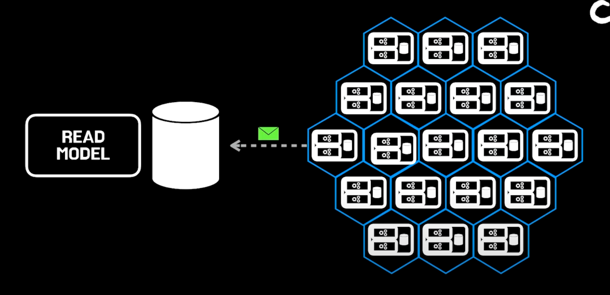
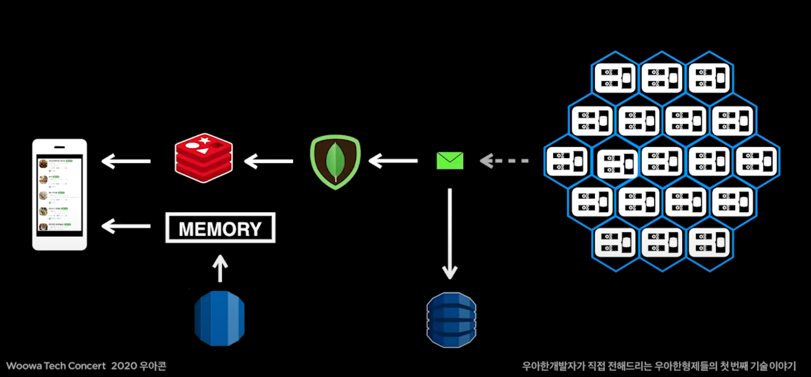
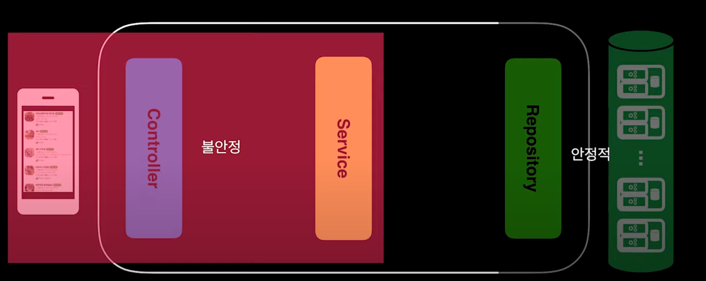
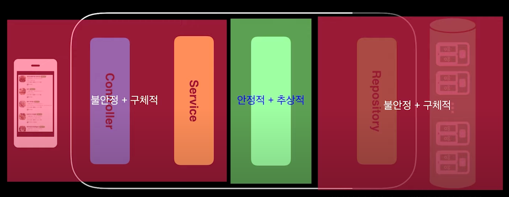
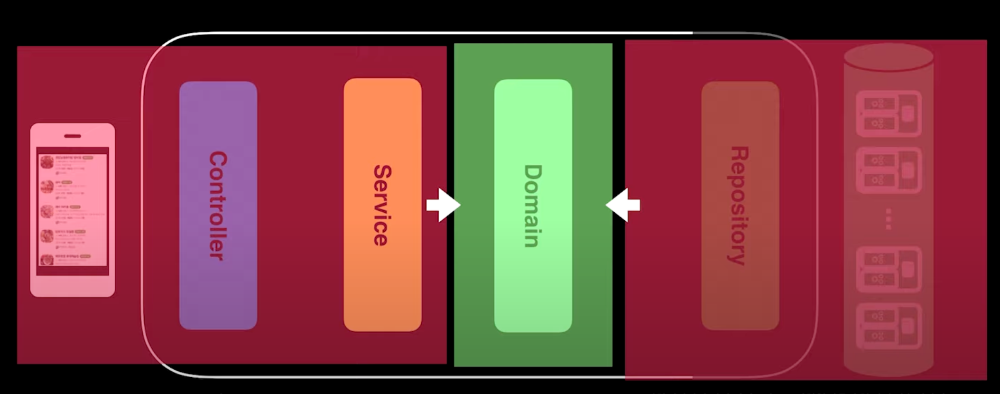
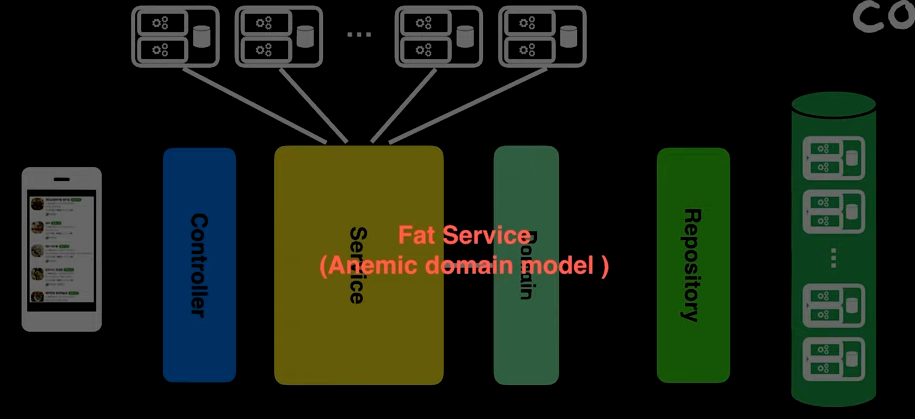
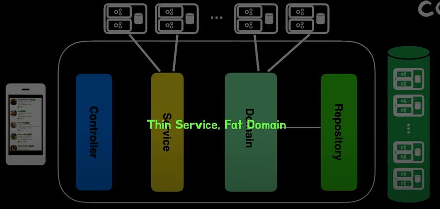

해당 포스팅은 **[우아콘2020] 배민 프론트서버의 사실과 오해** 라는 아주 멋진 강연을 해석하는 것에 중점을 둔다.
> Link: https://www.youtube.com/watch?v=38cmd_fYwQk

프론트 서버란 사용자 전면에서 요청을 처리하는 서버를 말한다.

즉, 이렇게 앱과 통신을 직접적으로 하는 서버를 말한다.

## 수많은 외부 서비스의 실시간 상태가 필요

1개의 가게를 노출하는데 필요한 외부 요청 수가 13번이었다.

하나의 요청을 보내는 데 걸리는 시간은 50ms이지만, 13번이면 650ms로 사용자에게 느리게 느껴질 수 있는 속도이다.

그래서 비동기 방식의 요청이 필요했다.
- 비동기 요청을 하면 13개의 요청 중에서 가장 늦게 처리되는 요청의 수행 시간이 전체 요청 시간이 된다.

하지만, 비동기 방식의 요청을 수행하게 되면 Thread 문제가 생기게 된다.
- TPS(초당 트랜잭션 수)가 15000 정도가 나오고 있었다.
- 즉, 비동기로 요청을 수행하려면  15000 * 13(210,000) 개의 Thread가 1초 동안 사용되게 된다.

그때 필요한 것이 Non-Blocking I/O였다.
- Blocking I/O와 Non-Blocking I/O 관련해서는 이전 포스팅을 참고하자. https://jaehoney.tistory.com/242

Non-Blocking I/O를 사용하면 대기 상황에서 스레드가 차단되지 않고 다른 작업을 수행할 수 있다.

정리하자면 1개의 Thread가 여러 개의 작업을 한 번에 담당하면서, Blocking I/O라면 작업을 수행 중 대기해야 하는 시간에 다른 작업을 처리할 수 있게 되고, 전체 처리 시간이 짧아질 수 있게 된다.

결과적으로 요청 수가 증가함에 따라 기하급수적으로 증가하던 필요 스레드 수가 대폭 감소하게 된다.

## Spring WebFlux

Spring WebFlux는 2017년 말 Spring 5.0에 도입된 도입된 라이브러리로 Async와 Non-Blocking I/O 처리를 할 수 있도록 도와준다.

(SpringBoot 2.0에는 2018년에 도입이 되었다.)

Spring WebFlux는 기존 Spring MVC와 패러다임이 많이 다르다.

그래서 Spring Committer인 Rossen Stoyanchev는 위와 같이 얘기한다.

**Mvc를 구동하는데 문제가 없으면 그냥 Mvc를 써라.** 하지만 한편으로 **확장성과 효율성이 중요한 애플리케이션의 경우에는 Webflux를 사용해라.**고 얘기를 한다.

프론트 서버팀에서 **많은 동시 요청**과 **많은 트래픽**을 가지고 있고, **좋은 사용자 경험**을 제공해야 했기에 Mvc에서 WebFlux로 변경을 하게 되었다.

## MSA

프론트 서버는 MSA의 최전방에 있다.

추가로 MSA를 얘기할 때 CQRS(Command and Query Responsibility Segregation) 패턴을 얘기를 같이 하게 된다.
- 관련해서는 이전 포스팅을 참고하자. https://jaehoney.tistory.com/255

- Command Side - 강한 정합성을 가진다.
- Query Side - 빠른 처리 속도와 효율성을 가진다.

MSA에서는 Command Side System과 Query Side System을 분리한다.

## 최종적 일관성

MSA의 타 시스템에 직접적으로 요청하는 것이 아니라 이벤트를 발행해서 정보나 데이터를 전송함으로써 직접적인 결합이 제거된다.

즉, 타 시스템에 기대하는 결과 같은 것이 사라지고 각 시스템이 자신의 할일만 잘하면 된다.

이벤트는 유실되지 않는 큐를 사용함으로써 수신하는 시스템들은 언젠가 큐를 통해 이벤트를 수신함으로써 최종적 일관성을 Read Model의 데이터를 저장되게 된다.

DB는 가장 앞단에는 대용량 처리와 빠른 처리 속도를 통해 UX를 극대화할 수 있는 Redis를 사용한다.

단, Redis를 사용할 경우 운영 이슈 해소를 위한 **질의**가 불편하기에 대용량 데이터를 저장할 수 있고, 질의가 용이한 MongoDB를 추가로 사용한다.
- RDS와 비교했을 때 NIO를 지원한다. (앞서 WebFlux를 도입한 것에 적합하다.)
- 속도가 빠르다는 장점도 있다.

그리고 운영 이슈 해소를 위해 이벤트를 기록 즉, 로그를 남겨야 했다. Event의 경우에는 언제 얼마나 발행될 지가 예측하기 힘든 모델이기 때문 대용량이 발행되기도 하고 속도도 중요하고 확장성도 중요한 그런 데이터이다. 그래서 DynamoDB 이벤트를 저장을 하기 시작했다.

추가로 광고, 배너 등의 자체적인 노출되는 데이터도 저장을 해야 하는데 이때는 질의가 가장 편리한 RDB를 사용했고, 적은 양의 데이터가 사용되기에 해당 RDB 위에 Memory에 올려서 관리를 하게 되었다.

최종적인 아키텍처 그림은 위와 같다.

결코 시스템이 단순하기만 하지는 않다는 것을 알 수 있다.

## 도메인

프론트 서버는 뒷단에 있는 여러 시스템에서 받은 정보를 조합해서 사용자에게 노출하는 일을 하게 된다.

즉, 결과 데이터는 본 시스템에서 구성된 데이터도 아니고 제어도 할 수 없다.

그래서 외부에서 받는 데이터만을 사용해서 사용자에게 노출을 해주니까 도메인 주도적인 개발을 할 수 없을 것이란 오해가 있었다.
 
## 구체적 데이터

많은 MicroService에서 온 데이터가 프론트 서버의 DB에 저장된다. 이때 데이터는 아래의 데이터 중 어떤 것을 선택해야 할까..?
- 요구사항에 맞게 가공된 데이터
- 원본의 형태와 유사한 데이터

만약 해당 DB에 잘못된 데이터가 들어가게 된다면 해당 DB에는 방대한 양의 데이터가 저장되어 있기 때문에 Full Index 조회를 해야해서 시간이 엄청 오래걸릴 것이다.

하지만 원본의 형태와 유사한 데이터가 저장되어 있다면 배포만으로도 수분 내에 바로 복구를 할 수 있다. 그래서 원본의 형태와 유사한 데이터를 사용한다.

## Stable

MicroServices에서 프론트 서버로 들어오는 데이터는 외부(해당 서버의 데이터 구조)에 의존한다. 즉, 불안전한 영역이다.

하지만 **클린 아키텍처, 4부 컴포넌트 원칙 - Robert C. Martin**을 살펴볼 필요가 있다.

### 안정된 추상화 원칙(Stable Abstraction Principle, SAP)

**불안정성 = 나가는 의존성 / (들어오는 의존성 + 나가는 의존성)**이라고 한다.

불안전성이 1이라면 굉장히 불안정한거고, 0에 수렴한다면 안전하다고 볼 수 있다.

그래서 각 Layer를 그림으로 표현하면 아래와 같다.

- Service Layer는 들어오는 의존성은 없고 나가는 의존성만 있으므로 불안정하다.
  - Business를 의존한다. 
- Repository Layer는 나가는 의존성은 없고 들어오는 의존성만 있으므로 안정적이다.
  - 외부 의존 데이터를 사용한다.

즉, Service Layer는 불안정 + 구체적이라고 말할 수 있고, Repository Layer는 안정적 + 구체적이라고 말할 수 있다.

문제는 SAP(안정된 추상화 원칙)에서는 안정적이라면 추상화되어야 하고, 불안정적이라면 구체화 되어야한다고 말한다.
- Repository Layer는 안정적이면서 구체적이기 때문에 안정적인 부분은 추상화를 할 수 있어야 한다.

Repository에서 안정적인 부분을 추상화해서 밖으로 빼는 작업이 필요한 것이다.
- 해당 Layer에 담을 안정적인 것은 해결해야 할 문제와 관심사이다. (가게를 노출해야 한다는 문제 영역은 절대 변하지 않기 때문)
- 즉, Domain을 말한다.

여기서 만약 Domain이 Repository의 조회 결과를 의존한다면 Domain이 외부 서비스에 영향을 받게 될 것이다. -> 좋지 않은 설계

 DIP에 의하면 저수준 모듈이 고수준 모듈에 의존해야 한다.
-> 즉, 불안정적인 것이 안정적인 것에 의존해야 한다.

그래서 Repository, Service 같이 불안정적인 것이 안정적인 Domain을 의존하면서 서비스의 변경이 용이하게 된다.

## 도메인 중심적인 설계

MSA는 큰 문제를 작은 문제로 쪼개서 문제를 풀어나간다는 것을 의미한다.

그런데 프론트 서버에서는 작은 문제들을 다시 모아서 큰 문제를 풀어나가는 일을 하게 된다.

그래서 흔히는 저장소에서 나오는 데이터를 도메인과 연관을 시키지만, 프론트 서버에서는 MSA의 다양한 데이터와 시간과 공간을 합쳐서 도메인이 만들어진다.

결국에는 Service에서 실시간 데이터들과 도메인이 조합이 되기 때문에 Service가 비대해질 수 밖에 없었다.

이는 마틴 파울러가 얘기하는 **빈약한 도메인 모델**이라는 안티 패턴과 같다.
- 빈약한 도메인 모델은 데이터와 프로세스가 결합된 절차 지향적인 데이터 패턴이라고 마틴 파울러는 말한다.

실제로 프론트 서버팀에서는 Service에서 데이터 조립, 데이터 계산, 비즈니스 구현 등을 모두 처리하고 있었다.

Eric Evans의 Domain Driven Design에 따르면 **Service Layer is thin - all the key logic lies in the domain layer.** 즉, **서비스 계층은 얇아야 하고 모든 핵심 로직은 도메인 계층에서 주도를 해야 한다.** 라고 얘기한다.

그래서 도메인 계층에서 데이터 조립, 데이터 계산을 대신 책임지면서 Service Layer가 Domain Layer 쪽으로 흡수가 되어서 마틴 파울러가 말하는 이상적인 Architeceture가 되었다.

## 참고
- https://www.youtube.com/watch?v=38cmd_fYwQk
