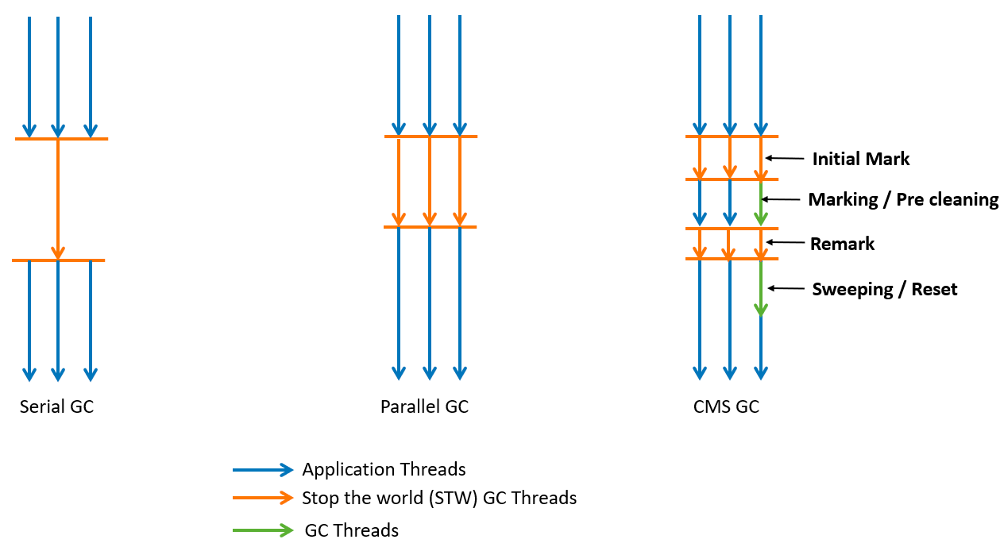
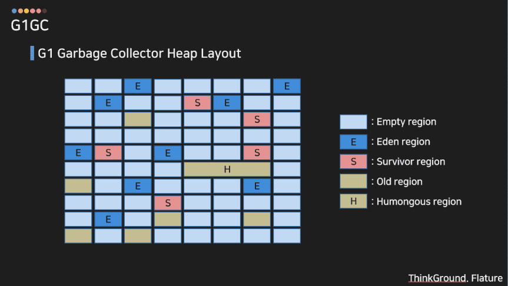
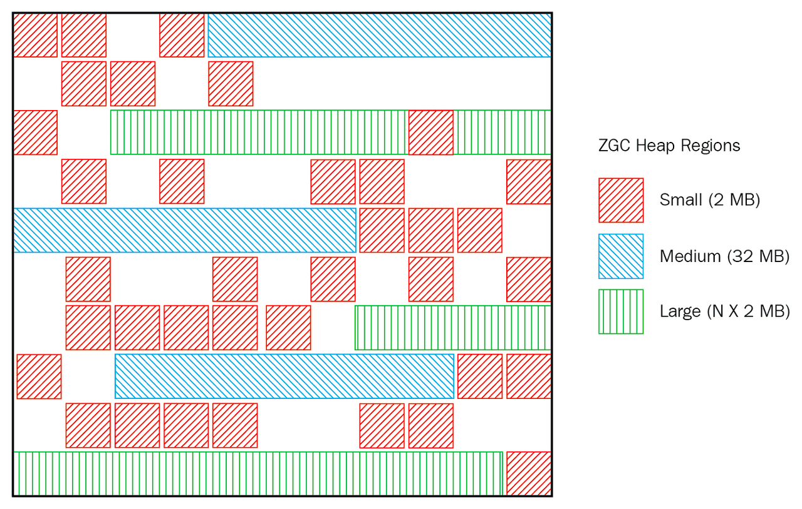
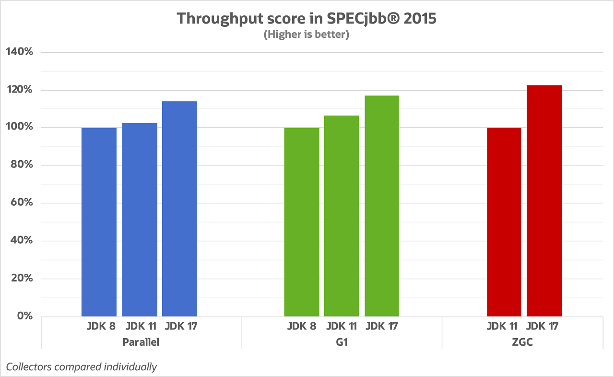

나는 Java 버전을 고를 때 주로 LTS 버전(현재 기준 17)을 선호한다.

그렇다면 해당 버전(17)에서는 JVM의 Garbage Collection(GC)가 어떤 식으로 동작할까?

```shell
docker run --cpus=1 --rm -it eclipse-temurin:17 java -Xlog:gc* -version
[0.004s][info][gc] Using Serial

docker run --cpus=2 --rm -it eclipse-temurin:17 java -Xlog:gc* -version
[0.007s][info][gc] Using G1
```

JDK 17 버전 기준으로는 CPU가 1개라면 Serial GC가 실행되고, CPU가 2개 이상이라면 G1 GC가 실행된다.

(사실 JDK 9 버전 이후로 동일하다.)

그렇다면 해당 GC들은 어떻게 동작하는 지 알아보자.

## GC 기본 동작

JVM GC는 알고리즘에 관계 없이 매커니즘은 동일하다.

JVM 힙 메모리의 사용가능한 모든 Object를 트래킹해서 참조되지 않는 것들을 폐기한다.

GC는 **Mark**와 **Sweep**이라는 두 가지 Step으로 구분한다.

- Mark - 사용중인 메모리 조각과 그렇지 않은 메모리 조각을 식별한 후 마킹하는 단계
- Sweep - 마킹된 사용하지 않는 객체를 삭제하는 단계

GC의 종류는 아래와 같이 나눌 수 있다.

- Major GC - Old, Perm 영역에서 발생하는 GC
- Minor GC - Young 영역에서 발생하는 GC
- Full GC - 메모리 전체를 대상으로 하는 GC

각 GC의 종류에 따라 성능에 크게 영향을 주며, GC의 알고리즘 종류는 크게 아래 5가지가 있다.

- Serial GC
- Parallel GC
- CMS GC
- G1 GC
- Z GC

## Serial GC

가장 간단한 GC 구현체이며 싱글 스레드로 동작한다. GC가 실행될 때 모든 애플리케이션 스레드를 정지시킨다.

그렇기에 멀티스레드 프로그램에서 Serial GC는 좋지 않은 방법이다.

애플리케이션을 일시정지해도 상관없을 때 사용한다.

## Parallel GC

Java 8의 default GC로 Throught Collectors라고도 불린다.

Serial GC와 달리 힙 공간 관리를 위해 다수의 스레드를 사용해서 stop-the-world 시간을 최소화한다.

GC가 수행될 때 다른 애플리케이션 스레드들이 정지되는 것은 동일하다.

## CMS GC

CMS는 Concurrent Mark Sweep의 약자로 Heap 메모리의 크기가 클 때 사용한다.

이 방식도 다수의 스레드를 사용한다. GC 동작 시 최소한의 pause 타임을 가지도록 설계으며, 애플리케이션이 실행되는 동안 GC와 프로세서의 리소스를 공유할 수 있다.

간단히 말하면 애플리케이션의 평균 응답 시간이 느려질 수 있지만 GC에 의해 애플리케이션이 정지되지 않는다는 장점이 있다.

추가로 위에서 언급한 Serial GC와 Parallel GC는 Compact라는 Sweep 이후 남은 데이터를 정리하는 과정이 있다. CMS는 Compact 과정을 사용하지 않고 대신 다양한 Mark 과정을 사용한다.

- Initial Mark - GC Root에서 참조하는 객체들만 식별
- Concurrent Mark - 이전 단계에서 식별한 객체들이 참조하는 모든 객체 추적
- Remark - 이전 단계에서 식별한 객체를 다시 추적, 추가되거나 참조가 끊긴 객체 확정

CMS GC는 주의할 점이 있는데 GC가 동시로 동작하기 때문에 프로세스가 작동하는 동안 System.gc()와 같은 명시적 가비지 컬렉터를 호출하면 실패/인터럽션이 발생할 수 있다.

(사실 System.gc() 메서드는 CMS GC 뿐만 아니라, 다른 GC에서도 악영향을 끼친다.)

- [https://d2.naver.com/helloworld/1329](https://d2.naver.com/helloworld/1329)

지금까지의 설명한 GC를 그림으로 표현하면 아래와 같다.



## G1 GC

하드웨어가 발전함에 따라 큰 메모리(RAM) 공간을 가지고 있는 멀티 프로세서 시스템에서 빠른 처리 속도를 지원한다.

CMS GC를 개선하기 위해 나왔으며, CMS GC보다 효율적으로 동작하고, Java 9+부터는 default GC로 채택되었다.

- Mark - 다른 GC와 달리 힙을 동일한 크기의 영역(region)으로 분할한다. 각 영역은 가상 메모리에서 연속된 공간으로 위치한다. 힙 전체에 대해 liveness를 결정하기 위해 동시에 모든 힙 영역에 marking을 수행한다.
- Sweep - 마킹이 끝나면 가장 많이 차있는 영역을 찾아내서 해당 영역부터 GC를 수행한다. (이는 일반적으로 가장 많은 양의 free space를 생성한다.)
  - 이러한 동작 방식 때문에 Garbage-First GC라는 이름으로 불리기도 한다.

G1GC는 CMS GC 처럼 모든 메모리를 탐색하지 않고, 메모리가 많이 차있는 영역(region)을 우선적으로 GC 하면서 조기 승격이나 할당률이 급격히 늘어나는 것을 방지한다.



추가로 기존에는 Young 영역(Eden->Surviovor0->Survivor1)->Old 영역 순으로 **순차적**으로 이동했다. G1 GC는 해당 객체를 **더 효율적이라고 생각하는 위치로 즉시 재할당(Reallocate)** 시킨다. 즉 G1 GC는 Young Generation에서 영역의 순서가 보장되지 않는다.

G1GC는 한 번에 더 많은 객체를 이동하고 처리한다. 작은 단위(분산된 영역)으로 GC를 수행하므로 힙 메모리가 클 수록 GC 비용을 더 분산시킬 수 있다.

그래서 Heap Memory가 4GB 이상인 환경에서 권장된다.

## Z GC

ZGC는 Java11부터 Linux 환경에 대해 실험적으로 소개된 확장성 있고 짧은 지연 시간을 갖는 GC이다.

JDK 14부터는 Windows, macOS 운영체제에 대해서도 지원한다. ZGC는 Java15부터 Production 상태로 제공된다.

ZGC는 애플리케이션 스레드의 실행을 10ms 이상 중단하지 않으며 고가의 모든 작업을 동시에 수행한다.



G1과 비슷하게 ZGC도 힙 영역을 파티션하지만, 동일한 사이즈로 분할하지 않는다는 것이 차이점이다.

## JDK 버전 별 처리 량(Throughput)

아래는 JDK 버전이 업데이트됨에 따라 GC 알고리즘의 처리량 변화이다.



단, 해당 특정 항목은 GC 성능에만 영향을 받는 것이 아니라 JIT 컴파일러와 같은 다른 플랫폼의 기여도 합한 결과이다.

## 참고

- [https://www.dhaval-shah.com/images/wp-content/uploads/2019/11/types-of-gc.png](https://www.dhaval-shah.com/images/wp-content/uploads/2019/11/types-of-gc.png)
- [https://stackoverflow.com/questions/70664562/criteria-for-default-garbage-collector-hotspot-jvm-11-17](https://stackoverflow.com/questions/70664562/criteria-for-default-garbage-collector-hotspot-jvm-11-17)
- [https://kstefanj.github.io/2021/11/24/gc-progress-8-17.html](https://kstefanj.github.io/2021/11/24/gc-progress-8-17.html)
- [https://ckddn9496.tistory.com/155](https://ckddn9496.tistory.com/155)
- [https://www.baeldung.com/jvm-garbage-collectors](https://www.baeldung.com/jvm-garbage-collectors)
- [https://kotlinworld.com/341](https://kotlinworld.com/341)