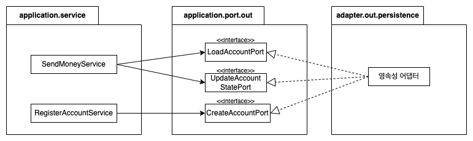

## 헥사고날 아키텍처 - 영속성 어댑터 구현하기!

클린 아키텍처에서는 전통적인 계층형 아키텍처에서 모든 것이 영속성 계층에 의존하게 되는 점을 역전시켜, 영속성 계층이 애플리케이션 계층의 플러그인으로 만든다.

## 아키텍처

헥사고날 아키텍처에서는 코어의 서비스가 영속성 어댑터에 접근하기 위해 포트를 사용하는 구조를 가진다.


즉, 코어의 서비스는 포트를 통해 영속성 계층에 DIP를 적용해서 의존을 역전시켜 영속성 계층의 변경이 애플리케이션 코어로 전파되지 않도록 한다.
- 예를 들면 DB를 변경하거나, JPA에서 JDBC로 기술을 변경한다던지 하는 상황 

## 책임

영속성 어댑터의 책임은 아래와 같다.
- 포트의 입력 모델을 DB 포맷으로 매핑한다.
- DB에 쿼리 요청을 보낸다.
- DB 출력을 포트의 출력 모델로 매핑한다.
- 결과를 반환한다.

## 포트 인터페이스

포트 인터페이스의 크기는 어떻게 하는 것이 적당할까?

일반적으로 아래처럼 특정 엔터티가 필요로 하는 모든 DB 연산을 하나의 리포지토리에 넣어 두는 것이 일반적이다. 


위왁 같이 설계했을 때는 문제점이 있다.

가령, RegisterAccountService의 경우 insert() 메서드만 필요하다. 하지만, 다수의 메서드가 포함된 AccountRepository에 의존하면서 '넓은' 포트 인터페이스 의존성을 갖는다. 불필요한 의존성이 생긴 것이다.

필요하지 않는 메서드에 생긴 의존성은 코드를 이해하고 테스트하기 어렵게 만든다.
- RegisterAccountService의 경우 AccountRepository의 어떤 메서드를 모킹해야 할까..?
- 다른 사람은 AccountRepository의 메서드 전체가 Mocking 되었다고 생각할 수 있다.

**인터페이스 분리 원칙(Interface Segregation Principle, ISP)**은 이 문제의 답을 제시한다. 클라이언트는 오로지 자신이 필요로 하는 메서드만 알도록 넓은 인터페이스를 분리해야 한다.



이제 각 서비스는 필요한 메서드에만 의존한다. 나아가 포트의 이름이 포트의 역할을 명확하게 표현하고 있다.

포트 하나가 반드시 하나의 메서드만 가질 수는 없을 때도 있다. 하지만, 가능한 인터페이스의 책임을 분리하는 것은 중요하다.

## 영속성 어댑터

영속성 어댑터의 크기는 어느정도가 적당할까?


일반적으로 애그리거트당 하나의 영속성 어댑터를 만들면 된다. 이는 바운디드 컨텍스트를 분리하기 위한 좋은 토대가 된다.

## JPA

앞 그림에서 본 AccountPersistenceAdapter를 구현한 코드를 살펴보자.

아래는 도메인 모델인 Account 엔터티의 골격이다.
```java
@AllArgsConstructor(access = AccessLevel.PRIVATE)
public class Account {
    
	@Getter private final AccountId id;
	@Getter private final Money baselineBalance;
	@Getter private final ActivityWindow activityWindow;
    
	public static Account withoutId(
					Money baselineBalance,
					ActivityWindow activityWindow) {
        // ...
	}
    
	public static Account withId(
					AccountId accountId,
					Money baselineBalance,
					ActivityWindow activityWindow) {
        // ...
	}

	public Optional<AccountId> getId(){
        // ...
	}
    
	public Money calculateBalance() {
        // ...
	}
    
	public boolean withdraw(Money money, AccountId targetAccountId) {
        // ...
	}
    
	public boolean deposit(Money money, AccountId sourceAccountId) {
		// ...
	}

	@Value
	public static class AccountId {
		private Long value;
	}

}
```

Account 클래스는 getter와 setter만 가진 데이터 클래스가 아니며 불변성을 유지한다.

그리고 생성과 모든 상태 변경 메서드에서 유효성 검증을 수행하기 때문에 유효하지 않은 도메인 모델을 생성할 수 없다.


