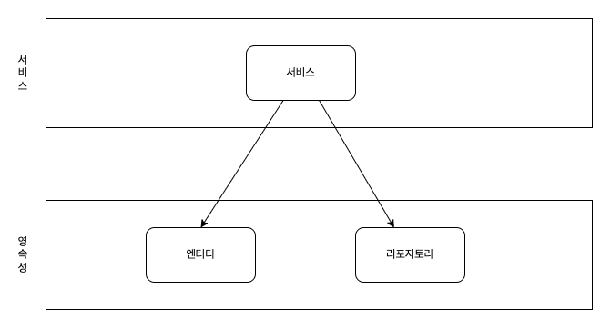
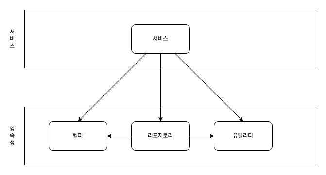
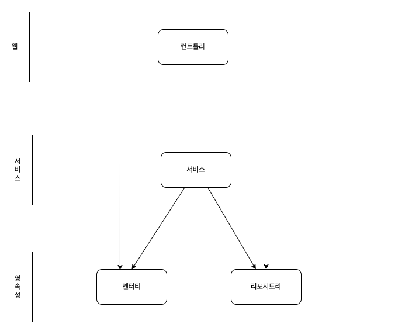
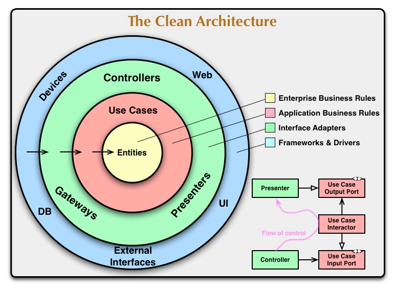
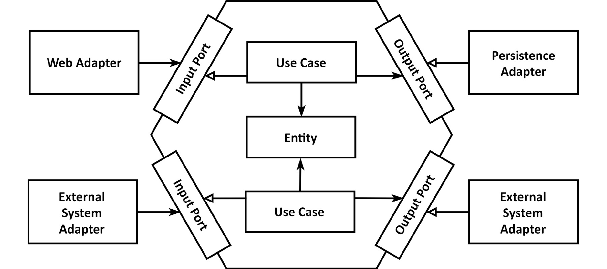

## 헥사고날(Hexagonal) 아키텍처란 무엇인가?!

헥사고날 아키텍처는 전통적인 계층형 아키텍처의 단점을 보완하기 위해 생겼다.
- **도메인 중심 아키텍처**의 일종으로 **클린 아키텍처**를 일반화한 구조 중 하나이다.
- (포트와 어댑터(Ports and Adaters) 아키텍처라고도 말한다.)

## 계층형 아키텍처의 문제

### 1. 데이터베이스(+ 영속성)에 대한 의존이 퍼지게 된다.

전통적인 계층형 아키텍처의 도메인 계층은 영속성에 의존한다.

즉, 도메인 계층이 자연스레 데이터 베이스에 의존하게 되어서 데이터 베이스에 변화가 일어난다면 도메인 계층도 변화가 생긴다.

추가로 아래와 같이 서비스 계층에서도 영속성 모델을 도메인 모델 처럼 사용하게 된다.



결과적으로 해당 도메인 모델을 사용하는 서비스 계층에서도 즉시 로딩, 지연 로딩, 트랜잭션, 플러시 등을 고려해야 하고, 영속성에 대한 의존이 프로젝트 전체적으로 퍼지게 되고 변경에 취약해진다.

### 2. 아키텍처 경계를 강제할 수 없다.

전통적인 계층형 아키텍처에서는 상위 계층에 있는 컴포넌트를 접근할 목적으로 해당 컴포넌트를 하위 계층으로 내려버릴 수 있다.



해당과 같은 행위가 쌓이면, 점점 경계가 모호해지다가 결국 경계가 허물어지게 된다. 위 그림처럼 모든 계층에서 헬퍼나 유틸리티에 의존하게 될 수도 있다.

중요한 것은 부적절한 선택지를 닫아야 한다는 점이다. 선택지가 열려 있으면 누군가는 반드시 그렇게 하기 마련이다.

### 3. 계층을 Skip 할 수 있다.

계층형 구조에서 많이 나타나는 형태로 계층을 건너뛰는 것이 가능하다.

가령, 구현이 간단한 경우 Controller에서 바로 도메인을 참조해서 로직을 작성할 수 있다.



이 경우 첫 번째 문제는 기능이 확장되었을 경우이다. '기능이 커지면 서비스 계층으로 로직을 옮기겠지..?' 라고 생각하지만, 다른 동료는 그렇게 생각하지 않을 수 있다.

두 번째 문제는 테스트가 복잡해진다는 것이다. Controller의 단위 테스트를 하는데 영속성 계층도 Mocking을 하면서 복잡한 처리를 해야만 테스트가 가능하게 된다.

### 4. 유스케이스를 숨긴다.

개발자들은 새로운 유스케이스를 구성하는 새로운 코드를 짜는 것을 선호하지만, 실제로는 기존 코드를 바꾸는 데 더 많은 시간을 소모한다.

추가로 해당 개발자는 유스케이스를 웹 계층에도 생성할 수 있고, 영속성 계층에도 생성할 수 있고 자유롭다.

즉, 개발자는 해당 유스케이스가 존재하는 지 여부를 파악하기 어려워서 동일한 로직을 다른 위치에 새롭게 구현하게 되어 코드가 지저분해질 수 있다.

### 5. 서비스의 크기를 강제할 수 없다.

계층형 구조에서는 서비스의 크기를 강제하지 않는다.

그래서 PostService에 수십개의 서비스 로직을 전부 때려박는 것도 가능해진다.

이 경우 Service는 너무 많은 의존을 가져버리고, 수많은 Web 계층이 해당 Service를 의존하게 된다.

결국 서비스를 테스트하기 어려워지고 작업해야 할 유즈케이스를 찾기도 힘들어진다.

## 클린 아키텍처

아래는 로버트 C. 마틴이 소개하는 Clean Architecture의 그림이다.



그는 클린 아키텍처에서는 비즈니스 규칙이 외부(Data-base, Framework, UI, 외부 System)로부터 독립적으로 만들어 테스트를 용이하게 하고, 비즈니스 규칙이 외부로 부터 독립적이라고 말한다.

이는 도메인 코드가 바깥으로 향하는 어떠한 의존성도 없어야 함을 의미한다. 대신 DIP의 도움으로 모든 의존성이 안쪽(도메인)을 향하고 있다.
- 도메인은 더 이상 어떤 영속성 프레임워크가 사용되는 지 알 수 없다. -> 특정 프레임워크에서 분리된 안정적인 도메인 코드를 작성할 수 있다.
- 영속성 계층이 도메인 계층에 의존하고, 영속성 엔터티를 도메인 엔터티로 변환해야 한다.

도메인 밖에는 Use Cases가 있고, 이는 단일 책임을 갖기 위해 조금 더 세분화 되어 있다.
- UserService가 아닌 RegisterUserService
- (이는 **비대한 서비스** 문제를 피할 수 있다.)

## 헥사고날 아키텍처

헥사고날 아키텍처(육각형 아키텍처)는 알레스테어 콕번이 만든 용어로 **클린 아키텍처**를 일반화한 구조 중 하나이다.
- (육각형 모양은 사실 아무 의미가 없다. -> 애플리케이션이 다른 시스템이나 어댑터와 연결되는 4개의 면을 나타내기 위해 육각형을 사용했다고 한다.)

헥사고날 아키텍처에서도 사용자 인터페이스나 데이터베이스 모두 비즈니스 로직으로부터 분리해야 하는 **외부 요소**로 취급한다.
- 이는 비즈니스 로직이 **외부 요소에 의존하지 않고** 프레젠테이션 계층과 데이터 소스 계층이 **도메인 계층에 의존**하도록 만들어야 한다는 것이다.



육각형 안에는 도메인 엔터티와 이와 상호작용하는 비즈니스 로직(UseCase)가 있다. 이는 육각형 외부로 향하는 의존성이 없기 때문에 클린 아키텍처에서 제시한 의존성 규칙이 그대로 적용된다. **모든 의존성은 코어를 향한다.**

서론에서 헥사고날 아키텍처는 **포트와 어댑터** 아키텍처로 부르기도 한다고 했다. 육각형 바깥에는 애플리케이션과 상호작용하는 어댑터가 있다. 일부 어댑터는 외부 시스템과 상호작용하며, 데이터베이스와 상호 작용하는 어댑터도 있다.
- 왼쪽에 있는 어댑터는 애플리케이션 코어를 호출하는 어댑터이고, 오른쪽에 있는 어댑터는 애플리케이션 코어에 의해 호출되는 어댑터이다.
- 어댑터와 애플리케이션 코어 간 통신을 할 때는 각각의 포트를 사용해야 한다.
  - 왼쪽에 있는 어댑터의 포트는 유스케이스에 의해 구현되고 호출되는 인터페이스가 된다.
  - 오른쪽에 있는 어댑터의 포트는 어댑터에 의해 구현되고 코어에 의해 호출되는 인터페이스가 된다.

정리하면 클린 아키텍처, 헥사고날 아키텍처 모두 의존성을 역전시켜 도메인 코드가 바깥쪽 코드에 의존하지 않게 함으로써 외부로 부터의 도메인 로직의 결합을 제거한다. 변경할 이유가 적을수록 유지보수성이 높은 코드가 된다.

## 패키지 구조

다음은 "만들면서 배우는 클린 아키텍처"라는 책에서 제시한 육각형 아키텍처의 패키지 구조이다.
```java
payment-system
        ㄴ account
            ㄴ adapter
                ㄴ in
                    ㄴ web
                        ㄴ AccountController
                ㄴ out
                    ㄴ persistence
                        ㄴ AccountPersistenceAdapter
                        ㄴ SpringDataAccountRepository
            ㄴ domain
                ㄴ Account
                    ㄴ Activity
            ㄴ application
                ㄴ SendMoneyService
                ㄴ port
                    ㄴ in
                        ㄴ SendMoneyUseCase
                    ㄴ out
                        ㄴ LoadAccountPort
                        ㄴ UpdateAccountStatePort
```


## 참고
- https://blog.jiniworld.me/176
- http://www.yes24.com/Product/Goods/105138479
