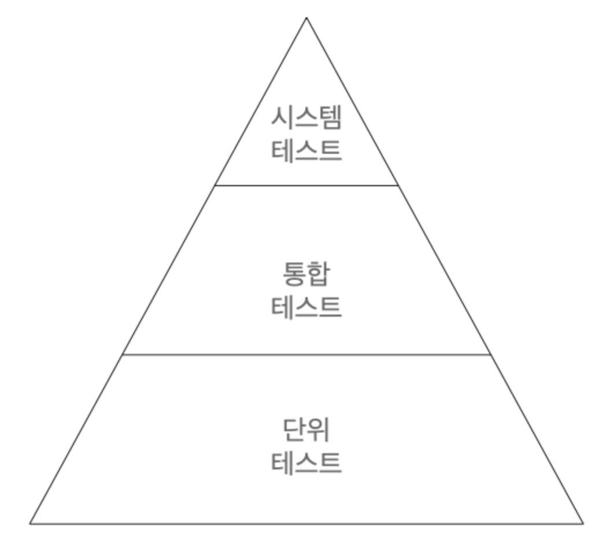

## 헥사고날 아키텍처 - 테스트를 유용하게 작성하는 방법!

## 테스트 피라미드

일반적으로 테스트의 기본 전제는 만드는 비용이 적고, 유지보수하기 쉽고, 빨리 실행되고, 안정적인 작은 크기의 테스트들에 대해 높은 커버리지를 유지하는 것이다.

하나의 단위(일반적으로 하나의 클래스)가 제대로 동작하는 지 확인할 수 있는 테스트는 단위 테스트이며, 여러 개의 단위를 넘는 경계나 아키텍처, 시스템을 결합하는 테스트는 비용이 더 비싸지고, 실행이 더 느려지며, 깨지기 쉬워진다.



단위 테스트는 의존하는 다른 클래스들은 인스턴스화 하지 않고 테스트하는동안 필요한 작업들을 흉내(mock)만 내도록 대체한다.

통합 테스트는 하나의 기능에 필요한 여러 유닛을 인스턴스화하고 데이터를 보낸 후 전체적인 기능을 테스트한다.

시스템 테스트의 경우 애플리케이션을 구성하는 모든 객체 네트워크를 가동시켜 특정 유스케이스가 전 계층에서 잘 작동하는 지 검증한다.

## 헥사고날 아키텍처에서는

헥사고날 아키텍처에서는 다음의 테스트 전략을 권장한다.

- 도메인 엔터티를 구현할 때는 단위 테스트로 커버한다.
- 유스케이스를 구현할 때는 단위 테스트로 커버한다.
- 어댑터를 구현할 때는 통합 테스트로 커버한다.
- 사용자가 취할 수 있는 애플리케이션 경로는 시스템 테스트로 커버한다.

아래는 예를 간략하게 설명한 것이므로 생략해도 무관하다.

## 도메인 테스트

```java
lass AccountTest {

    @Test
    void calculatesBalance() {
        AccountId accountId = new AccountId(1L);
        Account account = defaultAccount()
                .withAccountId(accountId)
                .withBaselineBalance(Money.of(555L))
                .withActivityWindow(new ActivityWindow(
                        defaultActivity()
                                .withTargetAccount(accountId)
                                .withMoney(Money.of(999L)).build(),
                        defaultActivity()
                                .withTargetAccount(accountId)
                                .withMoney(Money.of(1L)).build()))
                .build();

        Money balance = account.calculateBalance();

        assertThat(balance).isEqualTo(Money.of(1555L));
    }

    @Test
    void withdrawalSucceeds() {
        AccountId accountId = new AccountId(1L);
        Account account = defaultAccount()
                .withAccountId(accountId)
                .withBaselineBalance(Money.of(555L))
                .withActivityWindow(new ActivityWindow(
                        defaultActivity()
                                .withTargetAccount(accountId)
                                .withMoney(Money.of(999L)).build(),
                        defaultActivity()
                                .withTargetAccount(accountId)
                                .withMoney(Money.of(1L)).build()))
                .build();

        boolean success = account.withdraw(Money.of(555L), new AccountId(99L));

        assertThat(success).isTrue();
        assertThat(account.getActivityWindow().getActivities()).hasSize(3);
        assertThat(account.calculateBalance()).isEqualTo(Money.of(1000L));
    }

    @Test
    void withdrawalFailure() {
        AccountId accountId = new AccountId(1L);
        Account account = defaultAccount()
                .withAccountId(accountId)
                .withBaselineBalance(Money.of(555L))
                .withActivityWindow(new ActivityWindow(
                        defaultActivity()
                                .withTargetAccount(accountId)
                                .withMoney(Money.of(999L)).build(),
                        defaultActivity()
                                .withTargetAccount(accountId)
                                .withMoney(Money.of(1L)).build()))
                .build();

        boolean success = account.withdraw(Money.of(1556L), new AccountId(99L));

        assertThat(success).isFalse();
        assertThat(account.getActivityWindow().getActivities()).hasSize(2);
        assertThat(account.calculateBalance()).isEqualTo(Money.of(1555L));
    }

    @Test
    void depositSuccess() {
        AccountId accountId = new AccountId(1L);
        Account account = defaultAccount()
                .withAccountId(accountId)
                .withBaselineBalance(Money.of(555L))
                .withActivityWindow(new ActivityWindow(
                        defaultActivity()
                                .withTargetAccount(accountId)
                                .withMoney(Money.of(999L)).build(),
                        defaultActivity()
                                .withTargetAccount(accountId)
                                .withMoney(Money.of(1L)).build()))
                .build();

        boolean success = account.deposit(Money.of(445L), new AccountId(99L));

        assertThat(success).isTrue();
        assertThat(account.getActivityWindow().getActivities()).hasSize(3);
        assertThat(account.calculateBalance()).isEqualTo(Money.of(2000L));
    }

}
```

해당 테스트는 만들고 이해하기도 쉬운 편이고, 매우 빠르게 실행된다.

단위 테스트가 도메인 엔터티가 녹아 있는 비즈니스 규칙을 검증하기에 가장 적절한 방법이다.

## 유스케이스 테스트

```java
class SendMoneyServiceTest {

    private final LoadAccountPort loadAccountPort =
            Mockito.mock(LoadAccountPort.class);

    private final AccountLock accountLock =
            Mockito.mock(AccountLock.class);

    private final UpdateAccountStatePort updateAccountStatePort =
            Mockito.mock(UpdateAccountStatePort.class);

    private final SendMoneyService sendMoneyService =
            new SendMoneyService(loadAccountPort, accountLock, updateAccountStatePort, moneyTransferProperties());

    @Test
    void givenWithdrawalFails_thenOnlySourceAccountIsLockedAndReleased() {

        AccountId sourceAccountId = new AccountId(41L);
        Account sourceAccount = givenAnAccountWithId(sourceAccountId);

        AccountId targetAccountId = new AccountId(42L);
        Account targetAccount = givenAnAccountWithId(targetAccountId);

        givenWithdrawalWillFail(sourceAccount);
        givenDepositWillSucceed(targetAccount);

        SendMoneyCommand command = new SendMoneyCommand(
                sourceAccountId,
                targetAccountId,
                Money.of(300L));

        boolean success = sendMoneyService.sendMoney(command);

        assertThat(success).isFalse();

        then(accountLock).should().lockAccount(eq(sourceAccountId));
        then(accountLock).should().releaseAccount(eq(sourceAccountId));
        then(accountLock).should(times(0)).lockAccount(eq(targetAccountId));
    }

    @Test
    void transactionSucceeds() {

        Account sourceAccount = givenSourceAccount();
        Account targetAccount = givenTargetAccount();

        givenWithdrawalWillSucceed(sourceAccount);
        givenDepositWillSucceed(targetAccount);

        Money money = Money.of(500L);

        SendMoneyCommand command = new SendMoneyCommand(
                sourceAccount.getId().get(),
                targetAccount.getId().get(),
                money);

        boolean success = sendMoneyService.sendMoney(command);

        assertThat(success).isTrue();

        AccountId sourceAccountId = sourceAccount.getId().get();
        AccountId targetAccountId = targetAccount.getId().get();

        then(accountLock).should().lockAccount(eq(sourceAccountId));
        then(sourceAccount).should().withdraw(eq(money), eq(targetAccountId));
        then(accountLock).should().releaseAccount(eq(sourceAccountId));

        then(accountLock).should().lockAccount(eq(targetAccountId));
        then(targetAccount).should().deposit(eq(money), eq(sourceAccountId));
        then(accountLock).should().releaseAccount(eq(targetAccountId));

        thenAccountsHaveBeenUpdated(sourceAccountId, targetAccountId);
    }

}
```

해당 코드에서는 영속성 계층의 포트나 외부 객체는 Mock으로 대체하고 있다. 이를 통해 해당 Service가 가진 비즈니스 로직만 테스트가 가능하다.

## 웹 어댑터 테스트

웹 어댑터는 통합 테스트로 작성한다.

```java
@WebMvcTest(controllers = SendMoneyController.class)
class SendMoneyControllerTest {

    @Autowired
    private MockMvc mockMvc;

    @MockBean
    private SendMoneyUseCase sendMoneyUseCase;

    @Test
    void testSendMoney() throws Exception {

        mockMvc.perform(post("/accounts/send/{sourceAccountId}/{targetAccountId}/{amount}",
                41L, 42L, 500)
                .header("Content-Type", "application/json"))
                .andExpect(status().isOk());

        then(sendMoneyUseCase).should()
                .sendMoney(eq(new SendMoneyCommand(
                        new AccountId(41L),
                        new AccountId(42L),
                        Money.of(500L))));
    }

}
```

해당 코드를 보면 의문이 들 수 있다. (@SpringBootTest가 아닌데 왜 통합 테스트라고 부르는 지?) 실제로도 UseCase는 Mocking하고 있다.

테스트에서 하나의 웹 컨트롤러 클래스만 테스트한 것처럼 보이지만, 사실 보이지 않는 곳에서 더 많은 일들이 벌어지고 있다.
- @WebMvcTest의 경로 매핑
- 객체와 Json 간의 매핑
- HTTP 입력 검증

즉, Spring Framework와 함께 테스트하기 때문에 통합 테스트라고 부른 것이다.

(단위 테스트라고 명명해도 문제는 없다.)

## 영속성 어댑터 테스트

영속성 어댑터도 통합 테스트로 작성한다.

```java
@DataJpaTest
@Import({AccountPersistenceAdapter.class, AccountMapper.class})
class AccountPersistenceAdapterTest {

    @Autowired
    private AccountPersistenceAdapter adapterUnderTest;

    @Autowired
    private ActivityRepository activityRepository;

    @Test
    @Sql("AccountPersistenceAdapterTest.sql")
    void loadsAccount() {
        Account account = adapterUnderTest.loadAccount(new AccountId(1L), LocalDateTime.of(2018, 8, 10, 0, 0));

        assertThat(account.getActivityWindow().getActivities()).hasSize(2);
        assertThat(account.calculateBalance()).isEqualTo(Money.of(500));
    }

    @Test
    void updatesActivities() {
        Account account = defaultAccount()
                .withBaselineBalance(Money.of(555L))
                .withActivityWindow(new ActivityWindow(
                        defaultActivity()
                                .withId(null)
                                .withMoney(Money.of(1L)).build()))
                .build();

        adapterUnderTest.updateActivities(account);

        assertThat(activityRepository.count()).isEqualTo(1);

        ActivityJpaEntity savedActivity = activityRepository.findAll().get(0);
        assertThat(savedActivity.getAmount()).isEqualTo(1L);
    }

}
```

해당 테스트에서는 데이터 베이스를 모킹하지 않고 실제로 DB에 접근하기 떄문에 통합 테스트라고 명칭했다.
- Web 관련 Container 등을 모두 띄울 필요는 없어서 @SpringBootTest를 사용하지 않은 것 뿐

## 시스템 테스트

앞서 언급했듯 시스템 테스트에서는 전체 애플리케이션을 띄우고 API를 통해 요청을 보내고, 모든 계층이 조화롭게 잘 동작하는 지 검증한다.

```java
@SpringBootTest(webEnvironment = WebEnvironment.RANDOM_PORT)
class SendMoneySystemTest {

    @Autowired
    private TestRestTemplate restTemplate;

    @Autowired
    private LoadAccountPort loadAccountPort;

    @Test
    @Sql("SendMoneySystemTest.sql")
    void sendMoney() {

        Money initialSourceBalance = sourceAccount().calculateBalance();
        Money initialTargetBalance = targetAccount().calculateBalance();

        ResponseEntity response = whenSendMoney(
                sourceAccountId(),
                targetAccountId(),
                transferredAmount());

        then(response.getStatusCode())
                .isEqualTo(HttpStatus.OK);

        then(sourceAccount().calculateBalance())
                .isEqualTo(initialSourceBalance.minus(transferredAmount()));

        then(targetAccount().calculateBalance())
                .isEqualTo(initialTargetBalance.plus(transferredAmount()));

    }

    private ResponseEntity whenSendMoney(
            AccountId sourceAccountId,
            AccountId targetAccountId,
            Money amount) {
        HttpHeaders headers = new HttpHeaders();
        headers.add("Content-Type", "application/json");
        HttpEntity<Void> request = new HttpEntity<>(null, headers);

        return restTemplate.exchange(
                "/accounts/send/{sourceAccountId}/{targetAccountId}/{amount}",
                HttpMethod.POST,
                request,
                Object.class,
                sourceAccountId.getValue(),
                targetAccountId.getValue(),
                amount.getAmount());
    }

}
```

@SpringBootTest로 모든 객체 네트워크를 띄운다. 그리고 MockMvc를 이용하는 것이 아니라 실제 애플리케이션에 요청을 보내고 응답 상태와 결과를 검증한다.

시스템 테스트는 여러 개의 유스케이스를 결합해서 시나리오를 만들 때 진가가 더욱 커지며, 단위 테스트나 통합 테스트가 발견되는 버그와는 또 다른 버그를 찾아준다. (매핑 버그 등)

개인적으로는 인수 테스트라는 명칭이 더 익숙해서 인수 테스트 형태로 RestAssured로 사용하고 있다.
- 시스템 테스트와는 실제로 사용자 요청처럼 시나리오 대로 테스트를 작성한다는 차이가 있다.

시스템 테스트를 통해 중요한 시나리오들이 커버된다면 최신 변경사항들이 애플리케이션을 망가뜨리지 않았음을 가정할 수 있고, 배포될 준비가 되었다는 확신을 가질 수 있다.                                                                                                                                                                                                                                                                                                                                                                                                 
