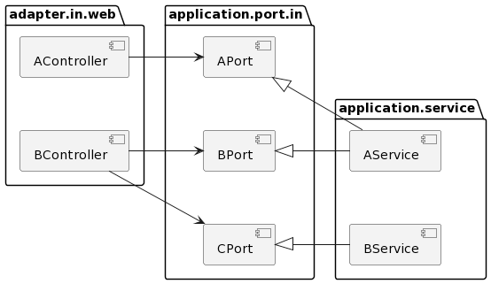

## 헥사고날 아키텍처 - 웹 어댑터 구현

헥사고날 아키텍처에서 Controller의 역할은 외부 세계로 보고 어댑터를 통해 이루어진다.

이를 어떻게 구현하는 지 알아보자.

## 의존성

아래 그림은 웹 어댑터와 애플리케이션 코어가 어떻게 상호작용하는 지 나타낸다.



웹 어댑터(인커밍 어댑터)는 애플리케이션에 의해 구현된 인터페이스인 전용 포트를 통해 애플리케이션 계층과 통신하고,

외부로부터 요청을 받아 애플리케이션 코어를 호출하는 역할을 수행한다.

해당 그림에서 만약 웹 어댑터에 능동적으로 알림을 줘야 한다면 아웃고잉 포트를 통과하도록 구현하면 된다.

## 역할

웹 어댑터는 일반적으로 다음의 처리를 한다. (시간 순)
- HTTP 요청을 자바 객체로 매핑
- 권한 검사
- 입력 유효성 검증
- 입력을 유스케이스의 입력 모델로 매핑
- 유스케이스 호출
- 유스케이스의 출력을 HTTP로 매핑
- HTTP 응답을 반환

언뜻 보면 웹 어댑터에 책임이 많은 것처럼 보인다. 하지만, 해당 책임들은 애플리케이션 계층이 신경쓰면 안되는 것들이다.
- HTTP와 관련된 것은 애플리케이션 계층으로 침투해서는 안된다.
- (HTTP를 사용하지 않는 다른 인커밍 어댑터는 동작할 수 없게 되고, 외부로 인해 애플리케이션 계층에 변경이 전파되기 때문)

## 컨트롤러의 크기

DDD, 클린 아키텍처를 보면 Service가 세분화 되어 있을 수록 유지보수성이 뛰어나고, 한 눈에 들어오고, 테스트가 용이하다고 했다.

그렇다면 Controller의 크기는 어느정도가 적합할까?

클린 아키텍처에 따르면 Controller도 너무 적은 것보다는 너무 많은 것이 훨씬 낫다고 한다.
- 각 컨트롤러는 가능한 좁고 다른 컨트롤러와 가능한 적게 공유하는 조각을 구현해야 한다.
- 이러한 설계는 단일 책임 원칙(SRP)를 지키고, 지나친 의존을 분리해서 테스트가 용이하게 한다.

가령, 아래의 클래스를 보자.

```java
@WebAdapter
@RestController
@RequiredArgsConstructor
class SendMoneyController {

	private final SendMoneyUseCase sendMoneyUseCase;

	@PostMapping(path = "/accounts/send/{sourceAccountId}/{targetAccountId}/{amount}")
	void sendMoney(
			@PathVariable("sourceAccountId") Long sourceAccountId,
			@PathVariable("targetAccountId") Long targetAccountId,
			@PathVariable("amount") Long amount) {

		SendMoneyCommand command = new SendMoneyCommand(
				new AccountId(sourceAccountId),
				new AccountId(targetAccountId),
				Money.of(amount));

		sendMoneyUseCase.sendMoney(command);
	}

}

```

해당 클래스는 변경할 이유가 적으며, 메서드 실행에 필요한 꼭 필요한 의존만 하고 있다. 그래서 리팩토링 내성을 가지고, 테스트가 용이하고, 테스트 코드를 찾는 것도 쉽게 된다.
- 한 클래스에 너무 많은 의존이 있으면 리팩토링이 힘들다.
- 한 클래스에 너무 많은 메서드가 있으면 해당 책임의 코드를 찾을 수 없다.

추가로 Service에서 입력받거나 반환하는 객체는 Controller에서 입력받거나 반환하는 객체와 다르다.
- Service에서 반환한 사용자 정보도 Controller가 반환해야 할까?
- Service에서 사용할 객체를 전부 입력 받아도 될까?

이때는 Controller에 맞는 모델을 Controller의 패키지에 private으로 선언할 수 있기 때문에 실수로 다른 곳에서 재사용될 일이 없다.
- RegisterAccountResource, UpdateAccountResource, ...

웹 컨트롤러를 나눌 때는 모델을 공유하지 않는다면 컨트롤러를 분리하는 것을 두려워해서는 안된다.

작은 클래스들은 파악하기 쉽고, 리팩토링이 용이하며, 테스트하기 쉬우며, 동시 작업을 지원한다.


## 도메인 로직

DDD에서는 간단한 로직의 경우 Presentation Layer에서 Application Layer를 생략하고 Domain Layer를 호출하는 것도 가능했다.

클린 아키텍처에서는 이를 막고 아키텍처를 강제해야 추후 파악과 유지보수가 편하다고 말하는 차이점이 있다.

## 참고
- https://jaime-note.tistory.com/416