## \@Where 애노테이션이 동작하지 않는 이유

실무에서 learning 테이블 레코드를 일괄 수정 시 인덱스를 타지 않는 문제가 발생했다.

이유는 `@Where(clause = "del_flag = 'N'")`을 했는데, QueryDsl을 사용한 조회에서는 **해당 조건을 수행하지 않아서** 인덱스를 탈 수 없었다.

요즘 Hibernate 및 JPA에 대한 관심이 부쩍 늘어서 이 문제에 접근해보면 경험치를 얻을 수 있을 것 같아서 디버깅해봤다.

## 문제 파악

다른 코드에 대한 영향 없이 확인해야 하기 때문에 새로 프로젝트를 만들었다. 

아래의 JPA Entity를 만들었다.

```java
@Entity
@Getter
@NoArgsConstructor(access = AccessLevel.PROTECTED)
@Where(clause = "name = 'violet'")
public class Learning {

    @Id
    @GeneratedValue(strategy = GenerationType.AUTO)
    private Long id;
    private String name;

    public Learning(String name) {
        this.name = name;
    }
}
```

그리고 아래의 QueryDsl 테스트를 돌렸다.

```java
@DataJpaTest
@Transactional
public class LearningTest {
    @Autowired
    EntityManager em;
    JPAQueryFactory queryFactory;

    @BeforeEach
    void before() {
        queryFactory = new JPAQueryFactory(em);
        Learning learning = new Learning("violet");
        em.persist(learning);

        Learning learning2 = new Learning("violet2");
        em.persist(learning2);
    }

    @Test
    void select() {
        Learning entity = queryFactory
            .select(learning)
            .from(learning)
            .fetchOne();

        assertThat(entity.getName()).isEqualTo("violet");
    }

    @Test
    void update() {
        long updated = queryFactory
            .update(learning)
            .set(learning.name, "updated")
            .execute();

        assertThat(updated).isEqualTo(1);
    }

}

```

Select는 예상대로 잘 실행 되었다. `@Where`애노테이션의 `clause`에 명시한 조건이 추가되어 있다.

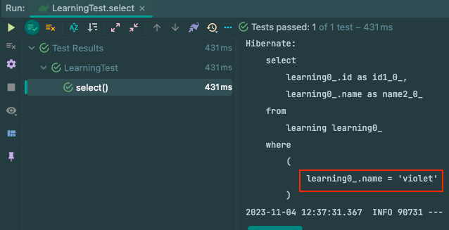

그러나 Update는 테스트가 실패했다. 조건이 들어갔다면 1개만 변경되었을 텐데 2개 row가 모두 영향을 받았다. 

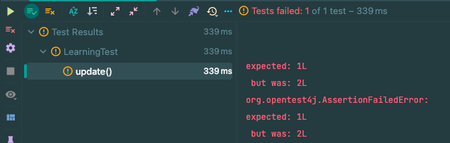

`@Where`의 조건이 수행되지 않았다.

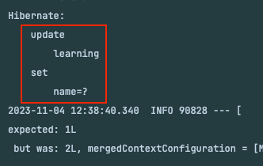

## 왜 동작하지 않을까..?

`hibernate-core`의 `AnnotationBinder`는 `@Where`을 가져와서 `EntityBinder`에 세팅한다. 

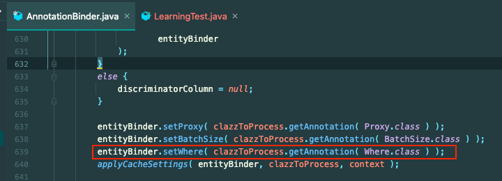

해당 부분이 사용되는 곳은 `AbstractEntityPersister`이다. 

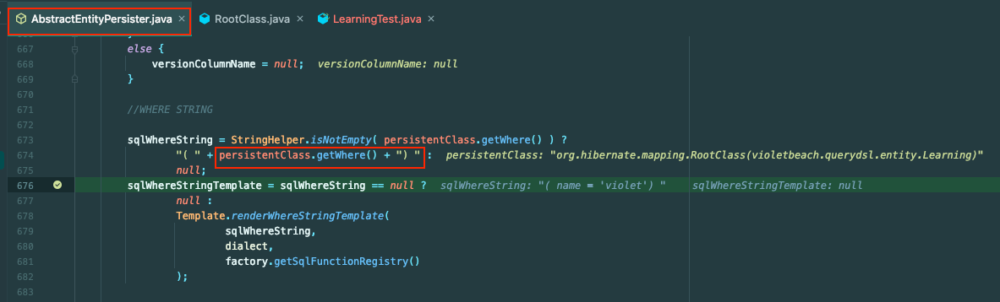

해당 부분은 `Persist(조회 및 영속화)`에서만 사용되고 있었다.

`Querydsl`의 `update()`는 영속화한 후 `save`하는 방식이 아니라, 영속성과 관계없이 바로 `Update`를 날려버린다.

그래서 동작하지 않았다.

## \@Modifying

한 가지 의문이 들었다.

`Hibernate`가 업데이트 쿼리할 때 `@Where`을 적용하지 않는다면, `JPA`의 `@Modifying`은 어떻게 `@Where`을 가져와서 동작시킬까?

```java
public interface LearningRepository extends JpaRepository<Learning, Long> {

    @Modifying
    @Query("UPDATE Learning l SET l.name = :name")
    int updateName(String name);

}
```

그걸 확인해보자. 아래의 테스트를 실행시키면 어떻게 될까?

```java
@DataJpaTest
class LearningRepositoryTest {

    @Autowired
    LearningRepository learningRepository;

    @Test
    void test() {
        learningRepository.updateName("1J");
    }

}
```

`Querydsl`로 Update할 때와 마찬가지로 `@Where` 애노테이션이 동작하지 않는다.

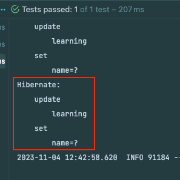

즉, `JPA`에서도 `@Modifying`을 사용한 쿼리에서는 `@Where`이 동작하지 않았다.

## 그럼 어떻게 할까?

이슈를 공유하고 의견을 제시하려고 `Hibernate`의 최신버전 프로젝트를 다운받았는데 갑자기 모든 것이 잘 통과했다.

`Querydsl`의 업데이트에서도 아래와 같이 `@Where` 애노테이션이 잘 적용되었고

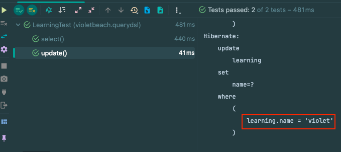

`JPA`의 `@Modifying`에서도 정상적으로 동작했다.

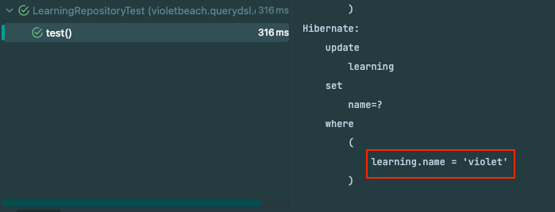

수정 이후 `@Where` 애노테이션에 대한 실제 적용을 `org.hibernate.sql.ast.spi` 쪽에서 하고 있었다.

(`Hibernate` 6.0 이전 버전에서는 해당 패키지에 아무것도 없었다.)

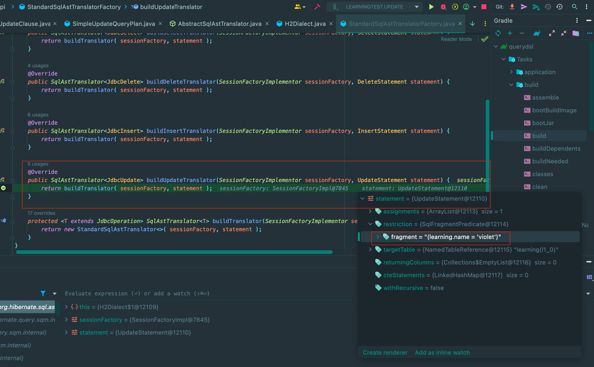

6.0 이후 버전에서는 아래와 같이 `BaseSqmToSqlAstConverter`에서 `applyBaseRestrictions()`를 실행하고,

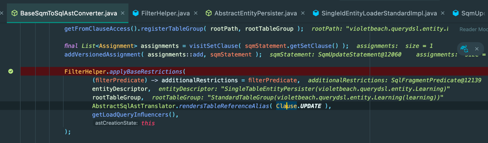

`applyBaseRestrictions()`는 `whereClauseRestrictions`에 아래와 같이 `SingleTableEntityPersister`의 `sqlWhereStringTemplate`을 사용한다.

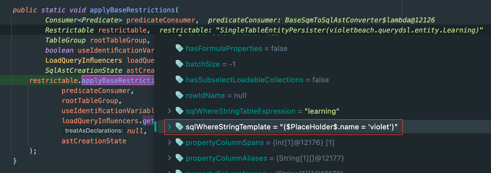

그리고 `additionalRestrictions`가 반영된 `UpdateState`를 생성한다. 

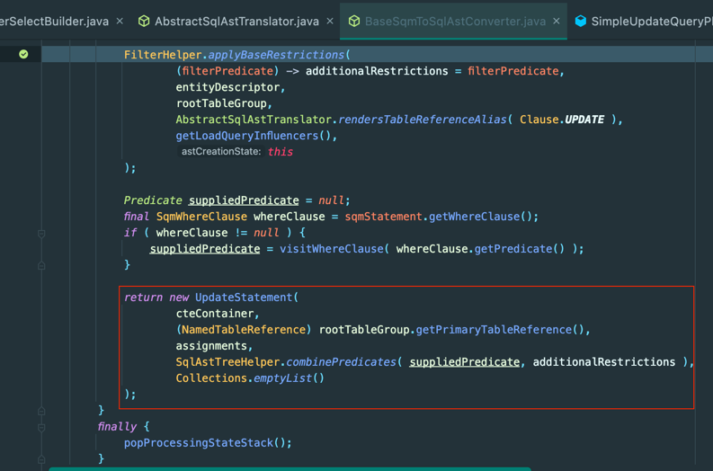

정리하면 Hibernate 6.0 버전 이후에서는 `@Where` 애노테이션의 내용이 적용된 `UpdateState`를 생성해서 `AST`를 생성하고 실행한다. 그래서 `@Where` 애노테이션이 정상적으로 적용된다.

6.0 버전 이전에는 이러한 과정이 없으며 Update에서는 인자로 들어온 주어진 JPQL만 실행했다.

(참고로 `@Where` 애노테이션은 6.3 부터 **Deprecated**되고 `@SQLRestriction`를 사용하라고 권장한다.)

## 마무리

6.0 이전 버전의 `@Where`의 버그에 대한 내용은 `release notes`에서 찾지는 못했다. 

변경사항은 `6.0.0`에 적용되었다. 버그에 대해 직접적으로 언급하거나 다루지는 않았지만 `HQL`에서 `SQM`을 지원하게 되었다. `SQM`에 대해서는 아래에서 기술하고 있다.
- https://github.com/hibernate/hibernate-orm/blob/main/design/sqm.adoc

`SQM`의 지원과 `AST`가 개선 되면서 `@Where` 애노테이션이 동작하지 않는 문제도 **해결**된 것으로 보인다.

## 참고
- https://github.com/hibernate/hibernate-orm/blob/main/changelog.txt
- https://hibernate.org/orm/releases/6.0


