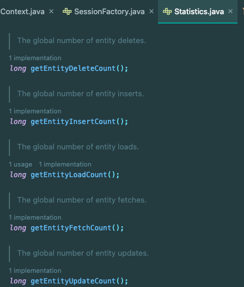
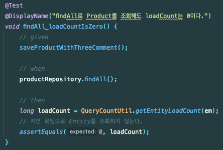

Spring JPA 기반에서 개발하다보면 아래 라이브러리를 사용하게 된다.
- Jakarta Persistence API
- Hibernate ORM
- Spring Data JPA

`Jakrta Persistence API`는 **명세**에 해당한다. 실제 구현하는 기술은 `Hibernate ORM`에 있다.

해당 포스팅에서는 `Hibernate ORM`에 대해 학습 테스트를 진행하면서 알아두면 좋을 내용에 대해 다룬다.

## Hibernate ORM

Hibernate ORM에서 소개하는 목표는 아래와 같다.

> Hibernate’s design goal is to relieve the developer from 95% of common data persistence-related programming tasks by eliminating the need for manual, hand-crafted data processing using SQL and JDBC.
> 
> 직역: Hibernate의 설계 목표는 SQL과 JDBC를 사용하여 수작업으로 데이터를 처리할 필요가 없도록 함으로써 개발자의 데이터 영속성 관련 프로그래밍 작업의 95%를 덜 수 있도록 하는 것입니다.

즉, ORM을 사용해서 개발자가 SQL이나 JDBC를 사용하는 부분을 대신 해결해준다. (JPA의 설명과 상통한다.)

Hibernate ORM은 Stored Procedure를 기반으로 하는 데이터 중심 애플리케이션에는 적합하지 않고, Java의 객체 지향 프로그래밍 모델 및 비즈니스 로직에서 가장 적합하다고 한다.

## Statistics

N+1 문제가 안터지게 되는 것은 어떻게 검증할 수 있을까?

사실 쿼리를 보면 확인할 수 있지만, 학습 테스트 중이라서 테스트 코드로 검증하고 싶었다.

이때 `org.hibernate.stat.Statistics`를 활용할 수 있었다.



`SessionFactory` 별로 `Statistics` 인스턴스를 가지고 있다. 그래서 나는 아래의 유틸 클래스를 만들었다.

```java
public class QueryCountUtil {
    public static long getEntityLoadCount(EntityManager entityManager) {
        return entityManager.unwrap(org.hibernate.Session.class).getSessionFactory().getStatistics()
            .getEntityLoadCount();
    }
    
    public static long getSelectQueryCount(EntityManager entityManager) {
        return entityManager.unwrap(org.hibernate.Session.class).getSessionFactory().getStatistics()
            .getQueryExecutionCount();
    }

    public static void clearAllCount(EntityManager entityManager) {
        entityManager.unwrap(org.hibernate.Session.class).getSessionFactory().getStatistics()
            .clear();
    }
}
```

`Statistics`는 `Hibnerate`에서 실행하는 쿼리의 개수나 시간 등을 측정하여 기록한다.

그래서 테스트 코드에서는 아래와 같이 작성할 수 있었다.



해당 테스트에서는 `Eager loading` 엔터티를 조회할 시 지연 로딩으로 인한 엔터티 로딩을 사용하지 않는다는 것을 검증한다.

TestContext를 재활용하면서 SessionFactory에 카운트가 쌓이는 문제는 아래와 같이 막을 수 있었다.

```java
@BeforeEach
void setup() {
    QueryCountUtil.clearAllCount(em);
}
```

## \@ElementCollection

`@OneToMany`를 사용하는 대신 `@ElementCollection`을 사용할 수 있다.

```java
@Getter
@Entity
@Table(name = "PERSON_TABLE")
public class Person {
    @Id
    @GeneratedValue(strategy = GenerationType.IDENTITY)
    private Long id;

    @ElementCollection
    @CollectionTable(name = "ADDRESS_TABLE",
            joinColumns = @JoinColumn(name= "person_id", referencedColumnName = "id")
    )
    private List<String> addresses = new ArrayList<>();

    public void setAddresses(List<String> addresses) {
        this.addresses = addresses;
    }
}
```

`@ElementCollection`은 아래의 특징을 가진다.
- 단순한 값의 컬렉션을 나타낸다. 
- 컬렉션만 조회, 삭제 등 어떤 행위도 할 수 없고, **반드시 부모를 통해 쿼리가 실행**된다.
- 컬렉션은 엔터티가 아니므로 **ID 생성 전략을 사용할 수 없다.**
- ID를 가지지 않으므로 컬렉션 값이 변경될 시 **전체 삭제** 후 생성한다.

반면 `@OneToMany`의 경우 Many 측이 단순한 컬렉션이 아닌 **자식 엔터티**로 인정을 받게 된다. 

엔터티로써 인정받을 필요가 없고, 엔터티의 속성일 뿐이라면 `@ElementCollection`만 사용하는 것이 적합할 수 있다.

## \@SoftDelete

기존에는 `SoftDelete`를 사용하려면 JPA에서 `@Where`와 `@SQLDelete`와 같은 애노테이션을 작성해야 했다.

```java
@Entity
@Table(name = "BOARD")
@NoArgsConstructor
@Where(clause = "is_deleted = false")
@SQLDelete(sql = "UPDATE board SET is_deleted = true WHERE id = ?")
public class Board {
    @Id
    @GeneratedValue(strategy = GenerationType.IDENTITY)
    private Long id;
    private boolean isDeleted;
}
```

Hibernate 6.4 부터는 `@SoftDelete` 애노테이션을 지원한다.

```java
@Entity
@Table(name = "BOARD")
@NoArgsConstructor
@SoftDelete(columnName = "is_deleted")
public class Board {
    @Id
    @GeneratedValue(strategy = GenerationType.IDENTITY)
    private Long id;
}
```

만약 반대로 `is_active` 컬럼이 있다면 `@SoftDelete(columnName = "is_active", strategy = SoftDeleteType.ACTIVE)`  처럼 `strategy` 옵션을 사용하면 된다.
- `Y`, `N` 등 문자열 등의 경우 Converter도 활용할 수 있게 지원한다.

`@SoftDelete`를 활용하면 코드가 훨씬 깔끔해진다.

## Inheritance

실제 서비스를 운영하다보면 아래의 경우가 자주 있다.
- Address라는 테이블이 있다.
- Address에는 type이 PRIVATE, SHARED로 나뉜다.
- 각 타입마다 사용하는 컬럼이나 조인 테이블이 다르다.

이런 경우 Inheritance를 사용하면 객체 지향적인 설계가 가능하다.

```java
@Getter
@Entity
@Table(name = "ADDRESS_TABLE")
@Inheritance(strategy = InheritanceType.TABLE_PER_CLASS)
@DiscriminatorColumn(name = "type")
public abstract class Address {
    @Id
    @GeneratedValue(strategy = GenerationType.TABLE)
    private Long id;
}

@Entity
@DiscriminatorValue("P")
public class PrivateAddress extends Address {
}

@Entity
@DiscriminatorValue("S")
public class SharedAddress extends Address {
    private String sharedType;
}
```

JPA Repository는 아래와 같이 사용할 수 있다.

```java
public interface PrivateAddressRepository extends JpaRepository<PrivateAddress, Long> {
}
```

그러면 데이터 삽입에서 `type`이 `P`로 삽입되고, 조회 시 `type = P` 조건이 들어간다.

그래서 각 타입의 엔터티가 필요한 필드와 메서드만 가지도록 설계할 수 있다.

## \@SQLRestriction

Client가 여러 타입의 Account를 가진다면 Entity를 어떻게 구성할 수 있을까?

그리고 각 타입의 Account가 다른 필드와 메서드를 가진다면?

`@SQLRestriction`을 사용하면 이를 풀어낼 수 있다.

아래와 같이 타입별로 다른 필드로 매핑한다.

```java
@Getter
@Entity(name = "CLIENT_TABLE")
@NoArgsConstructor
public class Client {
    @Id
    @GeneratedValue(strategy = GenerationType.IDENTITY)
    private Long id;

    @SQLRestriction("account_type = 'DEBIT'")
    @OneToMany(mappedBy = "client")
    private List<Account> debitAccounts = new ArrayList<>();

    @SQLRestriction("account_type = 'CREDIT'")
    @OneToMany(mappedBy = "client")
    private List<Account> creditAccounts = new ArrayList<>();

    public void addAccount(Account account) {
        if(account.getType() == AccountType.CREDIT) {
            creditAccounts.add(account);
        } else {
            debitAccounts.add(account);
        }
        account.setClient(this);
    }
}
```

아래는 Account 클래스이다.

```java
@Getter
@Entity(name = "Account")
@SQLRestriction("active = true")
@NoArgsConstructor
public class Account {
    @Id
    @GeneratedValue(strategy = GenerationType.IDENTITY)
    private Long id;
    @ManyToOne
    private Client client;
    @Column(name = "account_type")
    @Enumerated(EnumType.STRING)
    private AccountType type;
    private Boolean active = true;

    public Account(AccountType type) {
        this.type = type;
    }

    public void setClient(Client client) {
        this.client = client;
    }
}
```

이렇게 매핑을 하면 `Client`를 조회할 때 아래의 조회 쿼리가 두번 나간다.

```sql
select
    ca1_0.client_id,
    ca1_0.id,
    ca1_0.active,
    ca1_0.account_type
from
    account ca1_0
where
    ca1_0.client_id=?
    and ca1_0.active = true
    and ca1_0.account_type = 'CREDIT'
```

그래서 각각의 결과를 다른 필드에 매핑할 수 있다.

참고로 `@JoinTable`을 사용할 경우 `@SQLJoinTableRestriction`을 사용할 수 있다.

## CascadeType

JPA의 CascadeType은 아래 타입을 지원한다.
- ALL
  - 모든 엔터티 상태 전환 연산을 전파한다.
- PERSIST
  - 영속화를 전파한다.
- MERGE
  - 엔터티의 상태를 영속성 컨텍스트에 반영하는 연산을 전파한다.
- REMOVE
  - 삭제 연산을 전파한다.
- REFRESH
  - Refresh(엔터티의 데이터를 DB 데이터 기반으로 다시 로드) 연산을 전파한다.
- DETACH
  - 비영속화를 전파한다.

여기서 `Cascade.ALL`을 사용하면 아래의 `org.hibernate.annotation.CascadeType`도 포함한다.
- SAVE_UPDATE
  - SaveOrUpdate(Hibernate에서 지원하는 기능)을 전파한다.
- REPLICATE
  - 복제 연산(Slave DB에 데이터를 동기화하는 연산)을 전파한다.
- LOCK
  - 엔터티를 영속성 컨텍스트에 연결하는 연산을 전파한다.