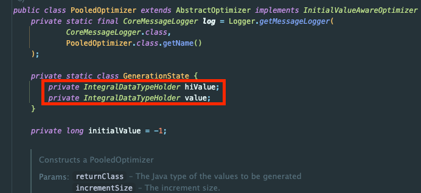
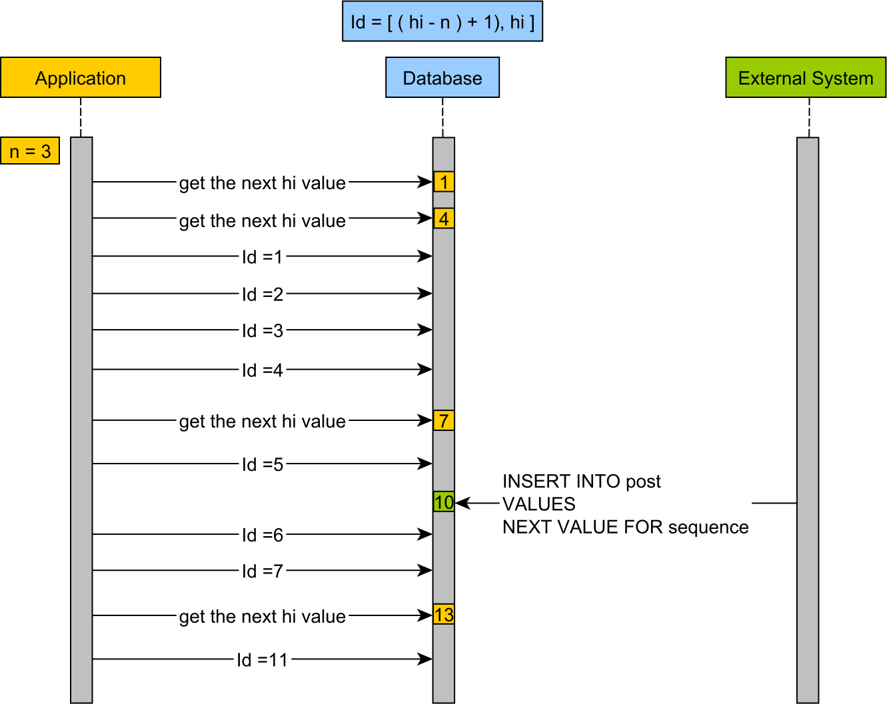

DB에 데이터를 적재할 때 시퀀스의 개념을 사용할 때가 많다.
- ID(PK)
- Request Id
- 카드번호
- 사원번호
- ...

시퀀스의 전략에 대해 알아보자. 예시 코드는 Hibernate를 사용했다.


## AUTO_INCREMENT 전략

시퀀스는 DB에서 고유한 값을 순차적으로 생성하는 객체를 말한다.

가장 익숙한 것은 아래와 같이 DB의 `AUTO_INCREMENT`를 사용하는 것이다.

```java
public class  Member {
    @Id
    @GeneratedValue(strategy = GenerationType.AUTO)
    private Long id;
}
```

위처럼 설정하면 대 부분의 애플리케이션에 문제없이 돌아간다.

하지만 추가로 고민해야 될 포인트가 있다. 성능적으로 문제가 없을 지이다.

## 성능이 낭비되는 문제와 시퀀스 전략

`AUTO_INCREMENT` 전략을 사용하면 레코드를 생성할 때마다 매번 DB에 접근해서 다음 시퀀스 값을 확인해야 한다. 

고성능 애플리케이션에서는 이런 부분을 주의해야 한다. 결제 시스템이 있고 1초 내에 반드시 결제를 마쳐야 한다고 가정이 있다면 지연을 조금이라도 줄여야 할 것이다.

이때 고민할 수 있는 게 `SEQUENCE` 전략이다.

```java
@Entity
@Table(name = "order")
public class Order {

    @Id
    @GeneratedValue(strategy = GenerationType.SEQUENCE, generator = "order_seq_gen")
    @SequenceGenerator(name = "order_seq_gen", sequenceName = "order_id_sequence", allocationSize = 100)
    private Long id;

    private String customerName;
}
```

이러한 전략은 아래와 같이 동작한다.
1. DB에서 시퀀스를 100(allocationSize)만큼 증가시킨다.
2. 해당 시퀀스를 메모리에 보관한다.
3. 메모리에서 시퀀스를 순차적으로 사용한다.

해당과 같이 별도 시퀀스를 사용해서 보관한다면 **미리 시퀀스를 확보**해두고 실제 레코드가 생성되는 시점에 DB와의 통신을 대폭 줄일 수 있다.

즉, 미리 시퀀스를 50개든 100개든 확보해두고 100개의 시퀀스가 소진될 때 다시 DB에 접근해서 확보한다.



`SequenceGenerator`가 사용하는 `PooledOptimizer`를 보면 시퀀스의 현재 사용할 값과 채번한 마지막 값을 저장해두고 사용하는 것을 확인할 수 있다.



만약 시퀀스를 지원하지 않는 DBMS를 사용한다면 테이블 전략을 사용하면 유사한 효과를 누릴 수 있다.

## 시뭔스가 낭비되는 문제

시퀀스 전략은 성능적으로 많이 향상되었지만 불필요하게 시퀀스가 낭비될 수 있다.

예를 들어 현재 시퀀스로 100개를 채번했고, 80개 정도가 잔여한 상황에서 신규 코드 배포를 위해 애플리케이션을 셧다운했다고 가정하자.

그러면 해당 애플리케이션에 할당한 80개의 시퀀스가 낭비된다. DB에는 기록되었지만 최종적으로 사용하지 않게 되기 때문이다.

예를 들어 카드번호는 카드사에 특정한 풀만큼 할당되기에 시퀀스의 낭비는 매우 비효율적인 요소일 수 있다.

그럴 때는 `IdentifierGenerator`를 구현해서 새로운 Custom Generator를 만들면 된다. 아래는 그 예시이다.

#### 1.앱 종료시 잔여 시퀀스 재확보

기존 `SequenceGenerator` 동작과 더불어 아래처럼 동작하는 `IdentifierGenerator`를 만든다면 시퀀스 낭비 문제를 해결할 수 있다.
1. 애플리케이션이 종료될 때 잔여한 시퀀스를 레디스에 저장한다.
2. 시퀀스를 꺼낼 떄 레디스에 저장된 시퀀스가 있다면 그것을 먼저 확보한다.

### 2. 시퀀스를 레디스에 보관

`Hibernate`의 `SequenceGenerator`는 기본적으로 애플리케이션 메모리에 시퀀스를 보관하지만, Redis에 시퀀스를 보관하면 애플리케이션이 재기동되면서 시퀀스가 낭비되는 문제를 해결할 수 있다.

하지만, 시퀀스는 특성상 중복이 발생하면 치명적인 문제가 생길 가능성이 크기에 Redis의 일관성 모델을 이해하고 구현해야 한다.

### 추가로 해결 가능한 문제

추가로 기존 시퀀스 문제에서는 고려해볼 점이 한 가지 더 있는데, 실제 시퀀스를 확보하는 시점에서는 지연이 생길 수도 있는 점이다.

이러한 부분은 무시해도 크게 부담되진 않겠지만, 주기적으로 일정 부분 이상 소요되면 시퀀스를 확보하는 전략을 추가로 고려해볼 수도 있다.

## UUID 기반 전략

단순히 고유한 ID 식별을 위한 경우처럼 순차적인 값을 보장하지 않아도 되는 경우라면 `UUID` 값을 사용하는 것도 추천한다.

```java
@Entity
public class Order {
    @Id
    @GeneratedValue(generator = "uuid2")
    @GenericGenerator(name = "uuid2", strategy = "uuid2")
    @Column(columnDefinition = "binary(16)")
    private UUID id;
}
```

UUID를 사용하면 분산 시스템에서도 충돌이나 성능저하 없이 시퀀스를 생성할 수 있지만 공간을 더 많이 차지한다는 단점이 있다.


## 참고

- https://vladmihalcea.com/hibernate-hidden-gem-the-pooled-lo-optimizer/
- https://devcamus.tistory.com/16
- https://techblog.woowahan.com/2663
