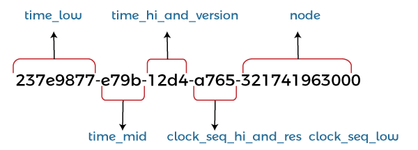
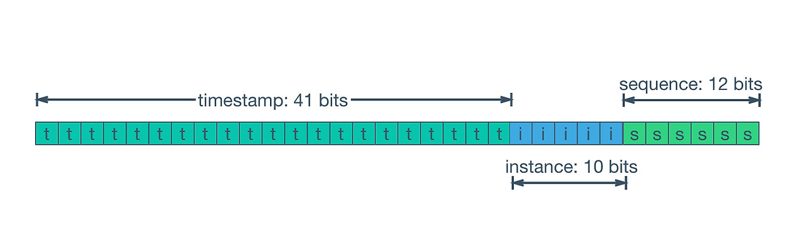

DB 입문할 때 일반적으로 MySQL을 사용했고 이유도 모른채 ID 생성 전략으로 Auto Increment를 사용했던 것 같다.

Oracle Sequence를 사용하는 것도 늘고 있고 ID 생성 전략은 무수히 많다. 각 ID 생성 전략을 알아본다.

## 시퀀스, 자동증가

MySQL의 Auto Increment나 Oracle의 시퀀스는 아래의 특징을 가진다.

- 트래픽이 매우 높으면 값 생성 부하도 커질 수 있다.
- 반드시 순서대로 생기는 것은 아니다.
  - 특정 ID는 패스될 수 있다
  - (Oracle RAC) 여러 인스턴스에서 각자가 담당하는 ID만 생성
- 일반적으로 4Byte / 8Byte를 사용

## UUID

ID 생성 전략으로 UUID를 사용할 수 있다. 특징은 아래와 같다.
- 서버에서 생성하므로 DB에서 ID 생성에 따른 부하를 부담하지 않아도 된다.
- (거의) 중복될 가능성이 없다.
- 16 Byte (36문자 - 16진수 32개 + 대시 4개)

큰 단점이 있는데 INSERT를 하면서 DB가 내부적으로 인덱스를 조정할 때 인덱스나 데이터의 이동이 더 많이 발생한다.

그래서 최신 데이터가 더 많이 조회되는 환경에서 페이지에 대한 캐시 효율이 떨어진다는 문제도 존재한다. (자동 생성을 사용했다면 인덱스 페이지가 최신 순으로 정렬되어 있었던 상황)

#### UUID v7

UUID v7에는 앞자리(48 bit)에 Timestamp가 들어간다.

그래서 시간 기준으로 정렬된 순서를 유지하므로 인덱스의 조정이 많은 문제, 캐싱이 어려운 문제 등이 개선된다.

UUID는 16 Byte라서 데이터 공간을 많이 먹는다는 단점이 있다.

#### Snowflake

Snowflake는 Twitter(X)가 만든 8 Byte 체계의 ID 생성 방식이다.

- 부호비트(1): 사용하지 않음
- TimeStamp(41): 밀리초로 시간 표현. 시작 지점부터 약 70년 사용 가능
- Machine ID(10): 개별 프로세스 단위로 할당
- Sequence(12): 카운터로 매 밀리초마다 0으로 초기화
  - 1개 서버의 동시 요청이 많아지면 이 bit를 늘린다.

## 정리

아래는 각 ID 생성 방식의 특징을 정리해본 것이다.

글로벌 서비스가 아니고, 트래픽도 크지 않은 경우 -> 시퀀스 / 자동 증가 사용

(추가 필요)

## 참고

- https://www.youtube.com/watch?v=gKbGIA7njQo
- https://en.wikipedia.org/wiki/Snowflake_ID#