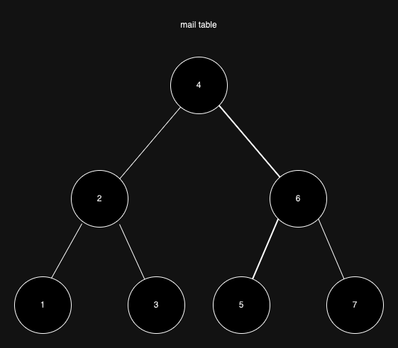
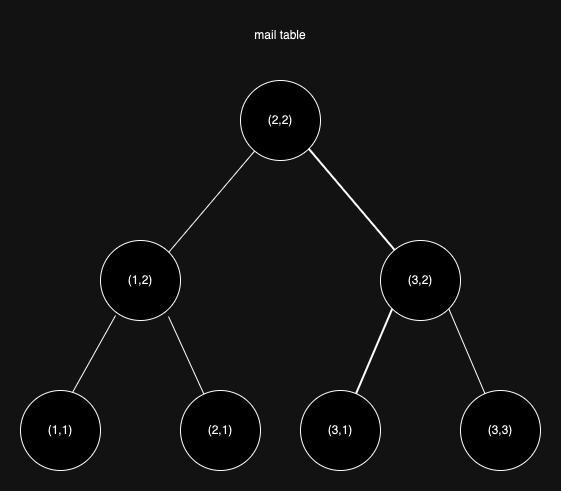

어느 날 신입 분이 나한테 찾아와서 물었다.

'메일 조회를 할 때 권한이 없으면 404가 아니라 401 또는 403이 나와야 하는 것 아닌가요?'

~~(인덱스 얘기한대놓고 무슨 권한 얘기인지..)~~

나도 쌩신입때 선배분께 동일한 질문을 했었다.

## 인덱스 오해

아래 코드는 비즈니스에서 Mail을 조회하기 위해 사용되던 코드이다.

```java
mailRepository.findByUserIdAndId(userId, id)
        .orElseThrow(() -> new EntityNotFoundException("Mail", id));
```

여기서 내가 생각한 문제는 3가지가 있다.
1. 쿼리에 비즈니스 로직이 들어간다.
    - 가독성이 나빠지고 객체지향적인 설계가 불가능해진다.
    - `프로그래밍 초식의 쿼리에서 로직 빼기` 부분을 참고하자.
2. 자신의 소유가 아닌 메일에 대해서 404(Not Found)가 내려온다.
    - REST 스펙에 따르면 인가와 권한의 문제는 403 Forbidden을 내려주는 것이 바람직한 것 같다.
3. 인덱스가 불필요하게 추가될 위험이 있다.

그래서 나는 `findById()`만 호출한 후 소유권자를 로직으로 비교하고 403 Forbidden으로 처리되어야 하지 않느냐는 질문을 했고

여기서 동료(선배) 분이 '**그렇게 하면 인덱스를 안타잖아요.**' 라는 답변을 주셨다. 완전 쌩신입이던 나는 우선적으로 동의했다.

테이블의 인덱스는 아래와 같았다.
- 기본 키(Primary Key): `id`
- 인덱스(Non-cluster Key): `user_id, id`

## 정말 그럴까?

동료 분의 의견은 Index를 하나라도 많은 컬럼을 태워야 성능이 향상된다는 것이다.

현재의 나는 Real MySQL이나 공식 문서를 정독한 경험이 있어서 그렇지 않다고 확신한다.

아래는 Primary Key의 동작 방식을 그린 것이다.

#### 1. Primary Key

만약 id가 5인 row를 조회한다고 하자.



아래와 같이 트리 순회를 하게 된다.
- B+ Tree 구조의 특징과 Clustered-Key의 특징은 생략했다.

## 2. Index

그러면 Index로 user_id, id를 걸고 그걸로 조회를 하면 더 속도가 빠를까?

user_id가 3이고, id가 1인 데이터를 조회하는 상황을 가정해보자.



위와 마찬가지로 **트리 순회**를 해서 찾게 된다. PK(컬럼 1개)로 조회하던 2개 컬럼의 Index를 사용하던 어차피 결과는 **트리 순회**다.

즉 PK를 사용하는 거에 비해서 Index를 사용하는 것의 이점이 없었다. 물론 유저별 메일을 검색할 때의 이점은 충분히 있다.

단건 조회 시 user_id까지 where 조건에 넣어야할 이유는 없다. 오히려 아래의 단점만 생긴다.
- Clustered Key를 사용하지 않고 Non-Clustered Key를 사용하므로 데이터를 매핑할 때의 오버헤드가 발생한다.
- Index의 동작을 파악하기가 더 복잡하다.

## 정리

정리하자면 `Index 컬럼을 하나라도 더 태워야 성능 상 이점이 있다`는 것은 사실이 아니다!

`user_id, id` 두개의 Index로 조회하지 않고 PK를 사용하면 아래의 이점이 있었다.
- 쿼리를 로직으로 노출할 수 있다.
- DB 예외가 발생하는 것이 아니라 앱에서 예외 처리가 가능하다.
- Non-Clustered Index의 매핑 비용을 없앨 수 있다.
- 불필요한 인덱스가 생성될 위험이 없다.

그렇다고 **무조건 단건 조회시 PK를 사용해야 한다는 것은 아니다.** 예를 들어 정책 상 `해당 유저의 엔터티가 아니라면 존재하지 않는 것`이라 한다면 404를 내려주는 것도 그리 잘못된 것은 아니다.

이유를 정확히 알고 사용하자는 것이다.