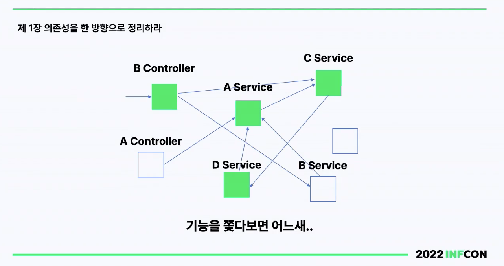
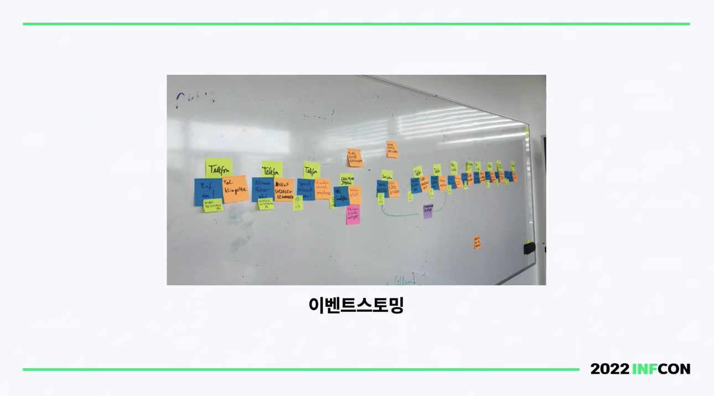

## 레거시 시스템 이란?

- 낡은 시스템
- 높아진 트래픽을 감당할 수 없는 시스템
- 새로운 요구사항을 반영할 수 없는 시스템

## 개편 시점

레거시를 개편할 지 여부는 투자 자본 수익률(ROI)과 아래의 사항들을 비교해서 결정할 수 있다.
- 시간, 비용(시스템 운영), 인원
- 생명주기, 학습비용, 비즈니스 지연, 채용, 퇴사 리스크, 한계

기존 시스템을 유지하면 시간이 지날 수록 비용이 매우 올라가지만, 새로운 시스템으로 개편하면 초기에는 비용이 많이 들어가지만 이후에는 비용이 줄어들게 된다.

개편 시점을 잘 선택하는 것이 중요하다. 가령 너무 유지보수만 하다가 개편 시점이 늦춰져서 시장 영향력이 떨어지게 되면 돌이킬 수 없게 된다.

## 개편 사례

- 2018 결제 시스템 개편 -> 트래픽이 2~3배 증가되면서 DB 파티셔닝을 진행
- 2018 주문 시스템 개편 -> 비주류인 기술을 사용한 성능이 부족한 시스템을 새로운 기술로 개편
- 2019 가게노출 시스템 - 새로운 요구사항(광고, 가게 등)을 수용할 수 없어서 개편 (클레이 프레임워크, 다른 언어)
- 2020 회원시스템 개편 - 성능이 부족한 시스템(인프라 최대치, 더이상 Scale out이 안됨)과 비주류인 기술, 회원과 인증 분리

## 개편 방법

## 1. 의존성을 한 방향으로 정리하라.

주문 시스템에서 스파게티 의존성이 되게 심했다고 한다.

객체에서 의존성 사이클이 돌아선 안된다.
- 어디가 문제인지 정확하게 파악이 어렵다.
- 개편을 하기 어려운 상태가 된다.

이를 해결하려면 **방향을 선택**해야 한다.
- 의존을 한 방향으로만 작성을 해도 스파게티 의존성을 피할 수 있다.
- Side Effect를 추적할 수 있게 된다.
- 변경 대상의 경계를 나눌 수 있다.

## 테스트

개편하면서 테스트는 일정이 빠듯해서 어쩔 수 없이 기존 시스템을 호출해서 JSON으로 동작하면 통과하는 방식으로 진행했다.

- 테스트 원칙에는 맞지가 않다고 한다.
- 인터넷이 안되어도 테스트가 돌아가야 하기 때문
  - 순수 자바 코드와 프로젝트 내부에서 동작을 검증해야 한다. (FIRST 원칙의 I 부분 참고)

#### 테스트가 없는 상황

기존 테스트가 하나도 없었어서 이전을 할 수도 없었따.
- 그래서 블랙박스 E2E 테스트를 수행했다.
- 1달동안 테스트 코드만 작성
- 목표는 심리적 안정감

## 이벤트 스토밍

이벤트 스토밍은 DDD에서 나오는 전술적 설계의 과정이다.

- 도메인에 익숙하지 않은 사람도 배울 수 있다.
- 모든 구성원이 비즈니스 개선에 도움이 될 수 있도록 기여할 수 있다.
- 모든 구성원이 도메인에 대한 이해를 공유하고, 같은 방향으로 나아갈 수 있게 된다.

