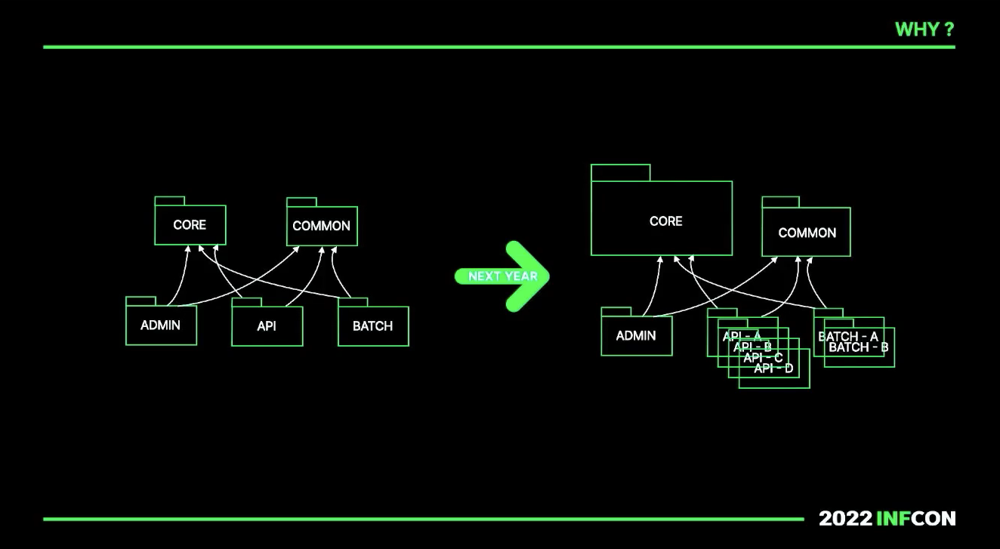
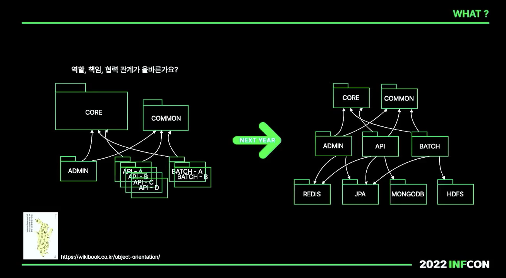
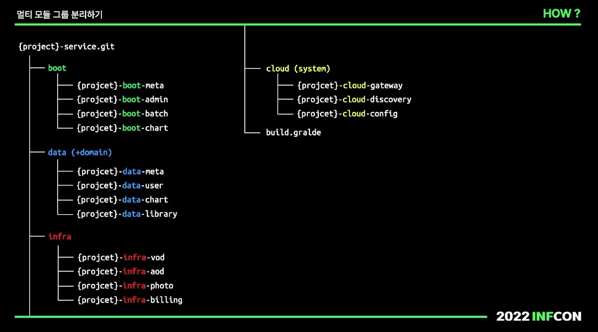
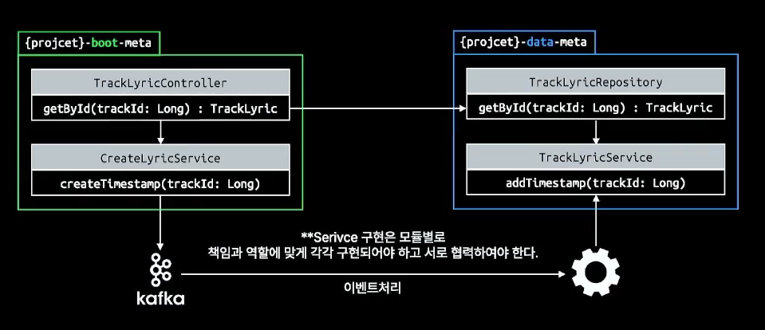

## 멀티모듈 이야기!

강연 내용을 정리함녀 아래와 같다.

1. Why 멀티모듈 프로젝트가 중요한 지
2. What을 기준으로 멀티 모듈 프로젝트를 나눌 지
3. How 실전 모듈 프로젝트를 구현할 지

## 1. 멀티 모듈이 중요한 이유

멀티 모듈 프로젝트는 나중에 적용하기 어렵게 된다.
- 빌드, 배포 프로세스와 프로덕트 코드 모두 수정해야 할 부분이 너무 많다.

그래서 적절한 시기에 멀티 모듈 프로젝트를 적용하는 것이 중요하다.

## 2. 멀티 모듈 프로젝트를 나누기

사실 해당 부분은 나도 현재 하고 있는 고민들이다.

처음엔 프로젝트가 깔끔하겠지만, 시간이 지날수록 Core와 Common이 비대하게 커지게 된다.
- 개발자는 중복을 제거해야 한다는 개념이 머리에 박혀있어서 Core와 Common에 로직을 구현하기 때문

해당 부분은 아래의 네 가지 문제가 생길 수 있다. 
1. 모든 API와 Batch 서비스에서 커넥션 풀을 할당받는다.
2. 특정 모듈이 하위 버전 라이브러리를 참조해야 하는 경우 NoClassDefFoundError가 발생한다.
3. 비대해지는 로직의 크기
    - 모듈에 따라 서비스에서 세부적인 처리가 필요할 수 있다.
    - 이때 Core 모듈의 서비스를 특정 파라미터로 호출하고, 해당 파라미터에 따라 if 분기를 자꾸 태우게 된다. (빠르게 배포해야 하기 때문)
    - 이런 게 하나 생기면 깨진 유리창 효과로 유사한 코드가 많이 생기게 된다.
4. 각 도메인이 필요하지 않는 것까지 가지게 된다.

### 비대한 Core, Common

비대하게 커져버린 Core과 Common 모듈 문제를 제거하려면 아래와 같이 처리할 수 있다.

문제는 오른쪽 모듈 구조는 기술 베이스 지향적인 모듈 구조라는 점이다.
- 세부 도메인의 저장소가 다른 경우에는 어디 모듈에 적재시켜야할까..?
- 유관 부서나 외부 업체 연동 모듈도 계속 추가된다.
- Spring Cloude와 같은 환경을 포함하는 모듈도 추가된다.

그래서 Naver 뮤직에서는 core모듈과 common 모듈을 삭제해버렸다. 대신에 중복된 코드를 일부 허용했다고 한다.
- 코드가 중복되는 문제보다 core 모듈과 common 모듈이 커지는 문제가 잠재적으로 더 큰 문제라고 판단

그렇다면 멀티 모듈의 프로젝트는 어떻게 나눠야 할까..?
- DDD에서의 바운디드 컨텍스트를 기반으로 멀티 모듈을 구성 

이를 기반으로 4개의 멀티모듈 그룹으로 경계를 나눌 수 있다.
- Boot (Server) (잦은 변화)
  - batch, admin, api
- Data (Domain)
  - meta, user, chart
- Infra (변경되면 코드에 큰 변화)
  - 유관 부서 및 외부 업체 연동
- Cloud (System)
  - config, gateway, discovery, aws, azure

그래서 특징에 맞고, 성격에 맞고, 사이클에 맞도록 그룹이 지정되어야 할 것 같다.

## 3. 멀티 모듈 프로젝트 구성하기

위를 정리하면 아래와 같이 모듈을 구성할 수 있다.

추가로 Core 모듈의 롲기이 비대해지는 문제는 도메인의 특성에 따라 각 Boot 모듈에서 처리를 하게 될 수 있다. 

잘 설계뙨 멀티 모듈 프로젝트는 언제든 하나로 합쳐지거나, 분리시킬 수 있어야 한다.