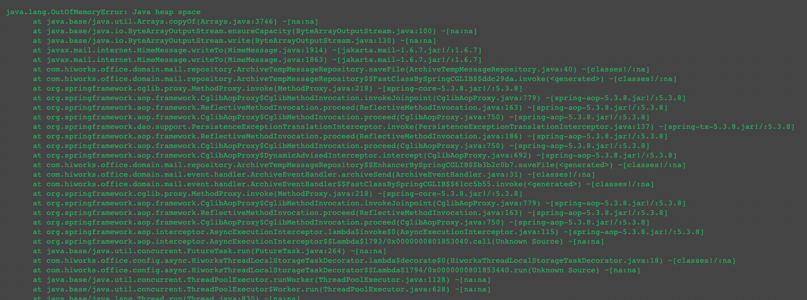
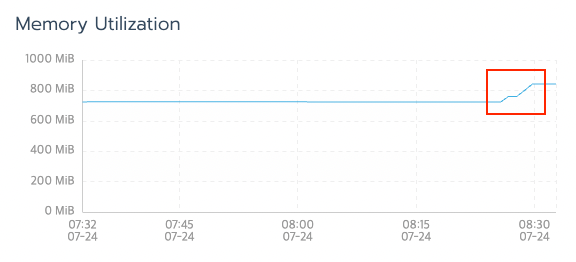
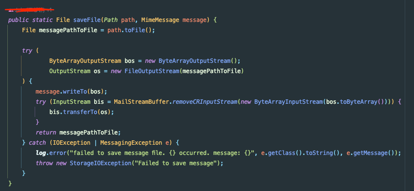
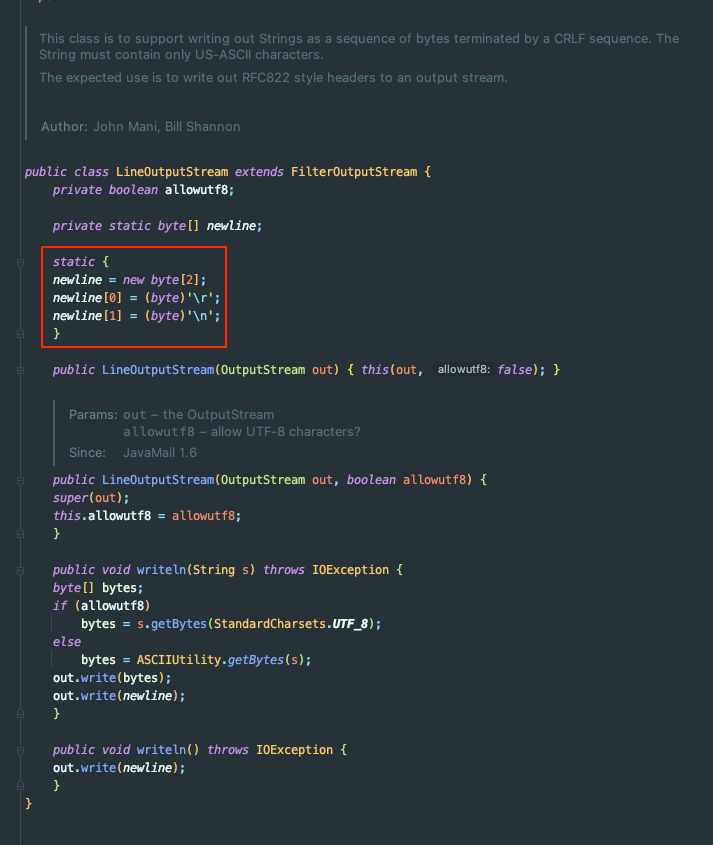
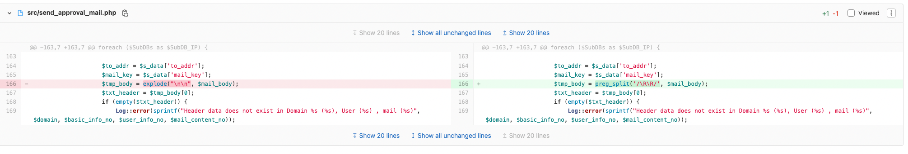
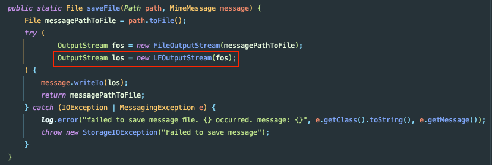
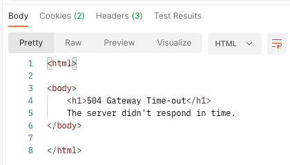
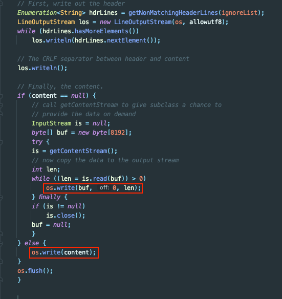
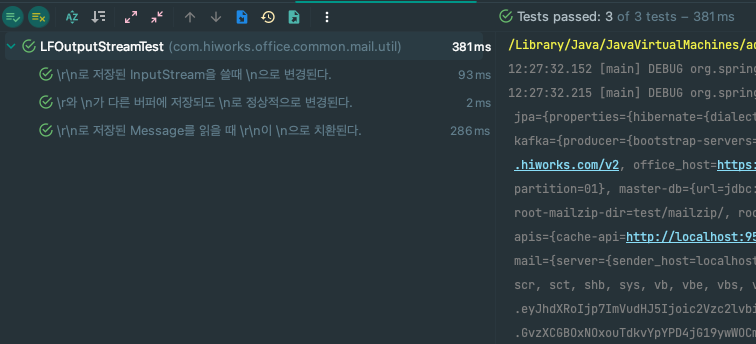
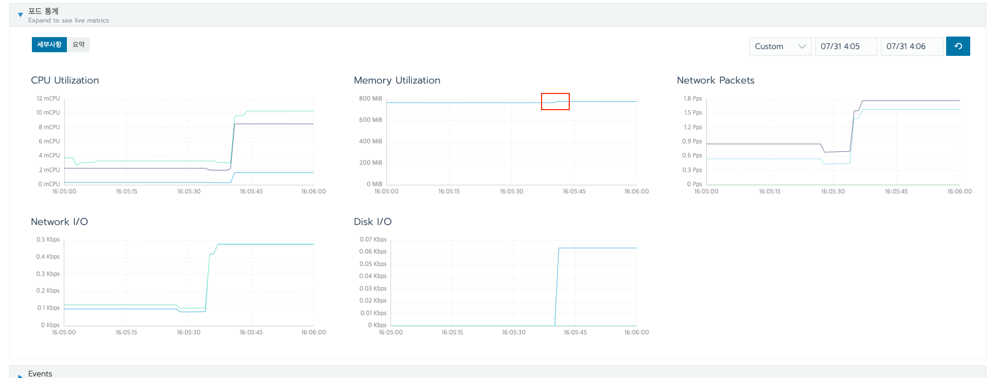

평화롭던 어느날 메일 API에서 OOM이 터졌다.



발생한 End-point는 메일 발송으로 확인했다.

메일 원문은 40MB였고 개발 서버에서 테스트를 해봤다.



동일 본문으로 메일 발송 요청 1번에 결과 메모리 사용량이 117MB 정도 급증했다. 세부적으로는 2단계 메모리가 튀는 것으로 확인된다.
- 1차: 724MB -> 761MB
- 2차: 761 MB -> 841MB

바로 의심했던 것이 발송 이벤트였다. 비동기 이벤트가 두 건 발행되고 있었다.
- Forward Event
- Archive Event

## Line Separator

확인 결과 1. 발송, 2. 포워드 이벤트 핸들러, 3. 아카이브 이벤트 핸들러에서 아래 로직을 수행한다.



코드를 보면 **ByteArrayOutputStream**에 eml 파일 내용을 저장한다.
- 바로 파일에 쓰는 것이 아니므로 `byte[]`가 메모리에 올라간다.

그 다음에 `FileOutputStream`으로 다시 데이터를 옮긴다.

해당 로직이 메인 스레드에서 1번 호출, 비동기 스레드에서 2번 호출한다.

해당 부분이 메모리 급증의 원인인 것 같다. 그럼 왜 이처럼 비효율적으로 처리되고 있을까..?

### 레거시

저렇게 처리해야만 하는 이유가 있었다.

메일 서비스의 수 많은 Cron, Script 프로젝트에서 원문의 Part를 `\n`으로 구분한다. 즉, 모든 eml 파일은 저장될 때 `\n`으로만 저장되어야 했다.

`JavaMailAPI`에서 메시지를 저장할 때 사용하는 `LineOutputStream`은 아래와 같이 OS 환경변수의 `lineSeparator`를 무시하고 `\r\n`으로 저장한다.



처음에는 아래와 같이 기존 Legacy 코드를 수정하고자 했으나, 영향 범위 파악이 너무 어렵고 광범위해서 현실적으로 불가능하다고 한다.




그래서 API 서버 단에서 처리를 해주고 있던 것이다.

### ReplacingInputStream

`ReplacingInputStream`을 사용해서 `\r\n`을 `\n`으로 처리해주면 되지 않을까..? 하는 생각을 가졌었다.
- `MimeMessage`에서 `IntputStream`을 꺼낸다.
- `InputStream`을 `ReplacingInputStream`으로 래핑한다.
- `InputStream`을 `FileOutputStream`에 저장한다.

여기서 문제가 발생했는 데 `MimeMessage`에서 `getInputStream()` 메서드로 꺼낸 것에는 **Header를 포함하지 않는다.** 즉, 반드시 `MimeMessage.write()`를 사용해야 했다.

그래서 `ReplacingInputStream`은 사용할 수 없는 상황이었다.

## FilterOutputStream ?

>This class is the superclass of all classes that filter output streams. These streams sit on top of an already existing output stream (the underlying output stream) which it uses as its basic sink of data, but possibly transforming the data along the way or providing additional functionality.

`FilterOutputStream`을 사용하면 OutputStream을 받아서 **OutputStream에 쓰기 전에 데이터를 조작할 수 있다.** 그래서 `FilterOutputStream`을 사용한 레퍼런스를 찾던 중 JavaMail API 공식 Github에서 아래의 데모 코드를 발견했다.
- https://github.com/javaee/javamail/blob/master/demo/src/main/java/NewlineOutputStream.java

해당 코드를 참조해서 아래의 FilterOutputStream 구현체를 만들었다.

```java
public class LFOutputStream extends FilterOutputStream {
    private byte lastRead = -1;
    private static byte separator = '\n';

    public LFOutputStream(OutputStream os) {
        super(os);
    }

    public void write(byte b) throws IOException {
        if (b == '\r') {
            out.write(separator);
        } else if (b == '\n') {
            if (lastRead != '\r')
                out.write(separator);
        } else {
            out.write(b);
        }
        lastRead = b;
    }

    public void write(byte b[]) throws IOException {
        write(b, 0, b.length);
    }

    public void write(byte b[], int off, int len) throws IOException {
        for (int i = 0 ; i < len ; i++) {
            write(b[off + i]);
        }
    }
}
```

그리고 코드를 아래와 같이 수정할 수 있었다.



## 처리량

코드 수정을 완료했지만, 내가 작성한 `LFOutputStream`은 파일을 1byte씩 쓰기 때문에 처리량이 낮은 문제가 생길 수도 있을 것 같다.

아마 `\r`과 `\n`이 각각 다른 Buffer에 잘려서 들어가면 `Reaplce`가 안될 수 있어서 공식 Repository에서도 1byte씩 쓰는 것 같다.

그래서 동작을 확인해본 결과



아니나 다를까 GateWay Time-out이 발생한다.

```java
public class LFOutputStream extends FilterOutputStream {
    private byte lastRead = -1;
    private static final byte separator = '\n';

    public LFOutputStream(OutputStream os) {
        super(os);
    }

    public void write(byte b[]) throws IOException {
        write(b, 0, b.length);
    }

    public void write(byte b[], int off, int len) throws IOException {
        int start = off;

        len += off;
        for (int i = start; i < len ; i++) {
            if (b[i] == '\r') {
                out.write(b, start, i - start);
                out.write(separator);
                start = i + 1;
            } else if (b[i] == '\n') {
                if (lastRead != '\r') {
                    out.write(b, start, i - start);
                    out.write(separator);
                }
                start = i + 1;
            }
            lastRead = b[i];
        }
        if ((len - start) > 0)
            out.write(b, start, len - start);
    }
}
```

그래서 위와 같이 코드를 변경하였다.
- 참고 코드: https://github.com/javaee/javamail/blob/master/demo/src/main/java/CRLFOutputStream.java

아래 `MimeMessage` 코드를 보면 `byte[]` 단위로 `write()`를 수행한다. 



이때 **기존 로직**의 경우 아래와 같이 동작을 수행하고 있었다.
- 1byte 검사
- 1byte write - I/O 발생!

String 문자열 크기가 n일 때 **Read -> O(n), Write -> O(n)**

**수정 후**에는 아래와 같이 동작한다.
- buffer 단위의 `byte[]`를 순회
- 줄바꿈 발생 시 1 Line write

String 문자열 크기가 n일 때 **Read -> O(n), Write -> O(n)** 이지만 Write의 경우 **N/8192(Buffer 크기) + Line 수**에 근사

#### 테스트 코드

```java
class LFOutputStreamTest {

    @Test
    @DisplayName("\r\n로 저장된 InputStream을 쓸때 \n으로 변경된다.")
    void ItReplaceCRLF_To_LF() throws Exception {
        // given
        String text = "\r\n" + "test" + "\r\n";
        InputStream emlInputStream = new ByteArrayInputStream(text.getBytes());

        ByteArrayOutputStream bos = new ByteArrayOutputStream();
        LFOutputStream los = new LFOutputStream(bos);

        // when
        los.write(emlInputStream.readAllBytes());

        // then
        String originEML = bos.toString();
        assertThat(originEML).isEqualTo("\n" + "test" + "\n");
    }

    @Test
    @DisplayName("\r와 \n가 다른 버퍼에 저장되도 \n로 정상적으로 변경된다.")
    void withSaveSplit_ItReplaceCRLF_To_LF() throws Exception {
        // given
        ByteArrayOutputStream bos = new ByteArrayOutputStream();
        LFOutputStream los = new LFOutputStream(bos);

        // when
        los.write(new byte[]{'\r'});
        los.write(new byte[]{'\n'});

        // then
        String originEML = bos.toString();
        assertThat(originEML).isEqualTo("\n");
    }

    @Test
    @DisplayName("\r\n로 저장된 Message를 읽을 때 \r\n이 \n로 치환된다.")
    void withMessage_ReplaceToLF() throws Exception {
        // given
        InputStream emlInputStream = MailStreamBuffer.getEmlInputStream(getEmlFile("crlf_basic.eml"));

        ByteArrayOutputStream bos = new ByteArrayOutputStream();
        LFOutputStream los = new LFOutputStream(bos);

        // when
        los.write(emlInputStream.readAllBytes());

        // then
        String originEML = bos.toString();
        assertThat(originEML.contains("\n")).isTrue();
        assertThat(originEML.contains("\r\n")).isFalse();
    }
}
```

작성한 테스트 코드는 위와 같다.



결과 위와 같이 테스트가 잘 통과하고


모듈을 사용하는 서버의 테스트도 모두 잘 통과한다.

### 결과

수정 이후 `GateTimeout`이 발생하지 않았고



메모리 사용량도 원래 **117MB** 급증하던 것이 768MB -> 776MB **총 8MB**정도만 튀는 것으로 보아 메모리 사용량 문제도 해결되었다!

## 참고
- https://github.com/javaee/javamail/blob/master/demo/src/main/java/NewlineOutputStream.java
- https://docs.oracle.com/javase/8/docs/api/java/io/FilterOutputStream.html
