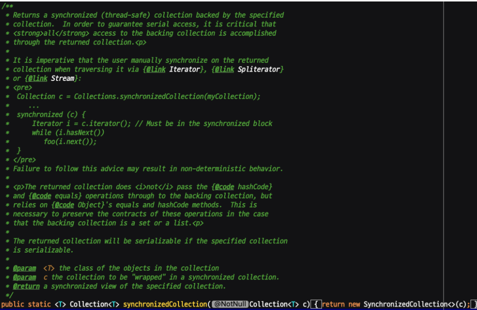

아래는 이펙티브 자바의 내용 중 **동시성**에 대한 부분을 정리한 것이다.

Effective Java는 동시성을 사용할 때의 몇가지 주의사항과 가이드라인을 제시한다.

## 동기화된 메서드 설계 시 주의할 점

**동기화된 메서드**를 작성할 때 중요한 것은 **재정의할 수 있는 메서드**를 호출해선 안되고 클라이언트가 넘겨준 **함수 객체**도 사용하면 안된다는 것이다.

```java
public class ObservableSet<E> extends ForwardingSet<E> {

    public void addObserver(SetObserver<E> observer) {
        synchronized (observers) {
            observers.add(observer);
        }
    }

    public boolean removeObserver(SetObserver<E> observer) {
        synchronized (observers) {
            return observers.remove(observer);
        }
    }

    private void notifyElementAdded(E element) {
        synchronized (observers) {
            for(SetObserver<E> observer : observers) {
                observer.added(this, element);
            }
        }
    }

    @Override
    public boolean add(E element) {
        boolean added = super.add(element);
        if(added) {
            notifyElementAdded(element);
        }
        return added;
    }
    
}
```

해당 코드를 보면 `add()` 내부적으로 `notifyElementAdded()` 메서드를 호출하고 있다.

여기서 `add()` 입장에서 보면 `notifyElementAdd()`는 바깥 세상에서 온 외계인 영역이다. 그 메서드가 무슨 일을 할 지도 모르고 통제할 방법도 없다.

외부 메서드는 동기화된 영역의 일관성을 해치거나 교착상태에 빠지게할 수 있다.

```java
public static void main(String[] args) {
    ObservableSet<Integer> set = new ObservableSet<>(New HashSet<>());
    
    set.addObserver(new SetObserver<Integer>() {
        public void added(ObservableSet<Integer> s, Integer e) {
            System.out.println(e);
            if (e == 23) s.removeObserver(this);
        }
    });
}
```

위 함수를 실행할 경우 23번째 반복에서 `ConcurrentModificationException`이 발생한다. `added()`를 호출한 시점이 `notifyElementAdded`가 `observers`를 순회하고 있는 지점이기 때문이다.

동기화 영역에서는 가능한 일을 적게 해야 하며, 외부 메서드를 호출해서는 안된다.

가변 클래스를 작성할 때는 두 선택지 중 한 가지를 선택하고, 선택한 부분을 문서화를 해야 한다.
- 동기화를 하지 않고 그 클래스를 사용하는 클래스가 동기화하게 만들기
- 동기화를 내부에서 수행하기

## 동시성 유틸리티 사용하기

자바에서 `wait()`과 `notify()` 등 스레드 동기화를 위한 메서드를 제공한다. 그러나 이는 **올바르게 사용하기 어렵다.** 대신에 고수준 **동시성 유틸리티**를 사용할 수 있다.

#### 동시성 컬렉션

`ConcurrentHashMap`을 사용한다면 내부에서 동시성을 제어할 수 있다. 여기서도 주의해야 할 것이 단순히 `put()`, `isEmpty()`를 활용해서 코드 블록에서 작성한다면 동기화되지 않는 부분이 생길 수 있다.

```java
private static final ConcurrentMap<String, String> map = new ConcurrentHashMap<>();

public static String intern(String s) {
    String result = map.get(s); // 최적화: 필요할 때만 putIfAbsent()를 호출
    if (result == null) {
        result = map.putIfAbsent(s, s);
        if (result == null)
            result = s;
    }
    return result;
}
```

자바 8부터는 `putIfAbsent(key, value)` 메서드와 같은 원자적인 동작을 보장하는 메서드를 지원한다. 

#### 동기화 장치

동기화 장치로는 대표적으로 `CountDownLatch`가 있다. 하나 이상의 스레드가 또 다른 하나 이상의 스레드 작업이 끝날 때까지 기다리게 한다.

아래는 주어진 동작들을 모두 마친 후에 처리 시간을 출력하는 메서드이다.

```java
public static long time(Executor executor, int concurrency,
                            Runnable action) throws InterruptedException {
        CountDownLatch ready = new CountDownLatch(concurrency);
        CountDownLatch start = new CountDownLatch(1);
        CountDownLatch done = new CountDownLatch(concurrency);

        for (int i = 0; i < concurrency; i++) {
            executor.execute(() -> {
                // 타이머에게 준비가 됐음을 알린다.
                ready.countDown();
                try {
                    // 모든 작업자 스레드가 준비될 때까지 기다린다.
                    start.await();
                    action.run();
                } catch (InterruptedException e) {
                    Thread.currentThread().interrupt();
                } finally {
                    // 타이머에게 작업을 마쳤음을 알린다.
                    done.countDown();
                }
            });
        }

        ready.await(); // 모든 작업자가 준비될 때까지 기다린다.
        long startNanos = System.nanoTime();
        start.countDown(); // 작업자들을 깨운다.
        done.await(); // 모든 작업자가 일을 끝마치기를 기다린다.
        return System.nanoTime() - startNanos;
}
```

`concurrency`는 동시에 작업을 수행할 스레드의 개수이다. 위 코드는 동시에 여러 개의 작업을 모두 대기시킨 후, 동시에 작업을 수행하고 전체 실행시간을 측정한다.

`concurrency`의 개수만큼 스레드를 생성하지 못하면 데드락이 생기는 점을 주의해야 한다.

## 스레드 안전성 수준 문서화

API 문서에 `synchronized`가 보인다고 스레드가 안전하다는 말은 사실이 아니다.

스레드 안전성에도 수준이 나뉜다.
- 불변: 클래스의 인스턴스가 마치 상수와 같아서 외부 동기화도 필요 없다.
- 무조건적 스레드 안전: 이 클래스의 인스턴스는 가변이나 내부에서 충실히 동기화하고 있다.
- 조건부 스레드 안전: 일부 메서드를 사용하려면 외부 동기화가 필요하다.
- 스레드 안전하지 않음: 이 클래스의 인스턴스는 수정될 수 있다. 동기화가 필요하다면 외부에서 직접 수행해야 한다.
- 스레드 적대적: 이 클래스는 외부에서 동기화가 불가능하다. (정적 데이터를 내부에서 마음대로 수정하는 경우)

멀티스레드 환경에서도 API를 안전하게 사용하려면 반드시 **스레드 안전성 수준**을 명시해야 한다.

예시로 `Collections.synchronizedMap()`을 살펴보자.



설명에는 아래 내용이 기술되어 있다.

> synchronizedMap이 반환한 맵의 컬렉션 뷰를 순회하려면 반드시 그 맵을 락으로 사용해 수동으로 동기화하라.
> 
> 코드대로 따르지 않으면 동작을 예측할 수 없다.

#### 번외 - final

만약 멀티쓰레드 환경에서 공유하는 객체를 사용하고자 한다면 final 키워드를 반드시 사용해야 한다.

Spring MVC에서 Singleton을 사용하는 경우에서 우리는 에러를 조기에 확인하기 위해 **생성자 주입**과 **final 키워드**를 활용한다.

에러 조기 확인뿐 아니라 **final 키워드**를 사용해야 공유하는 **인스턴스가 교체되는 것을 막을 수 있다.**

## 참고

- https://product.kyobobook.co.kr/detail/S000001033066