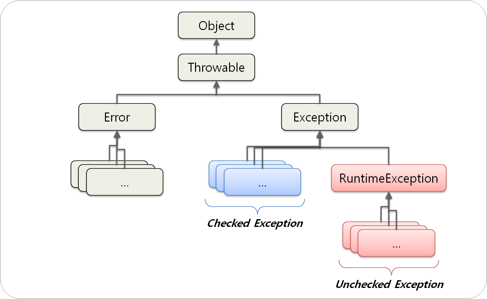

아래는 이펙티브 자바의 내용 중 **예외**에 대한 부분의 일부이다.
- ~~이펙티브 자바도 그렇고, 예외도 그렇고 포스팅할 내용이 너무 너무 많아서 다 정리할 수 없어서 아쉽다..!~~

일반적으로 검사 예외와 비검사 예외를 **CheckedException**, **UncheckedException**이라고 명명하지만, 해당 포스팅에서는 **Effective Java**의 명칭대로 **검사 예외**와 **비검사 예외**라고 명칭한다.

## 검사 예외와 비검사 예외

Throwable 클래스를 상속하는 것은 **Error**와 **Exception**이 있다.



Exception을 상속하면서 RuntimeException을 상속하지 않으면 **검사 예외**이고,  RuntimeException을 상속하면 **비검사 예외**라고 부른다.

참고로 **Error**는 `Throwable`을 상속하고 `OutOfMemoryError`나 `StackOverflowError`와 같이 복구할 수 없는 경우 터트린다.

## 선택하는 기준

검사 예외의 경우 무지성으로 핸들링해서 비검사 예외로 발생시켰다. 좋은 습관이 아니었다.

Effective Java에서는 **호출하는 쪽에서 처리할 수 있다면** 검사 예외를, 그렇지 않다면 비검사 예외를 사용하라고 한다.

아래는 `javax.mail`의 `InternetAddress` 클래스의 생성자다.

```java
public InternetAddress(String address) throws AddressException {
    // use our address parsing utility routine to parse the string
    InternetAddress a[] = parse(address, true);
    
    this.address = a[0].address;
    this.personal = a[0].personal;
    this.encodedPersonal = a[0].encodedPersonal;
}
```

입력 `address`가 잘못된 경우 `parse()`에서 검사 예외가 발생하고 그것을 외부로 그대로 던지고 있다.

사용자 측은 `address`가 잘못된 경우 로그를 찍고 넘어가던지, 다른 방법으로 생성하던지, 쓰레드를 종료하던지 등 **원하는 처리**를 할 수 있게 된다.

## 검사 예외 회피

검사 예외를 사용하면 그 API 사용자는 **try-catch 블록을 추가**해야되고 **스트림**에서 사용하지 못하게 된다.

그래서 검사 예외를 안 던질 수 있는 방법이 필요하다.

가장 쉬운 방법은 적절한 결과 타입을 담는 옵셔널을 반환하는 것이다.

```java
return Optional.ofNullable(resource);
```

이러면 사용자는 복잡한 절차나 제약 없이 처리가 가능하다.

다른 방법으로는 아래와 같이 예외가 터질 여부를 미리 검사하는 방법이다.

```java
if (actionPermitted(request)) {
    action(request);
} else {
    // 예외 상황 대처
}
```

위 두 사항을 적용하기가 명확하지 않고 애매할 때 검사 예외를 사용한다.

## 참고

향로님 블로그를 보면 **프로젝트 전체 관점**에서 예외를 어떻게 다루는 지와 몇 가지 **안티패턴**을 소개한다.
- https://jojoldu.tistory.com/734

매우 재미있으니 꼭 읽어보길 추천한다.