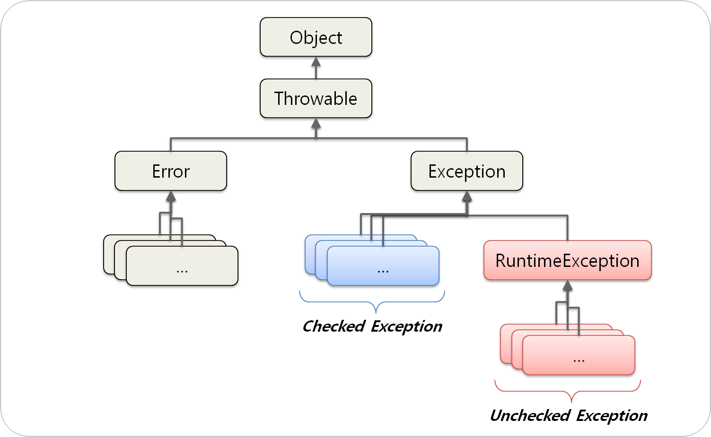

이펙티브 자바의 내용 중 **예외**에 대한 부분을 포스팅한다.

이펙티브 자바도 그렇고, 예외도 그렇고 포스팅할 내용이 너무 너무 많아서 다 정리할 수 없어서 아쉽다 ㅠ

보통 **CheckedException**, **UncheckedException**이라고 명명하지만 해당 포스팅에서는 Effective Java의 글대로 **검사 예외**와 **비검사 예외**라고 명칭한다.

## 검사 예외와 비검사 예외

Throwable 클래스를 상속하는 것은 **Error**와 **Exception**이 있다.

Exception을 상속하면서 RuntimeException을 상속하지 않으면 **검사 예외** RuntimeException을 상속하면 **비검사 예외**라고 부른다.

참고로 Error는 `OutOfMemoryError`나 `StackOverflowError`와 같이 복구할 수 없는 경우가 해당된다.

## 기준

사실 이제껏 개발하면서 검사 예외의 경우 무지성으로 핸들링해서 비검사 예외로 발생시켰다. 좋은 습관이 아니다.

Effective Java에서는 **호출하는 쪽에서 복구하길 원한다면** 검사 예외를, 그렇지 않다면 비검사 예외를 사용하라고 한다.

한가지 예로 자원이 고갈된 상황이라고 가정했을 때 복구가 가능하다면 검사 예외를 발생시키고, 복구가 불가능하다면 비검사 예외를 터트려야 한다.

## 검사 예외 회피

## 참고

향로님 블로그를 보면 **프로젝트 전체 관점**에서 예외를 어떻게 다루는 지와 몇 가지 **안티패턴**을 소개한다.
- https://jojoldu.tistory.com/734

매우 재미있으니 꼭 읽어보길 추천한다.