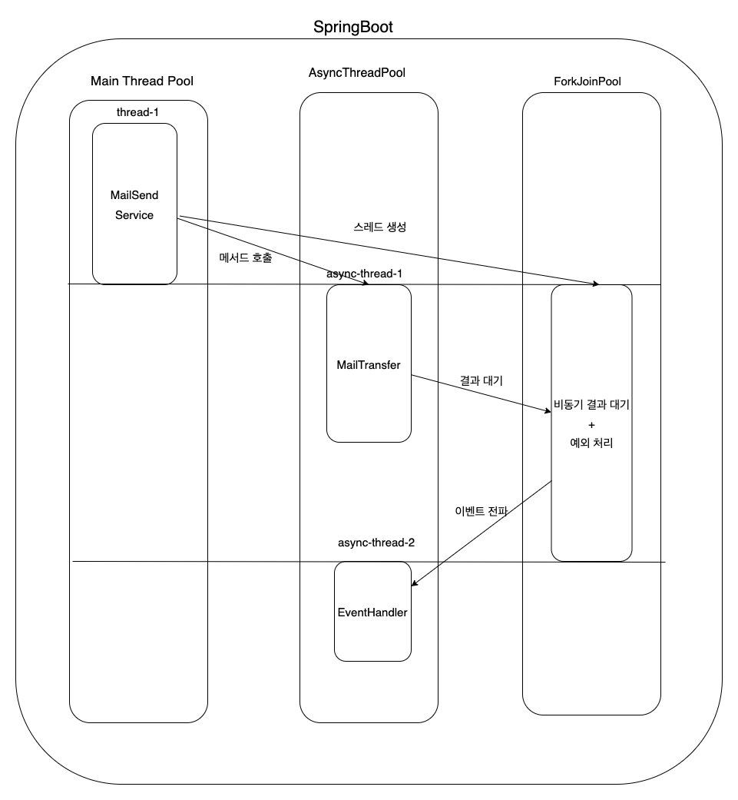
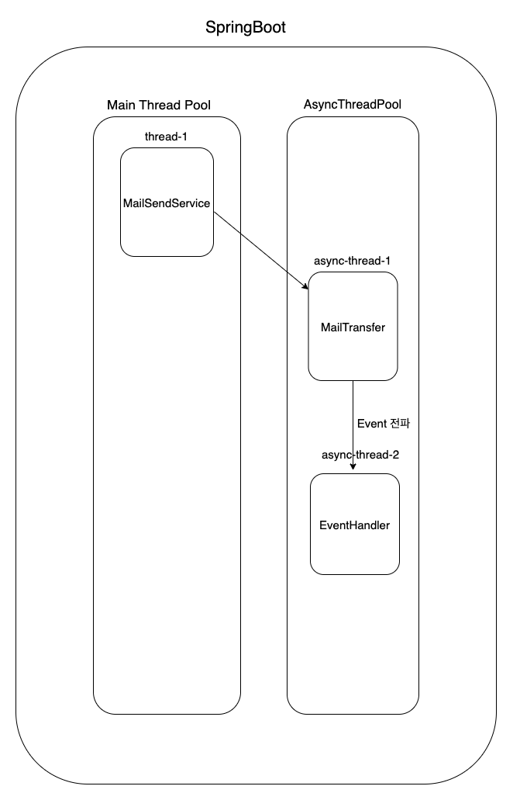

## JAVA - CompletableFuture 사용해보기! (feat. Event?)

## CompletableFuture 이해

Java에서 비동기 작업의 처리 결과를 반환받을 수 있는 방법이 없을까?

Java5 버전에는 Future라는 인터페이스가 추가되면서 비동기 작업에 대한 결과를 반환 받을 수 있게 되었다. 단, 아래의 한계가 있었다.
- 외부에서 완료시킬 수 없다.
- 블로깅 코드(get)를 통해서만 이후의 결과를 처리할 수 있다.
- 여러 Future를 조합할 수 없다.
- 예외 처리를 할 수 없다.

그래서 Java8에서는 위 문제들을 모두 해결한 CompletableFuture가 등장했다.

위 문제 이외에도, CompletableFuture는 CompletionStage 인터페이스를 구현하고 있었기에 콜백 형태로 동작이 가능했다. (ex. ~초 이내에 완료되지 않으면 기본 값 반환, 예외 처리 등)

## 비동기 작업

CompletableFuture의 기본적인 메서드는 아래와 같다.
- runAsync
  - 반환 값이 없는 경우

- supplyAsync
  - 반환 값이 있는 경우

runAsync와 supplyAsync는 Java7에 추가된 ForkJoinPool에 commonPool()을 사용해서 작업을 실행할 쓰레드를 쓰레드 풀로부터 얻어 실행시킨다.

만약 원하는 쓰레드 풀을 사용하려면, executorService를 파라미터로 넘겨주면 된다.

나의 경우에는 메일 발송을 구현하고 있었고, 반환 값이 필요 없었다. 그래서 아래와 같이 코드를 작성할 수 있었다.

```java
public CompletableFuture<Void> transfer(Iterator<MimeMessage> messages){
        return CompletableFuture.runAsync(()->
        javaMailSender.send(messages)
        ,asyncMailSendExecutor);
}
```

해당 메서드 사용처에서는 아래와 같이 사용할 수 있었다. exceptionally, exceptionallyAsync를 사용해서 예외를 반환받을 수도 있다.

```java
DBInfo DbInfo = ThreadLocal.getDbInfo();

mailTransfer.transfer(messages).exceptionallyAsync(e -> {
    MailBulkSendException exception = (MailBulkSendException) e.getCause();
    List<FailedMailInfo> failedMailInfos = exception.getFailedMailInfos();
    eventPublisher.publishEvent(new AsyncSendFailedEvent(failedMailInfos, DbInfo, exception.getMessage()));
    return null;
});
```

해당 메서드 이외에도 CompletableFuture에는 아래와 같은 기능을 제공한다.

**[Callback]**
- thenApply
  - 반환 값을 받아서 다른 값으로 반환
- thenAccept
  - 반환 값을 처리
- thenRun
  - 반환 값을 받지 않고 다른 작업을 실행함

**[Combine]**
- thenCompose
    - 두 작업이 이어서 실행하도록 조합
    - 앞선 작업의 결과를 받아서 사용할 수 있음
- thenCombine
    - 두 작업을 독립적으로 실행
    - 둘 다 완료되었을 때 콜백을 실행
- allOf
  - 여러 작업들을 동시에 실행
- anyOf
  - 여러 작업들 중에서 가장 빨리 끝난 하나의 결과에 콜백을 실행

단, 조합을 할 때는 스레드 풀의 스레드 수와 작업 수를 잘 조율하지 않으면 데드락이 발생할 수 있다.

아래는 해당 이슈를 잘 정리한 내용이다.
- https://techblog.woowahan.com/2722/

## 동작

그러면 어떻게 비동기 작업의 결과를 처리할 수 있을까..?

작성한 코드의 과정에서 세세하게 로그를 찍어 본 결과 흐름은 아래와 같았다.



즉, CompletableFuture에서 아래의 단점이 있었다.
1. 결과를 대기하는 스레드가 추가로 사용되는 점
2. 클래스 간 책임이 다소 복잡하게 이동되는 점

### 정리

사실 CompletableFuture를 고민하게 된 이유가 메일 발송 실패 시 callback이 필요한 것이었는데, 해당 부분은 그냥 비동기 작업 실패 시 이벤트를 발행하면 쉽게 처리가 가능하다.

> Event를 InfraStructure에서 발행하는 것이 부적절하다고 판단되면서, CompletableFuture를 권해주셨다.

하지만 해당 작업만 처리하기에 CompletableFuture는 코드가 복잡해지고, 스레드가 추가적으로 필요하다는 단점이 있었다.

그래서 CompletableFuture는 사용하지 않고, 외부 인터페이스를 사용하는 응용 서비스를 만들었고, 응용 서비스에서 이벤트를 발행하도록 처리했다.

결과적으로 흐름은 아래와 같이 되었다.



## 참고
- https://mangkyu.tistory.com/263
- https://stackoverflow.com/questions/38254268/completablefuture-exceptionally-with-executor
- https://techblog.woowahan.com/2722/

