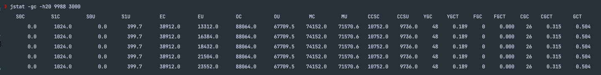

## jstat 사용해보기

jstat을 사용할 때는 PID를 알아야 하기 때문에 PID를 아래와 같이 조회한다.

`lsof -i :8080`

이후에 나온 PID가 9988이라면 아래의 명령어를 수행한다.
`jstat -gc -h20 9988 3000`

그러면 위와 같이 GC 관련 정보들을 모니터링할 수 있다. (각 공간을 점유하는 크기, GC 수 등)

## 참고
- https://d2.naver.com/helloworld/37111